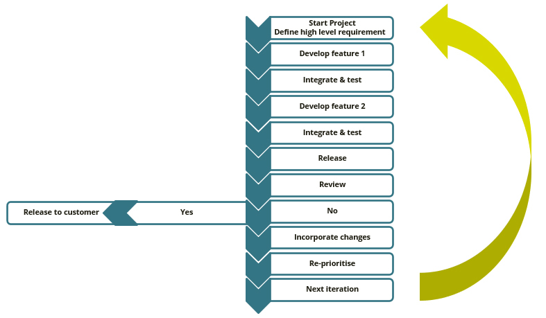

 # CI/CD (Continuous Integration/Continuous Delivery)<a name="indice"></a>
 - [Introducción CI](#intro-CI)
 - [Groovy](#groovy)
 - [Jenkins](#jenkins)
 - [GitLab](#GitLab)
 - [Github Actions](#github-actions)

## Introducción CI <a name="intro-CI"></a>
 - [Índice](#indice)

El objetivo técnico de **CI** es establecer una forma coherente y automatizada de crear, empaquetar y probar aplicaciones. **CD** automatiza la entrega de aplicaciones en diferentes entornos (desarrollo, producción...) e infraestructuras.

SDLC
Es el proceso que engloba la creacion de sofware.

Fases desarrollo:
1. Análisis de requisitos: que es lo  que quiere que haga la app
2. Diseño: arquitectura, lenguaje ...
3. Implementación
4. Test
5. Evolución

Hay varios modelos en el SDLC (Software Development Life Cycle ), entre ellos están:

### Waterfall


  
En este modelo hasta que no acabe una fase no se inicia la siguiente, lo cual genera incertidumbre ya que la integración se realiza al final del proceso (no vemos el proceso, solo el final). 
Por otro lado los requisitos suelen ser fijos y estar bien documentados.
 

### Agile



Este modelo es mejor en proyectos que requieren rapidez y flexibilidad. El software es puesto en producción frecuentemente.

El motro de Agile es la integracion continua.
Se necesita un GIT (Distributed Version Control System) para las continuas integraciones.

La CI es una práctica de desarrollo de software donde se van haciendo integraciones frecuentes con la rama de integración y crean una build.

Se puede ver toto el proceso, y ir probando las implementaciones pudiendo volver atras cuando algo falle. 


1. Creamos una característica

2. Se crea una rama nueva y se va desarrollando (cada característica nueva va en una rama)

3. Empezamos a crear procesos de “build y ciertos tests”: para ver que esa característica se integra bien, si falla volvemos al paso anterior, si va bien nos planteamos integrarla a la rama principal

4. Fase de integración: Aquí se prueba que la rama que tenemos definida funcione correctamente con la rama principal

5. Creamos la Build: Probamos que esta funcione correctamente
   
6. Procesos de integraciones: Verificamos las características nuevas funcionan con las existentes
   
7. Paquete final: Si todo lo anterior va bien, se genera y se sube al repositorio correspondiente

Un ejemplo de CI sería el proceso hasta crear nuestra imagen de Docker y la CD sería su despliegue en Kubernetes


## Groovy <a name="groovy"></a>

 - [Índice](#indice)
 - [Instalación](#instalación)
 - [Sintaxis](#sintaxis)
 - [Variables](#variables)
 - [Tipos de datos](#tipos-de-datos) 
 - [Estructuras de control](#estructuras-de-control)
 - [Subrutinas](#subrutinas)
 - [Clases y Objetos](#clases-y-objetos)
 - [Herencia](#herencia)

### Instalación

**Groovy** puede instalarse de [localmente](https://groovy.apache.org/download.html) o a través de un contenedor de [Docker](https://hub.docker.com/_/groovy) usando el siguiente comando
```docker
docker run --rm -it -v $PWD:/scripts -w /scripts groovy bash
```
(Una vex iniciado con docker no se utiliza sudo)

Para ejecutar un script se usa el comando `groovy`
```shell
groovy fichero.groovy
```

Ejecuta un script con docker
```
docker run --rm -v "$PWD":/home/groovy/ scripts -w /home/groovy/scripts groovy groovy <script> <script-args>

"-V" montamos seguido del drectorio personal, seguido por la imagen y despues el scripts
y los argumentos.


### Sintaxis

Es muy parecida a Java y compatible con el mismo. Los `;` son opcionales

`println`: Imprime algo en pantalla

```groovy
println "------------------------------------------------------------------"
println "Hello"
System.getenv().each{ // Imprimir las variables del sistema
    println it
}
println "------------------------------------------------------------------"
```

### Variables

Se definen usando `def <variable> = <valor>;` aunque sin usar `def` funciona

```groovy
def x = 5 // Definimos variable

x += 5 // Le sumamos 5 al valor actual

println x // Imprime el valor de x

assert x == 10 // Si x es distinto de 10 muestra un error en pantalla.

assert x == 11: "Value was not eleven" // Definir una salida de error personalizada
```

### Tipos de datos

Es opcional definirlos pero es una buena práctica

- `String`: Tipo cadena de texto
- `int`: Tipo entero
- `float`: Otro tipo numérico
- `Boolean`: Tipo booleano
```groovy
String name = "Joe Doe"
int courseCount = 14
float salary = 999999.99
Boolean isProgrammer = true

println name + " has created " + courseCount + " courses." // [1]
println name + " is a programmer? " + isProgrammer // [1]
println name + " wishes his salary was " + salary // [1]
```
Ya no escribimo string como en python, sino que le damos una sustitucion con un valor.


### Estructuras de control

- Condiciones

```groovy
if (isProgrammer) {
    println "He's a programmer, alright"
}
else {
    println "Not a programmer, tho"
}
```

- Bucles

```groovy
// for
for (int i = 0; i < courseCount; i++) {
    println "Chris made course " + (i + 1) + "!!!"
}

// while
int i = 0;

while (i < courseCount) {
    println "Chris made course " + (i + 1) + "!!!"
    i++
}

// for in
String[] singers = ["Bob", "George", "Jeff", "Roy", "Tom"]

for(String singer: singers) {  // en vez de atacar cada elemeto con for le damos la varible singer, 
    println singer                
}
// forma más compacta
singers.each(println(it)) // el ejecuta lo mismo que la anterior
```

### Subrutinas

Hay 2 tipos: funciones (devuelven un valor) y métodos (no devuelven nada). En el caso de `Groovy`, como `Java` y `C#`, un método es una función que devuelve un tipo `void`

```groovy
// Función que devuelve la primera letra minúscula del nombre + el apellido en minúsculas
String getUserName(String firstName, String lastName) {
    return firstName.substring(0, 1).toLowerCase() + lastName.toLowerCase();
}
// toLowerCase = a que me imprima en minúscula.


// Método que imprima las credenciales que le pasemos al llamar al método
void printCredentials(cred) {
    println("UserName is ${cred}")
}

//Llamamos al método
printCredentials(getUserName("Jose", "Lopez"))
```

```groovy
// Ejemplo con arrays
String getUserName(String firstName, String lastName) {
    return firstName.substring(0, 1).toLowerCase() + lastName.toLowerCase();
}

void printCredentials(cred) {
    println("UserName is ${cred}")
}

// Ejemplo con arrays
String[] firstNames = ["Ferra", "Dani", "Jordi", "Joan", "Martin"]
String[] lastNames = ["Adriá", "García", "Cruz", "Roca", "Berasategi"]

for (int i = 0; i < firstNames.size(); i++) {
   printCredentials(
       getUserName(firstNames[i], lastNames[i])
   );
}
```

### Clases y Objetos

Las clases son moldes para crear distintos objetos que pueden contener múltiples valores de tipos de datos más simples

##
User user = new User();
Useeer user1= new User();
user.UserName()
user1.UserName()

con el this orentamos a que objeto queremos ir (user)  
##

```groovy
// definimos la clase User con los atributos lastName y firstName
class User {
    String lastName;
    String firstName;

   // Método del objeto User que devuelve el valor del método 'getUserName'
   public String UserName() {
       return getUserName(this.firstName, this.lastName);
   }
    // Método del objeto User que crea el username
    private String getUserName(String firstName, String lastName) {
        return firstName.substring(0, 1) .toLowerCase() + lastName.toLowerCase();
    }
}

// Constructor 
User constructor(String firstNane, String LastName) {
  this.firstName = firstName;
  this.lastName = lastName
} 

// Creamos el array de objetos de la clase User
User[] users = [
    new User(firstName: "Ferra", lastName: "Adria"),
    new User(firstName: "Dani", lastName: "Garcia"),
    new User(firstName: "Jordi", lastName: "Cruz"),
    new User(firstName: "Joan", lastName: "Roca"),
    new User(firstName: "Martin", lastName: "Berasategi"),
];

// Bucle que imprime todos los usernames del array
users.each(user -> println("UserName is ${user.UserName()}"))
```

### Herencia

La herencia es uno de los conceptos más importantes de la programación orientada a objetos, y su principal ventaja es la capacidad de utilizar el mismo código que hemos programado en una clase, en otras clases que heredan de ella sus métodos (funciones) y sus atributos (variables). Cuando una clase hereda de otra, se le llama subclase, clase hija o clase derivada.

```groovy
// Creamos la clase User con sus funciones correspondientes
abstract class User {
    String lastName;
    String firstName;

    public String UserName() {
        return getUserName(this.firstName, this.lastName);
    }

    String getUserName(String firstName, String lastName) {
        return firstName.substring(0, 1).toLowerCase() + lastName.toLowerCase();
    }
}

// Creamos dos subclases de User

// Subclase FirstChef aporta el atributo Dishes
class FirstChef extends User {
    public String[] Dishes;
}

// Subclase Baker que aporta el atributo "Dessert ready" a través del método Bake
class Baker extends User {
    public void Bake() {
        println("Dessert ready");
    }
}

// Creamos el array de objetos de las subclases FirstChef y Baker
User[] users = [
    new FirstChef(firstName: "Ferra", lastName: "Adria", Dishes: ["Locura"]),
    new FirstChef(firstName: "Dani", lastName: "Garcia", Dishes: ["Mojama"]),
    new FirstChef(firstName: "Jordi", lastName: "Cruz", Dishes: ["Rocas de Mar"]),
    new Baker(firstName: "Joan", lastName: "Roca"),
    new FirstChef(firstName: "Martin", lastName: "Berasategi", Dishes: ["Torrija"]),
];

// Recorremos todo el array de objetos, y añadimos una condición para cada tipo de subclase
users.each{
    user ->
    if (user instanceof FirstChef) {
        println("Username is ${user.UserName()}");
        user.Dishes.each(d -> println("${d}"));
    } else {
        user.Bake();
    }
}
```

## Jenkins <a name="jenkins"></a>

- [Índice](#indice)
- [Instalación y configuración inicial](#instalación-y-configuración-inicial)
- [Interfaz](#interfaz)
  - [**Dashboard**](#dashboard)
  - [**Manage Jenkins**](#manage-jenkins)
  - [**New Item**](#new-item)
- [Crear una pipeline simple](#crear-una-pipeline-simple)
- [Crear una pipeline simple desde BitBucket](#crear-una-pipeline-simple-desde-bitbucket)
- [Crear una pipeline multibranch](#crear-una-pipeline-multibranch)
- [Crear una pipeline desde GitHub](#crear-una-pipeline-desde-github)
- [Crear una pipeline multi-stage](#crear-una-pipeline-multi-stage)
- [Solicitar input de usuario](#solicitar-input-de-usuario)
- [Parallel stages](#parallel-stages)
- [Clean code - Refactor pipeline](#clean-code---refactor-pipeline)
- [Pipelines con parámetros](#pipelines-con-parámetros)
- [Pipelines con funciones de Groovy](#pipelines-con-funciones-de-groovy)
- [Librerías compartidas](#librerías-compartidas)
- [Usar contenedor como build agent](#usar-contenedor-como-build-agent)

 
**Jenkins** es un servidor que se usa para la **CI** de proyectos de software. **Jenkins** trabaja con **Groovy** para gestionar sus pipelines, usándolo para escribir sus scripts 

### Instalación y configuración inicial
- [Índice](#jenkins)
  
Se puede instalar a través de `Docker`. En este caso para simplificar la instalación usaremos un `YAML` de `Docker Compose`:
```shell
## Entramos en la carpeta /extra de este repositorio y ejecutamos el fichero de Docker Compose
docker compose up
```
Accedemos a `http://localhost:8080/` e introducimos el password de Administrador que nos ha aparecido en el terminal

Posteriormente podemos instalar los plugins sugeridos o seleccionar los que queramos

Creamos el usuario Administrador rellenando los campos correspondientes
  
Ponemos el nombre del dominio de la red donde estemos. Si estamos en local usamos `http://localhost:8080/`

### Interfaz
- [Índice](#jenkins)

#### **Dashboard**

Nos muestra los `Items` que tenemos creados

#### **Manage Jenkins**


Distintos apartados de configuración: Gestión de nodos (donde se puede añadir y configurar nodos, gestionar nodos Windows y Linux en caso de querer realizar acciones específicas sobre los mismos), gestión de plugins, gestión de sistemas (podemos configurar entre otro, cuantas pipelines se pueden ejecutar simultáneamente)

#### **New Item**


- `Freestyle project`: Se usaba antiguamente. Funciona agrupando varios scripts de `shell`. La desventaja es que al no haber ningún `VCS` implicado si hay actualizaciones esos scripts pueden dejar de funcionar
  
- `Pipeline`: Se escriben en `Groovy` en un fichero llamado `Jenkinsfile` y estas pipelines las podemos vinculara un `VCS`

  - `Definition`: Elegir entre usar un script de pipeline o un script de un `VSC`
  - `Script`: Escribir la pipeline en `Groovy`
  - `Save` guarda los cambios y nos lleva al menú principal del proyecto y `Apply` solo los guarda

  - `Pipeline syntax`: Muestra ayuda y herramientas para crear las pipelines, como generadores de snippets
  
- `Folder`: Es un plugin que hay que instalar. Ayuda a organizar mejor los proyectos en la ventana principal de **Jenkins**
  
- `Multibranch Pipeline`: Permite crear subcarpetas donde irán las distintas ramas y así se puede realizar un tracking de cada una


### Crear una pipeline simple
- [Índice](#jenkins)

*New Item > Introducimos el nombre y seleccionamos "Pipeline"*
```groovy
// Definimos la pipeline declarativa
pipeline {

    // Workers que usarían esta pipeline. Se puede especificar si la pueden usar todos, o específicos de Windows o Linux. También se puede especificar mediante 'labels' que nodos queremos que usen dicha pipeline
    agent any // La pueden usar todos los nodos

    // Cada fase puede contener distintos pasos a ejecutar
    stages {

        // Cada stage dentro de stages puede contener distintos pasos
        stage('Hello') {

            // Se crean los pasos a ejecutar
            steps {
                echo "This is build number $BUILD_NUMBER" // Si ponemos comillas simples no hara interpolación de la variable y en vez de mostrar el valor de la variable mostrará su nombre
            }
        }
    }
}
```
Para la sintaxis utilizamos https://www.jenkins.io/doc/book/pipeline/syntax/

Tras guardar, seleccionamos `Build now` y al lanzar la pipeline podemos ver el resultado e incluso los logs


En este caso hemos creado la **build #1** y si entramos tenemos un menú de configuración específico de la misma

Si la abrimos con `Blue Ocean` podríamos ver en otro tipo de interfaz todo el listado de proyectos y ver descripción específica de cada uno con sus ramas, etc. Podríamos entrar en cada build y ver un gráfico de como se ha ejecutado. Además que podemos encontrar otras opciones a nivel de ejecución, gráfico, etc


Si quisieramos crear otra build solo tendríamos que hacer entrar en la **#1** y hacer `Replay` y creariamos la **build #2**. Dentro de cada build si seleccionamos `Console Output` podemos ver el resultado de la ejecución

### Crear una pipeline simple desde BitBucket
- [Índice](#jenkins)

Lo primero es crear una cuenta en **BitBucket** y creamos el repositorio demo1-2. Tras lo que lo clonaremos
```shell
git clone https://L0kyLuke@bitbucket.org/l0kyluke/demo1-2.git
```
Es importante crear un **App Password** para poder realizar cambios en nuestro repositorio desde VSCode. Sirve para crear credenciales para repositorios privados

*Pulsamos en el avatar > Personal Settings > App Passwords > Creamos el password dando permiso de lectura/escritura en repositorios y lo salvamos (solo se muestra 1 vez)*

```shell
## ATBB7XzDk58zyNTe5dLJQEbsX3nxD3FE9705 Usarlo para hacer cambios en el repositorio de BitBucket
```

Creamos el Jenkinsfile y lo subimos al repositorio de BitBucket
```groovy
pipeline {
    agent any
    stages {
        stage('stage1') {
            steps {
                echo "This is the $BUILD_NUMBER of demo $DEMO"
            }
        }
    }
    environment { // Definimos una variable de entorno que estará disponible en todos los stages
        DEMO = '1'
    }
}
```

*New Item > Introducimos el nombre y seleccionamos "Pipeline"*. Luego seleccionamos:
- `Definition`: Pipeline script from SCM
- `SCM`: Git
- `Repository URL`: Dirección del repositorio (en el repo vamos al apartado `Clone` y seleccionamos `HTTPS`)
 
Si es público no hay que hacer nada, pero si es privado hay que generar un App Password y rellenar más campos:

   1. Si ya tenemos el **App Password** creado usamos ese o si no se crea como se ha explicado anteriormente
  
   2. `Credentials`: Añadimos de tipo `Username with password`, en `Username` ponemos nuestro usuario y en `Password` el generado

- `Script Path`: Si usamos nombre distinto para el Jenkinsfile o está en otra ruta distinta a la del directorio raíz del repositorio hay que especificarla. 
Ruta del archivo que queremos ejecutar.
- `Branch Specifier`: Hay que poner `*/main` en vez de `*/master` ya que GitHub desde hace tiempo llama a la rama principal `main` en vez de `master`

Una vez ejecutada correctamente si vamos a la build y vamos a `Console Output` podemos ver cada paso, desde la conexión al repositorio hasta la ejecución del Jenkinsfile

### Crear una pipeline multibranch
- [Índice](#jenkins)

Lo normal es que trabajemos con varias ramas. Vamos a ver un ejemplo multibranch

*New Item > Introducimos el nombre y seleccionamos "Multibranch Pipeline"*. Luego seleccionamos:

- `Branch Sources`: Elegimos el repositorio. En este caso GIT

Tras guardar hará un escaneo de la pipeline para ver si está todo correcto

Si nos vamos al directorio inicial de `Jenkins` podemos ver que el icono del pipeline multibranch tiene forma de carpeta y al entrar podemos ver las distintas ramas. En este caso solo está la **main** y ya `Jenkins` ha creado automáticamente la **Build #1** y está correcta

### Crear una pipeline desde GitHub
- [Índice](#jenkins)

Creamos un repositorio en GitHub llamado **jenkins-sessions** que será público, si fuera privado habría que generar un token:
- *Usuario > Settings > Developer settings > Personal access tokens* y creamos un token clásico:
  - Seleccionamos `repo` para dar control total sobre repositorios privados
  - En `user` seleccionar `user:email` para acceder desde **Blue Ocean**
  - Copiamos la contraseña (solo la muestra 1 vez)
  - Nos vamos a *Jenkins > Manage Jenkins > Manage Credentials*
  - Luego dentro `Stores scoped to Jenkins` entramos en `System`
  -  Para que sean credenciales globales entramos dentro de `Global credentials (unrestricted)` y seleccionamos `Add Credentials`
  -  La elegimos de tipo `Username with password`, en `Username` ponemos el usuario de `GitHub` y en `Password` ponemos el token

Volvemos a **GitHub** y clonamos nuestro repositorio
```git
git clone https://github.com/L0kyLuke/jenkins-sessions.git
```
Dentro de la carpeta creamos el `Jenkinsfile` con el siguiente código
```groovy
// Comprobaremos que variables de entornos que creemos aquí van a poder ser accedidas desde scripts (en este caso test.sh) que nosotros creemos
pipeline {
    agent any

    environment { // secuencia de pares clave-valor que se definirán como variables de entorno para todos los pasos de la etapa
        DEMO='1.3'
    }

    stages {
        stage('stage-1') {
            steps {
                echo "This is the build number $BUILD_NUMBER of demo $DEMO"
                
                // Vamos a añadir varios comandos de shell, para comando único se escribe sh 'comando' si son comandos multilínea sería sh ''' cada línea de comando dentro de las triples comillas '''
                
                // En los comandos se usan comillas simples para evitar interpolaciones no deseadas de las variables que se nombraran en los scripts

                //Hay que poner la ruta de test desde la raíz del repositorio al fichero test.sh o si no Jenkins dará fallo

                // Las " comillas dobles son para interpolaciones, las ' simples para shell y ''' comillas paras hacer scrith complejo (como el de abajo.)


                sh '''
                echo "Using a multi-line shell step"
                chmod +x ./01/demo1/1.1/test.sh
                ./test.sh
                '''
            }
        }
    }
}
```

Creamos el fichero test.sh
```shell
#!/bin/sh

echo "Inside this script, demo $DEMO"
```

Subimos los cambios al repositorio
```sh
git add .
git commit -m "add files"
git push
```
Volvemos a `Jenkins` y creamos una nueva pipeline haciendo *New Item > Introducimos el nombre y seleccionamos "Pipeline"*. Luego seleccionamos:
- `Definition`: Pipeline script from SCM
- `SCM`: Git
- `Repository URL`: Dirección del repositorio (en el repo vamos al apartado `Clone` y seleccionamos `HTTPS`)
- `Credentials`: Seleccionamos la credencial anteriormente creada
- `Branch Specifier`: Hay que poner `*/main` en vez de `*/master`
- `Script Path`: Ponemos la ruta del `Jenkinsfile` (01/demo1/1.1/Jenkinsfile)

Creamos la build y veremos que el fichero test.sh ha recogido el valor de la variable del `Jenkinsfile`


### Crear una pipeline multi-stage
- [Índice](#jenkins)

Las variables de entorno declaradas dentro de un stage no son accesibles desde fuera del mismo. Vamos a hacer un ejemplo para comprobarlo

Creamos el `Jenkinsfile` en 01/demo2/1.1
```groovy
// Las variables de entorno dentro de un stage se quedan en ese stage
pipeline {
    agent any

    environment {
        RELEASE='0.0.1'
    } 

    stages {
// si el enviroment se pusiera aqui se aplicaria a un stage especifico. 
        stage('Build') {
            agent any
            environment {
                LOG_LEVEL='INFO'
            }
            steps {
                echo "Building release ${RELEASE} with log level ${LOG_LEVEL}..."
            }
        }

        stage('Test') {
            steps {
                echo "Testing...I can see release ${RELEASE}, but not log level ${LOG_LEVEL}" // Aquí debe dar fallo al llamar a ${LOG_LEVEL} cuando es una variable de oro stage
            }
        }
    }
}
```

Subimos los cambios al repositorio
```sh
git add .
git commit -m "add files"
git push
```

Para este ejemplo aprovechamos el pipeline anterior (ya que los datos a introducir serán casi iguales) para no hacerlo desde cero haciendo New Item > Introducimos el nombre y en "Copy from" ponemos el nombre de la pipeline a copiar, y solo necesitamos cambiar la ruta del `Jenkinsfile` a 01/demo2/1.1/Jenkinsfile


Como podemos comprobar el stage *Build* ha arrancado correctamente pero el *Test* ha dado error debido a que llama a una variable que es interna del stage *Build*

### Solicitar input de usuario
- [Índice](#jenkins)

Vamos a crear una pipeline que en un cierto momento solicite el input de un usuario

Creamos el `Jenkinsfile` en 01/demo2/1.2
```groovy
pipeline {
    agent any
    environment {
        RELEASE='0.0.1'
    }
    stages {
        stage('Build') {
            agent any
            environment {
                LOG_LEVEL='INFO'
            }
            steps {
                echo "Building release ${RELEASE} with log level ${LOG_LEVEL}..."
            }
        }
        stage('Test') {
            steps {
                echo "Testing release ${RELEASE}..."
            }
        }
        stage('Deploy') {

            // Le mostramos el mensaje 'Deploy?' al usuario y un botón de ok y abort
            input {
                message 'Deploy?'
                // El botón de aceptar mostrará la etiqueta 'Do it!'
                ok 'Do it!'

                // El contenido de lo que haya elegido el usuario lo voy a guardar en la variable TARGET_ENVIRONMENT, cuyo valor por defecto es 'PROD'
                parameters {
                    string(name: 'TARGET_ENVIRONMENT', defaultValue: 'PROD', description: 'Target deployment environment')
                }
            }
            // Una vez el usuario ha alimentado esa entrada ejecutamos los steps
            steps {
                echo "Deploying release ${RELEASE} to environment ${TARGET_ENVIRONMENT}"
            }
        }
    }
    // La directiva "post" puede ponerse, al igual que environment, tanto en la raiz o dentro de un stage específico, sirve para realizar ciertas operaciones cuando se hayan ejecutado todos los steps de un stage o todos los stages (si se ha puesto a nivel global)
    post {
        // Podemos elegir que se ejecute always, changed (el stage se haya ejecutado debido a un cambio), fixed (el stage se haya ejecutado debido a un fix), aborted (si el stage ha sido abortado), failure (si el stage ha fallado), success (únicamente cuando ha tenido éxito), unstable (ha ido bien pero no del todo), etc
        always {
            echo 'Prints wether deploy happened or not, success or failure'
        }
    }
}
```

Subimos los cambios al repositorio
```sh
git add .
git commit -m "demo1.2"
git push
```

Volvemos a `Jenkins` y creamos la pipeline copiando los datos de la demo-2, cambiando el directorio donde se encuentra el `Jenkinsfile` y la ejecutamos


Como puede verse en la imagen, cuando llega al stage *Deploy* se queda pausado y al pasar el ratón por encima aparecerá el input. Si pulsamos *ok* se ejecutará los siguientes steps pasándole también el valor introducido a la variable *TARGET_ENVIRONMENT*, y si pulsamos *abort* se saltará el resto de stages o steps. El *post* se ejecutará igualmente al final ya que lo configuramos como *always*

Se puede ejecutar una build desde `Blue Ocean` y se pueden ver todos los pasos de forma más clara


Tras aceptar el input muestra los mensajes posteriores a la pausa


### Parallel stages
- [Índice](#jenkins)

Todas las pipelines realizadas hasta ahora van ejecutando los stages de forma secuencial, pero puede darse el caso de que queramos que esos stages se ejecuten en paralelo (por ejemplo probando una app para distintas arquitecturas)

Creamos el `Jenkinsfile` en 01/demo2/1.3
```groovy
pipeline {
    agent any
    environment {
        RELEASE='0.0.1'
    }
    stages {
        stage('Build') {
            environment {
                LOG_LEVEL='INFO'
            }
            // Creamos los stages que se van a ejecutar en paralelo
            parallel {
                stage('linux-arm64') {
                    steps {
                        echo "Building release ${RELEASE} for ${STAGE_NAME} with log level ${LOG_LEVEL}..."
                    }
                }
                stage('linux-amd64') {
                    steps {
                        echo "Building release ${RELEASE} for ${STAGE_NAME} with log level ${LOG_LEVEL}..."
                    }
                }
                stage('windows-amd64') {
                    steps {
                        echo "Building release ${RELEASE} for ${STAGE_NAME} with log level ${LOG_LEVEL}..."
                    }
                }
            }
        }
        stage('Test') {
            steps {
                echo "Testing release ${RELEASE}..."
            }
        }
        stage('Deploy') {
            input {
                message 'Deploy?'
                ok 'Do it!'
                parameters {
                    string(name: 'TARGET_ENVIRONMENT', defaultValue: 'PROD', description: 'Target deployment environment')
                }
            }
            steps {
                echo "Deploying release ${RELEASE} to environment ${TARGET_ENVIRONMENT}"
            }
        }
    }
    post {
        always {
            echo 'Prints wether deploy happened or not, success or failure'
        }
    }
}
```

Subimos los cambios al repositorio
```sh
git add .
git commit -m "demo1.3"
git push
```

Volvemos a `Jenkins` y creamos la pipeline copiando los datos de la demo-2-1.2, cambiando el directorio donde se encuentra el `Jenkinsfile` y la ejecutamos, pudiendo comprobar que las 3 stages se ejecutan en paralelo y luego se ejecutan las siguientes


### Clean code - Refactor pipeline
- [Índice](#jenkins)

Cuando trabajamos en múltiples proyectos hay pasos repetitivos que se suelen hacer copy/paste. Vamos a ver como generar cosas comunes para diferentes proyectos

Creamos la carpeta 02 en la raíz del repositorio. Luego partimos de un proyecto (al que le aplicaremos CI) guardado en la carpeta "solution" realizado en Node.js, que está en extra/jenkins/ y lo copiamos a 02 quedando 02/solution/. Por otro lado creamos el `Jenkinsfile` (02/demo1/1.1/)

```groovy
pipeline {
    agent any
    environment {
        // Se ejecuta script para sacar la versión de la app (package.json). En este caso permite ejecutar comandos de node al haber instalado Node.js junto a Jenkins
        // Con returnStdout: True devolvemos el valor devuelto a la variable VERSION. Se aplica el trim en caso de que pudieran haber espacios
        VERSION = sh([ script: 'cd ./02/solution && npx -c \'echo $npm_package_version\'', returnStdout: true ]).trim() // con esto guardamos los datos de salida
        VERSION_RC = "rc.2" //sacamos la version que tenga el proyecto
    }
    stages {
        // Mostramos las versiones de git, docker, node y npm que tenemos
        stage('Audit tools') {
            steps {
                sh '''
                    git version
                    docker version
                    node --version
                    npm version
                '''
            }
        }
        //  Instala las dependencias de este proyecto (npm install) y ejecuta el script build de este proyecto (package.json)
        stage('Build') {
            steps {
                //De forma declarativa entramos en la carpeta solution y luego se ejecutan esa serie de instrucciones desde dentro de la carpeta
                dir('./02/solution') { // con "dir" entramos en la carpeta del directorio
                    echo "Building version ${VERSION} with suffix: ${VERSION_RC}"
                    sh '''
                    npm install
                    npm run build
                    '''
                }
            }
        }
        // Realizamos pruebas unitarias
        stage('Unit Test') {
            steps {
                dir('./02/solution') {
                    sh 'npm test'
                }
            }
        }
    }
}
```

Subimos los cambios al repositorio
```sh
git add .
git commit -m "demo-clean1.1"
git push
```

Volvemos a `Jenkins` y creamos la pipeline copiando los datos de la demo-2-1.3, cambiando el directorio donde se encuentra el `Jenkinsfile` y la ejecutamos. Posteriormente si observamos el log podemos ver como cada paso se ha ido ejecutando secuencialmente

### Pipelines con parámetros
- [Índice](#jenkins)

Podemos definir la ejecución de ramas de un proyecto o stages en base a ciertos condicionales

Creamos el `Jenkinsfile` (02/demo1/1.2/)
```groovy
pipeline {
    agent any
    // Añadimos un nuevo parámetro, será booleano. La variable que va a recoger ese parámetro es RC (valor por defecto false)
    parameters {
        booleanParam(name: 'RC', defaultValue: false, description: 'Is this a Release Candidate?')
    }
    // Entramos en la app y obtenemos la versión del package.json
    environment {
        VERSION = sh([ script: 'cd ./02/solution && npx -c \'echo $npm_package_version\'', returnStdout: true ]).trim()
        VERSION_RC = "rc.2"
    }
    stages {
        // Hacemos auditoría de herramientas para ver sus versiones
        stage('Audit tools') {
            steps {
                sh '''
                    git version
                    docker version
                    node --version
                    npm version
                '''
            }
        }
        stage('Build') {
            // Añadimos variable de entorno cuya valor va a estar condicionado a si el booleano anterior será true o false. Si estamos en una Release Candidate le damos el valor de VERSION_RC+texto extra, si no le damos el valor de VERSION_RC solo
            environment {
                VERSION_SUFFIX = sh(script:'if [ "${RC}" == "true" ] ; then echo -n "${VERSION_RC}+ci.${BUILD_NUMBER}"; else echo -n "${VERSION_RC}"; fi', returnStdout: true)
                // si no es release candide solo nos quedamos con "VERSION_RC
            }
            
            steps {
                // Entramos en la app y hacemos build e imprimimos como cambia la versión según el condicional anterior
                dir('./02/solution') {
                    // echo "Building version ${VERSION} with suffix: ${VERSION_RC}"
                    echo "Building version ${VERSION} with suffix: ${VERSION_SUFFIX}"
                    sh '''
                        npm install
                        npm run build
                    '''
                }
            }
        }
        // Tests unitarios
        stage('Unit Test') {
            steps {
                dir('./02/solution') {
                    sh 'npm test'
                }
            }
        }
        // Esta stage solo se ejecuta cuando sea una Release Candidate (o sea, la expresión booleana sea verdadera)
        stage('Publish') {
            when { // when acepta varias cosas: branch (para una rama específica), buildingTag (uso de tags), equals (expresión de igualdad), expression (expresión booleana)
                expression { return params.RC }
            }
            steps { // Se va a generar el directorio app/ y todos los ficheros generados con npm run build se van a guardar en él
                archiveArtifacts('02/solution/app/')
            }
        }
    }
}
```
Subimos los cambios al repositorio
```sh
git add .
git commit -m "condicional"
git push
```

Volvemos a `Jenkins` y creamos la pipeline copiando los datos de una anterior, cambiando el directorio donde se encuentra el `Jenkinsfile`

Al no saber que tenemos esta build parametrizada nos muestra **Build now** por lo que se ejecuta sin esperar entrada de parámetros (y no se ejecuta el código de dentro `parameters`) por lo que el valor del booleano coge su valor por defecto que es falso y no se ejecutará el stage *Publish*


Refrescamos la pantalla y al ver `Jenkins` que este proyecto necesita parámetros nos aparece **Build with Parameters**, por lo que podremos configurar ciertos valores antes de ejecutar toda la pipeline (a diferencia del apartado anterior que requería una entrada de usuario, aquí requiere un parámetro). Al ejecutarse pide la introducción de parámetros


Si decimos que es una *Release Candidate* ya se ejecutarán los pasos del publish


Si volvemos a la pantalla de la pipeline podremos ver los artefactos generados en la última build


### Pipelines con funciones de Groovy
- [Índice](#jenkins)

Un ejemplo como en el caso anterior puede en vez de usando *Shell Scripting*, hacerlo de forma más ordenada usando funciones de `Groovy`. Vamos a partir del ejemplo anterior e ir modificándolo
```diff
pipeline {
    agent any
    parameters {
        booleanParam(name: 'RC', defaultValue: false, description: 'Is this a Release Candidate?')
    }
    environment {
        VERSION = sh([ script: 'cd ./02/solution && npx -c \'echo $npm_package_version\'', returnStdout: true ]).trim()
        VERSION_RC = "rc.2"
    }
    stages {
        stage('Audit tools') {
            steps {
-               sh '''
-                   git version
-                   docker version
-                   node --version
-                   npm version
-               '''
+               auditTools()
            }
        }
        stage('Build') {
            environment {
-               VERSION_SUFFIX = "${sh(script:'if [ "${RC}" == "false" ] ; then echo -n "${VERSION_RC}+ci.${BUILD_NUMBER}"; else echo -n "${VERSION_RC}"; fi', returnStdout: true)}"
+               VERSION_SUFFIX = getVersionSuffix()
            }
            steps {
                dir('./02/solution') {
                    echo "Building version ${VERSION} with suffix: ${VERSION_SUFFIX}"
                    sh '''
                        npm install
                        npm run build
                    '''
                }
            }
        }
        stage('Unit Test') {
            steps {
                dir('./02/solution') {
                    sh 'npm test'
                }
            }
        }
        stage('Publish') {
            when {
                expression { return params.RC }
            }
            steps {
                archiveArtifacts('02/solution/app/')
            }
        }
    }
}
+
+String getVersionSuffix() { // Función que devuelve un string
+   if (params.RC) { // Usamos el objeto predefinido params de Jenkins con el nombre RC
+       return env.VERSION_RC
+    } else {
+        return env.VERSION_RC + '+ci' + env.BUILD_NUMBER // Ponemos env. delante de las variables de entorno para acceder a ellas
+    }
+}
+
+void auditTools() {
+    sh '''
+        git version
+        docker version
+        node --version
+        npm version
+    '''
+}
```
Subimos los cambios al repositorio
```sh
git add .
git commit -m "funciones"
git push
```

Volvemos a `Jenkins` y creamos la pipeline copiando los datos de una anterior, cambiando el directorio donde se encuentra el `Jenkinsfile`

Tenemos que ejecutarla con **Build with Parameters** pora conomo en el ejemplo anterior pasarle los parámetros

### Librerías compartidas
- [Índice](#jenkins)

Estas funciones usadas en el apartado anterior normalmente se almacenan en otro sitio también versionadas y podremos acceder a ellas para no tener que estar haciendo copy/paste de un proyecto a otro. Para esto se usan las **librerías compartidas** de `Jenkins`

En el repositorio que usemos (GitHub, BitBucket, etc) podremos guardar funciones y podremos importar esas librerías dentro de nuestras pipelines. Para hacer esto necesitamos crear en la raíz del repositorio un directorio vars que contenga tantos ficheros de `Groovy` como funciones queramos que van a estar disponible dentro de nuestra pipeline si los invocamos con su nombre (si el fichero se llama func.groovy en la pipeline si invocaría como func())

Hay 2 formas de compartir las librerias que creemos con `Jenkins`:
- **De forma estática**: *Manage Jenkins > Configure System > Global Pipeline Libraries > Add*: Para definirlas de forma global para todas las pipelines que tengamos. De esta forma en el `Jenkinsfile` la llamaríamos así al principio del fichero:
    ```groovy
    @library('<nombre librería@<rama>') _
    ```
explicacion video 2 min 2:35:00

- **De forma dinámica**: Definiéndola dentro de la pipeline

Al estar trabajando con el repo *jenkins-sessions* vamos a crear otro repo llamado *jenkins-sessions-library* y lo clonamos junto a *jenkins-sessions* para que estén al mismo nivel, dentro creamos la carpeta **vars**

Primero creamos el fichero *auditTools.groovy* dentro de **vars**
```groovy
def call() { // jenkins nos lee la libreria con "call"
    node { // Ponemos el nodo que estamos usando
        sh '''
        docker version
        node --version
        npm version
        '''
    }
}
```
Para que este disponible como parte de una librería compartida tendremos que hacer 3 cosas:
  1. El código tiene que estar envuelto en un bloque _node_
  2. El nombre del método tiene que ser _call_. Ese es el nombre por defecto que _Jenkins_ espera cuando invoque un de los `custom steps`
  3. El nombre del fichero `auditTools.groovy`, coincidirá con  el nombre del paso que queremos utilizar.

Subimos los cambios al repositorio
```sh
git add .
git commit -m "auditTools"
git push
```

Para este ejemplo vamos a crear el `Jenkinsfile` en /02/demo2/1.1/
```groovy
library( // Definimos la librería de forma dinámica
    identifier: 'jenkins-lib@main', // Nombre de la librería
    retriever: modernSCM( // Quien la trae. Va con varios parámetros
    $class: 'GitSCMSource', // La clase
    remote: 'https://github.com/L0kyLuke/jenkins-sessions-library.git', // ruta repositorio
    credentialsId: 'f5cc1152-ba3c-47dc-ae97-1ad680bb3878' // En caso de necesitar credenciales ponemos el Id
    )
)

pipeline {
    agent any
    stages { // Ejecutamos la función auditTools que está en el otro repo en el fichero auditTools.groovy
        stage('Audit tools') {
            steps {
                auditTools()
            }
        }
    }
}
```

Subimos los cambios al repositorio
```sh
git add .
git commit -m "demo2-1.1"
git push
```

Volvemos a `Jenkins` y creamos la pipeline copiando los datos de una anterior, cambiando el directorio donde se encuentra el `Jenkinsfile`. La ejecutamos y comprobaremos que funciona corréctamente.

### Usar contenedor como build agent
- [Índice](#jenkins)

Gracias a la integración de `Jenkins` con `Docker` podemos usar contenedores para realizar builds de nuestros desarrollos (en vez de como en ejemplos anteriores donde se había usado Node.js porque lo habíamos instalado con `Jenkins`)

Para este ejemplo vamos a crear el `Jenkinsfile` en /03/demo1/1.1/
```groovy
pipeline {
    agent {// especificamos que el agente será Docker. Al estar en la raíz todos los stages se ejecutarán en un contenedor que use la imagen de Docker, así si trabajamos con distintos nodos no hace falta instalar Node.js en cada uno de ellos.
        docker {
            image 'node:alpine3.12' // Especificamos la imagen a utilizar que se instalará en el nodo de Docker y se accederá desde el nodo de Jenkins
        }
    }
    stages {
        stage('Verify') {
            steps { // se va a ejecutar dentro del docker
                sh '''  
                  node --version
                  npm version
                '''
                sh 'printenv | sort' // Imprimir variables de intorno
            }
        }
        stage('Build') { // Hacemos el build del proyecto solution usado anteriormente
            steps {
                dir("$WORKSPACE/02/solution") { // Ponemos la ruta donde tenemos el proyecto de ejemplos anteriores copiado. (en el docker-compose donde pone Jenkins)
                    sh '''
                      npm install
                      npm run build
                    '''
                }
            }
        }
        stage('Unit Test') { // Hacemos un test
            steps {
              dir("$WORKSPACE/02/solution") {
                sh 'npm test'
              }
            }
        }
    }
}
```

Subimos los cambios al repositorio
```sh
git add .
git commit -m "demo3-1.1"
git push
```

Volvemos a `Jenkins` y creamos la pipeline copiando los datos de una anterior, cambiando el directorio donde se encuentra el `Jenkinsfile`. La ejecutamos y si comprobamos el log veremos como se crea el contenedor de `Docker` y tras ejecutar la build se acaba eliminando

De esta forma podemos usar contenedores de `Docker` en ciertas stages o en la pipeline en total

También podríamos generar una imagen de Docker de nuestra app y subirla a nuestro repositorio en una stage concreta, usando el `agent any` y en la stage poner:
```groovy
stage('Build image & push') {
    agent any
    steps {
        sh 'docker build -t user/my-image'
        sh 'docker push -t user/my-image'
        sh 'docker rmi my-image'
    }
}
```

## GitLab <a name="gitlab"></a>
 - [Índice](#indice)
 - [Instalación en local](#instalación-en-local)
 - [Conceptos básicos](#basicos-gitlab)
 - [Crear un pipeline](#pipeline-gitlab)
 - [Variables](#variables-gitlab)
 - [Control de errores](#conterr-gitlab)
 - [Fusionar ramas](#fusionar-ramas)
 - [Condicionales](#condi-gitlab)
 - [Artifacts](#artifacts)
 - [Environments](#environments)
 - [Despliegue de app en Flask](#despliegue-de-app-en-flask)
 - [Despliegue de app en Spring](#despliegue-de-app-en-spring)
 - [Usando nuestras propias imágenes localmente](#usando-nuestras-propias-imágenes-localmente)
 - [GitLab Pages](#gitlab-pages)
 - [Comportamiento stages y jobs](#comportamiento-stages-y-jobs)
 - [Triggers](#triggers)
 - [Releases](#releases)
 - [Templating](#templating)

**GitLab** es una especie de **GitHub** con opciones más avanzadas, ya que no es un simple sistema de repositorios sino que proporciona diversas herramientas, que a diferencia de otros servicios, elimina la necesidad de usar herramientas externas. Lo que está haciendo que muchos servicios de **GitHub** acaben mudándose a **GitLab**

| GitHub       | Gitlab        | Significado                                                                      |
|--------------|---------------|----------------------------------------------------------------------------------|
| Pull request | Merge request | Solicitud para integrar una ramificación en el maestro                           |
| Gist         | Snippet       | Trozo de código                                                                  |
| Repositorio  | Proyecto      | Contenedor con el repositorio, los anexos y los ajustes específicos del proyecto |
| Organización | Grupo         | Nivel en el que se asignan proyectos a usuarios                                  |

#### Gitlab Runners
Complemento de Gitlab que no es necesarios si queremos usar **GitLab** solo como un repositorio. Hay que instalarlo aparte y se dedica a la ejecución de los pipelines, por lo que sin *runners* no se podrán ejecutar pipelines en **GitLab**

La forma de ejecutarse puede ser con *SSH, Shell, Parallels, VirtualBox, Docker, Docker Machine, Kubernetes y Custom*. En este caso usaremos *Docker*

### Instalación en local
- [Índice](#gitlab)

Para instalarlo de forma local en Linux necesitamos tener instalado `Docker` y realizamos los pasos siguientes:

1. Permitimos registry inseguro a docker
```shell  
## Agregamos esta línea al fichero /etc/docker/daemon.json 
{"insecure-registries" : ["gitlab.local:5001", "gitlab.local:8888"]}
```
2. Reiniciamos docker
```shell
sudo systemctl restart docker
```        

3. Ejecutamos el fichero de Docker Compose guardado en este repositorio
```shell
docker compose -f gitlab-local/gitlab/docker/docker-compose.yml up -d
```
4. Autoregistramos runner en GitLab
```shell
## Esperamos a que la conexión de el ok
while ! curl -f -LI localhost:8888;do echo sleeping; sleep 5;done;

## Exportamos varias configuraciones
export gitlab_id=$(sudo docker ps --filter "name=^gitlab$" --format "{{.ID}}")

export runner_token=$(docker exec -i $gitlab_id /opt/gitlab/bin/gitlab-rails runner -e production "puts Gitlab::CurrentSettings.current_application_settings.runners_registration_token")

export runner_id=$(docker ps --filter "name=^gitlab-runner$" --format "{{.ID}}") docker exec -i $runner_id gitlab-runner register  --non-interactive   --url "http://gitlab.local:8888/"   --registration-token $runner_token   --executor "docker"   --docker-image docker:19.03.13   --description "docker-runner" --docker-volumes /var/run/docker.sock:/var/run/docker.sock  --tag-list "docker"   --run-untagged="true"   --locked="false"   --access-level="not_protected"   --env "DOCKER_DRIVER=overlay2" --env "DOCKER_TLS_CERTDIR="  --docker-privileged  --docker-network-mode "bootcamp_network"   --docker-extra-hosts "gitlab.local:172.40.0.2" --docker-pull-policy if-not-present 
```
5. Añadimos entrada a /etc/hosts
```shell
## sudo nano /etc/hosts
<ip local> gitlab.local

```
1. Nos conectamos desde `http://gitlab.local:8888`

### Conceptos básicos <a name="basicos-gitlab"></a>
- [Índice](#gitlab)

Para ver toda la documentación de nuestra versión entramos en `http://gitlab.local:8888/help`
  
En el *Panel de Administración* podemos encontrar multitud de opciones


Una de las primeras cosas a hacer es desactivar el **Auto DevOps** (ya que esto dependiendo del lenguaje de nuestra app crea unos pipelines de forma automática, lo cual no nos interesa ya que nos conviene hacerlos personalizados): *Settings > CI/CD > Continuous Integration and Deployment > Desactivar Default to Auto DevOps pipeline for all projects*

#### Runners

GItLab Runners recoge las tareas de pipelan, y las devuelve a GitLab


En el *Panel de Administración > Runners* podemos ver los runners instalados y sus tags (se usan para linkear pipelines a ciertos runners)

#### Users    # V3 1:05:00

En el *Panel de Administración > Users* se realiza la gestión de usuarios. Lo ideal es crear un usuario para no usar el *Administrador*. En este caso crearemos el usuario **developer1** con *nivel de acceso* *regular* y para configurar una contraseña editamos el usuario tras su creación, añadimos la contraseña y guardamos los cambios

Para usar nuestro usuario con privilegios normales, salimos y entramos con ese nuevo usuario. Una vez dentro, para poder trabajar con podemos hacer 2 cosas:
- Crear una clave SSH:
  1. Ejecutamos `ssh-keygen -t rsa -b 4096 -C "developer1@localhost"` y la guardamos en el fichero developer1_rsa (generará developer1_rsa con la clave privada y developer1_rsa.pub con la clave pública) dentro de la carpeta **.ssh** de nuestro directorio de usuario
   
  2. Hacemos un cat al fichero developer1_rsa.pub y copimos la clave
   
  3. Pulsamos en el *Avatar > Preferences > SSH Keys*, pegamos la clave en *SSH Fingerprints* y la añadimos
   
  4. Para configurar la autentificación con la privada para los correspondientes clonados, pusheos, etc, nos creamos un fichero llamado **config** dentro de la carpeta **.ssh** con el siguiente contenido
        ```shell
        Host gitlab.local
        Hostname gitlab.local
        PreferredAuthentications publickey
        IdentityFile ~/.ssh/developer1_rsa 
        Port 2222 ## Puerto que usa GitLab
        User developer1
        ```

- Crearnos un *Access Token*:
  1. Pulsamos en el *Avatar > Preferences > Access Tokens*
   
  2. Damos nombre al token y seleccionamos los *scops* que queremos (para el ejercicio seleccionaremos todos)
   
  3. Copiamos el token (no se volverá a mostrar)

#### Groups

Podemos crear grupos donde organizar los proyectos que tengamos en **GitLab** (Página principal > Create a Group > Create Group):
- Se le añade nombre
  
- Visibility level: Private (solo lo ven los usuarios añadidos al grupo), Internal (cualquier usuario en mi GitLab lo puede ver), Public (Pueden verlo aunque no estén logueados)
  
- Pulsamos en *Create group* y se accederá desde `http://gitlab.local:8888/bootcamp`

#### Projects

Desde dentro del grupo creado podemos crear un nuevo proyecto pulsando en *Create new project > Create blank project*, añadimos el nombre y damos a *Create project*

Desde dentro del proyecto podemos ver los usuarios con acceso al mismo en *Project Information > Members* y los roles de los mismos (los 3 principales son: Developer, Maintainer y Owner)


#### Tokens y Keys

Podemos crear *Deploy tokens o Deploy keys* asociadas a un proyecto (no a un usuario), desde dentro del proyecto hacemos *Settings > Repository*

El *Deploy key* sería una clave SSH solo asociada a ese proyecto que permite clonar y pushear si se le da permisos de *escritura*

El *Deploy token* permite interactuar con el repositorio a solo lectura (y otras opciones)

Por otro lado tendríamos los *Access tokens* que serían iguales que serían igual que los generales pero en este caso solo en el contexto de cada proyecto

#### Branches

Podemos configurar en cada proyecto en  *Settings > Repository* la *Default branch* (para crear una hay que entrar en el proyecto > Settings > Repository) y las *Protected branches* (no las puede borrar nadie, ni pushearlas si no damos permisos, para así mantener la integridad de la rama)

#### Deployments

En cada proyecto en *Deployments > Environments* podremos ver todos los *Deployments* de cada entorno que tengamos y podremos hacer *rollbacks* y demás

#### Branches

En nuestro proyecto el interfaz se presenta de la siguiente manera


Podemos crear una nueva *Branch* desde la siguiente opción


### Crear un pipeline <a name="pipeline-gitlab"></a>
- [Índice](#gitlab)

Las pipelines son especie de órdenes que se ejecutan en función a ciertos eventos (commit, merge request, etc). En **GitLab** los pipelines se definen en el fichero `.gitlab-ci.yml`

Para crear una nueva pipeline, dentro del proyecto vamos a *CI/CD > Editor > Configure pipeline*, borramos el contenido de la plantilla del editor e introducimos

Un "stage" es una agrupación de job
```yaml
stages: # Definimos stages
    - stage1

default: # Esta línea en principio no es necesaria pero en un futuro será obligatoria
    image: python:3.8-slim # Especifico imagen de Docker a usar

testjob: # Definimos los jobs
    stage: stage1 #definimos a que stage pertenece
    before_script:
        - echo "hola mundo"
    script:
        - echo "adios mundo"
```
Pulsamos *Commit changes* y nos vamos a *CI/CD > Pipelines* para ver el estado de la misma


Con cada job que se ejecute, *Docker* usa una imagen que tras finalizarse el job se vuelve a eliminar. Si fueramos usar un script de *Python* usaríamos una imagen con el binario de *Python*

SI en el job utilizamos una imagen con otra version cogerá la version de "default"

GibLab cachea las images para que solo te las tengas que descargar una vez, quedan en un banco para poder utilizarlas.

### Variables <a name="variables-gitlab"></a>
- [Índice](#gitlab)

Hay una gran cantidad de [variables predefinidas en *GitLab*](https://docs.gitlab.com/ee/ci/variables/predefined_variables.html)

Para no tener el problema de *Rate limit* de *Docker Hub*, no deberíamos descargar la misma imagen desde *Docker Hub* cada vez que ejecutemos un job de nuestro proyecto. Podemos usar la variable predefinida `Dependency proxy` de *GitLab*
```yaml
image: ${CI_DEPENDENCY_PROXY_GROUP_IMAGE_PREFIX}/python:3.8-slim
```
De esta forma tras la 1ª descarga de la imagen, se guardará en la caché y se usará para los próximos jobs de ese proyecto, por lo que si muchos usuarios están ejecutando muchas pipelines podremos evitar el *Rate Limit*, a parte que el tiempo de respuesta es más rápido

#### Variables globales o a nivel de job      # v3 1:53:00
Podemos definir variables globales o solo específicas de algunos *jobs*
```yaml
variables: # Aquí se define de forma global
    mi_var: "Variable defecto"

stages:
    - stage1
    - stage2

testjob:
    variables: # Aquí se define en este job concreto
       mi_var: "Esto es una variable de job"
    stage: stage1
    script:
      - echo $mi_var


testjob2:
    stage: stage2
    script:
      - echo $mi_var
```
#### Variables a nivel de grupo
Podemos definir variables a nivel de grupo para que todos los proyectos de ese grupo hereden esa variable. Dentro del grupo vamos a *Settings > CI/CD > Variables > Add variable* y rellenamos:
- `Key`: Nombre variable
- `Value`: Valor de la variable
- `Type`: Puede ser variable o file (carga variables desde un fichero)
- `Environment scope`
- `Protect variable`: Si se selecciona solo se usa en las ramas protegidas (normalmente la master)

Estas variables tienen preferencia sobre las globales, osea machacan al resto

#### Variables a nivel de proyecto
Podemos crear variables a nivel de proyecto, siendo estas de nivel superior al de las anteriores. Dentro del repositorio vamos a *Settings > CI/CD > Variables > Add variable* y rellenamos los datos

#### Variables manuales
Podemos introducir variables de forma manual al ejecutar un pipeline, siendo estas de nivel superior a todas las anteriores. Dentro del repositorio vamos a *CI/CD > Pipelines > Run pipeline*, le damos nombre y valor a la variable y ejecutamos el pipeline

### Control de errores <a name="conterr-gitlab"></a>
- [Índice](#gitlab)

Cuando tenemos un pipeline con varias stages y una falla, las stages posteriores no se ejecutarían. Podemos hacer que aunque una falle el resto se ejecuten añadiendo dentro del job que falla `allow_failure: true`

### Fusionar ramas
- [Índice](#gitlab)

Para fusionar algo que tengamos en otra rama a la master debemos ir a *Merge requests > Create merge request*. Esto va a crear un pipeline diferente al que hay en la rama que hemos fusionado con master

A la hora de hacerlo si no queremos que la rama que fusionaremos con master se borre hay que deseleccionar `Delete source branch when merge request is accepted`

### Condicionales <a name="condi-gitlab"></a>
- [Índice](#gitlab)

#### only
Puede haber casos que queremos que ciertos jobs se ejecuten en ramas concretas:

```yaml
stages:
  - stage1
  - stage2
  
testjob:
  stage: stage1
  script:
    - echo stage en develop
  only: # Solo se ejecutará desde la rama develop
    - develop


testjob2:
  stage: stage2
  script:
    - echo stage en master
  only: # Solo se ejecutará desde la rama master
    - master
```
Si este pipeline se está ejecutando en la rama develop ejecutará su stage concreta, y si se fusiona con la master, el pipeline que se genera solo ejecutará el stage de master

#### when
Permite múltiples valores:
- `on_success (default)`: Ejecuta el job solo cuando stages anteriores funcionarion o las que no tenían `allow_failure: true`
- `manual`: Se ejecuta solo de forma manual
- `always`: Se ejecuta independientemente del estado de los jobs de stages anteriores
- `on_failure`: Se ejecuta cuando al menos 1 de los jobs de stages anteriores falla
- `delayed`: Se ejecuta en un valor de tiempo que le configuremos
- `never`: Nunca se ejecuta

```yaml
# Ejemplo con when: manual
stages:
    - stage1
    - stage2
    
testjob:
    stage: stage1
    script:
      - echo stage en develop
    only:
      - develop
    
testjob2:
    stage: stage2
    script:
      - echo stage en master
    only:
      - master
    when: manual # Este job se ejecutará en la rama master pero de forma manual

# En este caso el job que se ejecuta en 'develop' se ejecuta automáticamente, pero si hacemos un merge request y vamos al pipeline creado en master, veremos que está en pausa a la espera que pulsemos de forma manual para que se ejecute
```

```yaml
# Ejemplo con when: on_failure
stages:
    - stage1
    - stage2
    - stage3

testjob:
    stage: stage1
    script: # Esto hace que el stage falle de forma forzosa
        - exit 1"


testjob2:
    stage: stage2
    script:
        - echo "Adios mundo"
    when: on_failure

testjob3:
    stage: stage3
    script:
        - echo "Adios mundo"

# En este caso el stage2 se ejecutaría al fallar el stage1 y el stage3 no se ejecutaría ya que no tiene 'allow_failure: true'
```

#### rules
Con esto podemos hacer lo mismo que con `only` y con `when` pero podemos aportarle más complejidad usando distintas reglas:
- `if`: Usar condicionales que cambien los elementos que se ejecutan
- `changes`: Si cuando hacemos un *push* algún fichero ha cambiado, se ejectua
- `exists`: Si al hacer *push* cierto fichero existe, se ejecuta
- `when`: cuando se cumple una condición, se ejecuta
- `variables`: Si la condición se cumple se crea la variable y puede usarse en toda la pipeline
```yaml
stages:
    - stage1
    - stage2
    
variables:
    MYVARIABLE: "global"

testjob:
    stage: stage1
    script: # Aquí haremos echo de MYVARIABLE y va a dar error
      - echo $MYVARIABLE
      - exit 1
    rules: # reglas, no se puede utilizar el when con el rules
      - if: '$CI_COMMIT_REF_NAME  ==  "develop"  &&  $CI_PIPELINE_SOURCE  ==  "push"' # Si la rama que estamos usando es develop y estamos haciendo un push, se va a ejecutar añadiendo la variable MYVARIABLE con el valor "variable develop"
        variables:
          MYVARIABLE: "variable develop"
        allow_failure: true # Se ejecuta aunque falle
      - if: '$CI_COMMIT_REF_NAME  ==  "master"  &&  $CI_PIPELINE_SOURCE  ==  "push"' # Si la rama que estamos usando es master y estamos haciendo un push, se va a ejecutar añadiendo la variable MYVARIABLE con el valor "variable master"
        variables:
          MYVARIABLE: "variable master"
        allow_failure: true # Se ejecuta aunque falle

testjob2:
    stage: stage2
    script:
      - echo stage en master
      - env
    rules:
      - if: '$CI_COMMIT_REF_NAME  ==  "master"  &&  $CI_PIPELINE_SOURCE  ==  "web" && $DEPLOY == "TRUE"' # Si la rama que estamos usando es master, lo estamos ejecutando de forma manual y la variable DEPLOY es true, se ejecutará
      - if: '$CI_COMMIT_REF_NAME  ==  "master" && $CI_PIPELINE_SOURCE  ==  "push"' # Si la rama que estamos usando es master y estamos haciendo push, entonces hay que ejecutarlo de forma manual
        when: manual
```
Si ejecutamos esta pipeline en *develop* solo se ejecutará la 1ª condición de la stage1. Si mergeamos esa rama a master y la ejecutamos pueden pasar 2 cosas:

- Si hacemos un *push* ejecutará la 2º condición de la stage1 y la 2º condición de la stage2 (que dejará el job en espera a que lo ejecutemos de forma manual)
  
- Si introducimos la variable *$DEPLOY* con el valor *TRUE* de forma manual y ejecutamos la pipeline desde la web, se ejecutará la 1º condición del stage2 y de forma automática

#### Workflows

Las condiciones que se estén dentro de esa etiqueta se ejecutan de forma prioritaria

```yaml
workflow: 
  rules:
    - if: '$CI_PIPELINE_SOURCE == "web"' # No se cree pipeline si se ejecuta desde el interfaz web
      when: never
    - if: '$CI_PIPELINE_SOURCE == "merge_request_event"' # No se cree pipeline si se hace merge request
      when: never
    - if: '$CI_COMMIT_REF_NAME == "develop" || $CI_COMMIT_REF_NAME =~ /^release\//' # Se ejecuta si la rama es develop o sea release\
      variables:
        MYVARIABLE: "mi variable para develop y release" # Variable para el caso de rama develop y release 
    - if: $CI_COMMIT_REF_NAME == "master" # Si la rama es master tengo otra variable
      variables:
        MYVARIABLE: "mi variable para master"    
    - when: never

stages:
  - stage1
  - stage2

testjob:
    stage: stage1
    script:
      - echo $MYVARIABLE
      - exit 1
    rules:
      - if: '$CI_COMMIT_REF_NAME  ==  "develop"'
        allow_failure: true

testjob2:
    stage: stage2
    script:
      - echo $MYVARIABLE
    rules:
      - if: '$CI_COMMIT_REF_NAME  ==  "master"' # Si se ejecuta en la rama master hay que hacerlo de forma manual
        when: manu al
```

### Artifacts
- [Índice](#gitlab)

En una pipeline cada vez que creamos un job, se crea un contenedor de `Docker` y posteriormente se destruye, por lo que los datos que se generen se perderan. Con los artefactos podemos generar datos que podamos usarlos en jobs posteriores

```yaml
stages:
    - stage1
    - stage2

testjob:
    stage: stage1
    script:
      - echo "este es mi artifact" >> artifact.txt # Generamos artifact.txt con el contenido "este es mi artifact"
    artifacts:
        when: on_success # Si se ejecuta correctamente se guarde el fichero artifact.txt
        paths:
            - "artifact.txt" # Siempre se pone la ruta relativa
    only:
      - develop
      
testjob2: 
    stage: stage2
    script:
      - cat artifact.txt # Hacemos
    only:
      - develop
```
Si tras ejecutarse la pipeline vamos a *CI/CD > Jobs* y entramos al 1º job (donde se creó el artefacto) podremos ver en la parte derecha en la sección *Job artifacts*, los artifacts que se han generado e incluso descargarlos. Si entramos al 2º job podremos ver que ha obtenido los datos del artefacto y lo ha impreso en pantalla.

Intentar definir los artefactos con lo minimo, porque se van arrastrando y cada vez se hace mas grande

#### Dependencies
Se usan para que los artefactos no estén disponibles de forma global, si no en los jobs que queramos. Esto se traduce en rendimiento y en evitar carga innecesaria usando artefactos que no necesitamos

Los artefactos tienen un tiempo de expiración. Por lo que tras un tiempo dejarán de estar disponibles.

En cada job a traves de dependencias señalamos de que jon queremos coger nuestras dependencias

```yaml
stages:
    - stage1
    - stage2
    - stage3

testjob: # Aquí generamos artifact1.txt
    stage: stage1
    script:
      - echo "este es mi artifact1" >> artifact1.txt
    artifacts:
        when: on_success
        paths:
            - "artifact1.txt"
      
testjob2: # Aquí generamos artifact2.txt
    stage: stage2
    script:
      - echo "este es mi artifact2" >> artifact2.txt
    artifacts:
        when: on_success
        paths:
            - "artifact2.txt"

testjob3:
    stage: stage3
    script:
      - ls # Verifica que solo vemos el artifact1.txt (excluyendo el artifact2.txt)
      - cat artifact1.txt
    dependencies: # Decimos que tenemos dependencia de testjob a nivel de artefacto
      - testjob

testjob4:
    stage: stage3
    script:
      - ls # Verifica que solo vemos el artifact2.txt (excluyendo el artifact1.txt)
      - cat artifact2.txt
    dependencies: # Decimos que tenemos dependencia de testjob2 a nivel de artefacto
      - testjob2

testjob5:
    stage: stage3
    script:
     - ls
    dependencies: [] # Decimos que no queremos ningún artefacto cuando haga el ls
```

Podemos visualizar reportes de test unitarios en **GitLab** usando los `reports`. Aquí hay un ejemplo de pipeline que visualizaría si tuvieramos el fichero report.xml en el repositorio
```yaml
stages:
    - stage1

testjob:
    stage: stage1
    script:
        - echo "Hola"
    artifacts:
        reports:
            junit: report.xml
```

### Environments
- [Índice](#gitlab)

Podemos ver los entornos creados a partir de la ejecución de pipelines en *Deployments > Environments*

```yaml
# Ejemplo donde generamos un artefacto y tenemos 3 despliegues (test, pre, prod)
stages:
    - stage1
    - stage2

testjob: # Este job genera el artefacto artifact.txt
    stage: stage1
    script:
       - echo $CI_COMMIT_REF_NAME >> artifact.txt # Contendrá el valor de la variable que nos dice en que rama estamos
    artifacts:
        when: on_success
        paths:
            - "artifact.txt"
      
deploy:test: # Este job hace un cat de esa variable
    stage: stage2
    script:
      - echo "My env is $CI_ENVIRONMENT_NAME" # Imprime la variable que nos dice en que entorno estamos (en este caso en test)
      - cat artifact.txt
      - echo $CI_COMMIT_SHA
    only:
      - develop # este job solo se ejecuta si es la rama develop
    environment: # Definimos que estamos en el entorno test
      name: test

deploy:pre:
    stage: stage2
    script:
      - echo "My env is $CI_ENVIRONMENT_NAME"
      - cat artifact.txt
      - echo $CI_COMMIT_SHA
    only: # En los only podemos usar también expresiones regulares
      - /^release\/.*$/ # este job solo se ejecuta si es una rama release\x.x
    environment: # Definimos que estamos en el entorno pre
      name: pre
      
deploy:prod:
    stage: stage2
    script:
      - echo "My env is $CI_ENVIRONMENT_NAME"
      - cat artifact.txt
      - echo $CI_COMMIT_SHA
    only:
      - master # este job solo se ejecuta si es la rama master
    environment:
      name: prod # Definimos que estamos en el entorno prod     
```
- Si ejecuto la pipeline en la rama develop, se ejecuta el 1º job y crea el entorno test
- Si por ejemplo creamos la rama release/1.0, se ejecuta el 2º job y se crea el entorno pre
- Si hacemos una merge request de la rama anterior, se ejecuta el 3º job y se crea el entorno prod

Si tras hace esto nos vamos a *Deployments > Environments*, podremos ver que se han creado los 3 entornos. Esto nos da la posibilidad de hacer `redeploys` o `rollbacks` de los distintos despliegues que hagamos, ya que en cada environment se quedarán almacenados los distintos estados de las pipelines ejecutadas dentro de los mismos. Esto es muy útil si hemos hecho cambios en nuestra app y queremos revertirlos

### Despliegue de app en Flask
- [Índice](#gitlab)

Para este ejemplo, creamos un nuevo proyecto en **GitLab** y lo clonamos usando `git clone <URL>` para tenerlo en local. Entramos en la carpeta y copiamos dentro el contenido de la carpeta [*flaskapp*](extra/gitlab/flaskapp/). Posteriormente hacemos *commit* de los cambios y luego un *push*

Posteriormente creamos una rama *develop* en **GitLab** y nos vamos a *CI/CD > Editor* para hacer el *build* del `Dockerfile`

Un apunte importante es que en **GitLab** existe un **Docker Registry** (como en **Docker Hub**) y cada proyecto tiene su propio **Container Registry** al que se puede acceder desde *Packages and registries > Container Registry*. En la siguiene pipeline nos loguearemos en el **Container Registry** (al igual que haríamos en **Docker Hub** si tuvieramos un repo privado)

```yaml
stages:
  - build
  - deploy


build: # Hacemos el build
  stage: build
  before_script:
    - docker login -u $CI_REGISTRY_USER -p $CI_JOB_TOKEN $CI_REGISTRY/$CI_PROJECT_PATH # Nos logueamos en el Container Registry. $CI_JOB_TOKEN es un token dinámico que se genera automáticamente
  script:
    - echo $CI_REGISTRY $CI_REGISTRY_USER $CI_REGISTRY_PASSWORD # Mostramos el valor de las variables
    - docker build -t $CI_REGISTRY/$CI_PROJECT_PATH/flaskapp:$CI_COMMIT_SHA . # Hacemos un build usando la URL del Container Registry
    - docker push $CI_REGISTRY/$CI_PROJECT_PATH/flaskapp:$CI_COMMIT_SHA # Hacemos push a nuestro Container Registry. El tag de la imagen va a ser el commit que estamos haciendo

# Aquí ya tendriamos una imagen de flaskapp en nuestro Container Registry

# Lo siguiente sería hacer el despliegue (al no poder hacerlo en la nube, en este ejemplo lo emulamos en local)

# Hacemos el deploy (despliegue)
deploy:test:
   stage: deploy
   before_script:
     - docker login -u $CI_REGISTRY_USER -p $CI_JOB_TOKEN $CI_REGISTRY/$CI_PROJECT_PATH # Nos logueamos en el Container Registry
     - if [[ $(docker ps --filter "name=flaskapptest" --format '{{.Names}}') == "flaskapptest" ]]; then  docker rm -f flaskapptest; else echo "No existe";  fi # Si existe lo mata
   script:
     - docker run --name flaskapptest -d -p 8081:8080 --rm $CI_REGISTRY/$CI_PROJECT_PATH/flaskapp:$CI_COMMIT_SHA # Hacemos docker run de la imagen que hemos subido, desplegando una aplicación en local en el puerto 8081
   only:
     - develop
   environment: test

# Hacemos el deploy en producción tras hacer una merge request y ejecutarlo en master lo cual nos desplegará la app en local en el puerto 8080
deploy:prod:
   stage: deploy
   before_script:
     - docker login -u $CI_REGISTRY_USER -p $CI_JOB_TOKEN $CI_REGISTRY/$CI_PROJECT_PATH
     - if [[ $(docker ps --filter "name=flaskapp$" --format '{{.Names}}') == "flaskapp" ]]; then  docker rm -f flaskapp; else echo "No existe";  fi
   script:
     - docker run --name flaskapp -d -p 8080:8080 --rm $CI_REGISTRY/$CI_PROJECT_PATH/flaskapp:$CI_COMMIT_SHA 
   only:
     - master
   environment: prod
```

El **Portainer** (localhost:9000) que viene con la instalación de **GitLab** para este lab, nos muestra los contenedores que estamos desplegando

### Despliegue de app en Spring
- [Índice](#gitlab)

Creamos un nuevo proyecto pulsando `New Project > Create blank project`, lo nombramos *springapp*, lo dejamos con visibilidad `privado` y damos a `Create project`

Le damos a `Clone > Clone with HTTP` y desde el terminal lo clonamos a nuestro directorio de trabajo
```s
git clone http://gitlab.local:8888/gitlab-instance-712fc994/springapp.git
```

Copiamos el contenido de la carpeta [*springapp*](extra/gitlab/springapp/) al directorio clonado y comitamos los cambios para subir los cambios al repositorio
```s
git add .
git commit -m "add files"
git push
```

El contenido de la app springapp contiene el código fuente y el *Dockerfile* necesario para hacer el build de la imagen de la app
```dockerfile
# Dockerfile

FROM openjdk:8-jdk-alpine
VOLUME /tmp

ARG JAR_FILE
# El artefacto que vamos guardando todo el rato en el job "maven:build" para tenerlo disponible a la hora de hacer el build en el job "build", a la hora de ejecutar gitlab-ci.yml a continuación
ADD target/spring-boot-hello-world-1.0.0-SNAPSHOT.jar app.jar

ENV JAR_OPTS=""
ENV JAVA_OPTS=""
ENTRYPOINT exec java $JAVA_OPTS -Djava.security.egd=file:/dev/./urandom -jar /app.jar $JAR_OPTS

```

Con esta aplicación vamos a hacer un *build* (para compilar la app), haremos *unity test*, crearemos la imagen de *Docker* y la desplegaremos

Nos vamos a `CI/CD > Editor > Configure pipeline`, borramos el editor y modificamos el `gitlab-ci.yml`
```yml
stages:
  - maven:build
  - maven:test
  - docker:build
  - deploy
maven:build:
  image: maven:3.6.3-jdk-8-slim
  stage: maven:build
  script:
    - mvn clean package # Creamos el paquete para hacer el build
  artifacts:
    when: on_success # Se genera el artefacto si el job ha funcionado
    paths:
      - "target/*.jar" # Artefacto (fichero que se puede usar entre distintos jobs, ya que despues de que un job se ejecute muere junto con los ficheros generados, pero los artefactos se mantienen) que se va a generar al hacer el build

maven:ut:
  image: maven:3.6.3-jdk-8-slim
  stage: maven:test
  dependencies:
    - maven:build
  script:
    - mvn verify # Hace los tests unitarios
  artifacts:
    when: on_success
    reports:
      junit:
        - target/surefire-reports/TEST-*.xml # Genera este report tras realizar los tests unitarios, en forma de artefacto de tipo report JUnit (distinto de los artefactos normales, que nos deja ver el resultado de los tests en una pestaña concreta)

build:
  stage: docker:build # Hacemos el bild de la imagen de Docker
  before_script:
    - docker login -u $CI_REGISTRY_USER -p $CI_JOB_TOKEN $CI_REGISTRY/$CI_PROJECT_PATH 
  script:
    - echo $CI_REGISTRY $CI_REGISTRY_USER $CI_REGISTRY_PASSWORD # Usamos nuestro propio Registry en GitLab para almacenar las imágenes creadas de Docker
    - docker build -t $CI_REGISTRY/$CI_PROJECT_PATH:$CI_COMMIT_SHA . # Hacemos el build
    - docker push $CI_REGISTRY/$CI_PROJECT_PATH:$CI_COMMIT_SHA # Hacemos el pusheo al Registry

deploy:
  stage: deploy
  before_script:
    - docker login -u $CI_REGISTRY_USER -p $CI_JOB_TOKEN $CI_REGISTRY/$CI_PROJECT_PATH
    - if [[ $(docker ps --filter "name=springapp" --format '{{.Names}}') == "springapp" ]]; then docker rm -f springapp; else echo "No existe"; fi
  script:
    - docker run --name "springapp" -d -p 8082:8080 $CI_REGISTRY/$CI_PROJECT_PATH:$CI_COMMIT_SHA # Lo desplegamos en Local ya que no tenemos un entorno Cloud
```

Ejecutamos la *pipeline* pulsando `Commit changes`, y nos vamos a `CI/CD > Pipelines` pudiendo observar como se van ejecutando los distintos jobs al pulsar bajo `Status`:
- `maven:build`: Aquí se tiene que descargar las distintas dependencias definidas en *pom.xml* para la app en Spring. Si vamos a `job artifacts > Browse` podremos ver el artefacto generado
- `maven:ut`: Aquí vuelve a descargarse las dependencias, posteriormente veremos como usar una *caché* dentro del *pipeline*, que tras cachearlas en el 1º job ya el resto tirarán de ese *caché*

  Tras ejecutarse los *unity tests* reporta que ha encontrado un report artifact de JUnit en *XML*. Para verlo vamos a `CI/CD > Pipelines`, pulsamos bajo `Status` y nos vamos a la pestaña `Tests`, veremos que hay 2 tests y podemos ver la duración y detalles de cada uno. Es una forma más intuitiva de verlos sin tener que ser directamente desde la consola de ejecución del job

- `build`: Se realiza el build de la imagen de Docker, y se ha pusheado. La podemos encontrar en ``Packages and Registries > Container Registry`

- `deploy`: Se ha desplegado, lo cual puede comprobarse desde el **Portainer** (localhost:9000) que viene instalado en este Lab. Que muestra que está expuesta en el puerto 8082 por lo que podemos acceder por `http://localhost:8082`
  
  

### Creando nuestras propias imágenes base
- [Índice](#gitlab)

Hasta ahora las imágenes base utilizadas venían de **DockerHub**. Vamos a aprender a crear las nuestras propias y a usarlas en nuestros *Dockerfiles*. Primero crearemos una *pipeline* de creación de una imagen base de *Python*

Primero creamos un nuevo grupo desde `Groups > New group > Create group` y lo llamamos *base_images*. Luego damos a `Create new project > Create blank project` y lo llamamos `python`

Pulsamos en `+ > New file`. Luego en `Select a template type > Dockerfile`, lo llamamos *Dockerfile* y escribimos lo siguiente, y damos a `Commit changes`:
```dockerfile
# Versión de la imagen
ARG base_version
# Nombre de la imagen
ARG base_image_name  
# Partimos de la imagen_base:versión
FROM $base_image_name:$base_version  
# Pasamos versión de Python que queremos instalar
ARG python_version
RUN echo $python_version  
# Actualizamos repositorios e instalamos Python para tenerlo en este Docker
RUN apt-get update  
RUN apt-get install -y python$python_version python3-pip --no-install-recommends
```
Ahora vamos a hacer el *pipeline* para que genere esta imagen y la pushee al *Container Registry*. Nos vamos a `CI/CD > Editor > Configure pipeline`, borramos lo que viene por defecto y escribimos
```yml
variables: # Variables que necesitamos
    PYTHON_VERSION: "3.8"  
    BASE_VERSION: "20.04"  
    BASE_IMAGE_NAME: "ubuntu"  
  
stages:  
    - docker:build  
   
docker:build:  
    stage: docker:build  
    before_script:  
        - docker login -u $CI_REGISTRY_USER -p $CI_JOB_TOKEN $CI_REGISTRY_IMAGE # Nos logueamos contra el Registry
    script: 
        # Hacemos el docker build pero pasándole como argumentos los valores que deben tener las variables en el Dockerfile. También le pasamos como llamaremos a la imagen nombre:commit_tag
        - docker build --build-arg base_image_name=$BASE_IMAGE_NAME --build-arg python_version=$PYTHON_VERSION --build-arg base_version=$BASE_VERSION -t $CI_REGISTRY_IMAGE:$CI_COMMIT_TAG .  
        - docker push $CI_REGISTRY_IMAGE:$CI_COMMIT_TAG  
        - echo "Pushed $CI_REGISTRY_IMAGE:$CI_COMMIT_TAG"  
    rules:  
        - if: $CI_COMMIT_TAG # El pipeline solo se ejecutará cuando generemos un tag, por lo que si sin haber generado un tag hacemos commit el pipeline no se ejecuta
```

Commiteamos los cambios (sin que ocurra nada) y para generar la tag vamos a `Repository > Tags > New tag`, la llamamo *1.0* y damos a `Create tag`, entonces vamos a `CI/CD > Pipelines` y veremos que la pipeline se ha ejecutado, haciendo el `docker build` y pusheándolo. Lo cual podemos comprobar yendo a `Packages and registries > Container registry` donde tendremos la imagen base creada con el tag *1.0*

Ahora vamos a imaginar que trabajamos con **AWS** y necesitamos **AWS CLI**. Entonces vamos a crear una imagen que use esta imagen de base y le pasamos el **AWS CLI**. Para esto creamos un nuevo proyecto `New Project > Create blank project`, lo llamamos *aws_cli*, que pertenezca al grupo *base_images* y damos a `Create project`. Dentro del proyecto creamos el *Dockerfile* haciendo `+ > New file`. Luego en `Select a template type > Dockerfile`, lo llamamos *Dockerfile* y escribimos lo siguiente, y damos a `Commit changes`:
```dockerfile
# La URL la saco de yendo al proyecto 'base_images/python', luego 'Packages and registries > Container Registry' y entramos en la tag 1.0 de la imagen creada y pulsamos el icono del portapapeles

# Con esta URL tiramos de la imagen creada en nuestro Registry y no de una de DockerHub
FROM gitlab.local:5001/base_images/python:1.0

# Instalamos el AWS CLI  
RUN pip3 install awscli
```

Ahora vamos a crear la pipeline para generar la imagen desde `CI/CD > Editor > Configure pipeline`, borramos lo que viene por defecto y escribimos
```yml
# Hacemos un docker build basándonos en una imagen base e instalándole la librería de AWS CLI
stages:
    - docker:build

docker:build:
    stage: docker:build

    before_script:
        - docker login -u $CI_REGISTRY_USER -p $CI_JOB_TOKEN $CI_REGISTRY_IMAGE

    script:
        - docker build -t $CI_REGISTRY_IMAGE:$CI_COMMIT_TAG .
        - docker push $CI_REGISTRY_IMAGE:$CI_COMMIT_TAG
        - echo "Pushed $CI_REGISTRY_IMAGE:$CI_COMMIT_TAG"
    rules: 
        - if: $CI_COMMIT_TAG # El pipeline se ejecuta al generar un tag
```

Commiteamos los cambios y vamos a `CI/CD > Pipelines` viendo que como en el caso anterior no ocurre nada hasta que generemos un tag, por lo que creamos el *1.0* y entonces se ejecuta el *pipeline*. Cuando vayamos al Registry podemos ver que se ha creado la imagen con el **AWS_CLI** partiendo de la anterior imagen base

Estas imágenes pueden usarse en los *Dockerfiles* y como imagen que usará un job en el momento de ejecutarse una pipeline

Esto es muy útil ya que desde un `Grupo` grupo distinto al que tiene alojadas estas imágenes, puedo crear un nuevo `Proyecto` con una *pipeline* que use una de estas imágenes. Por ejemplo, cambiamos al grupo *bootcamp*, creamos un nuevo proyecto llamado *test_images* y dentro vamos a `CI/CD > Editor > Configure pipeline`, borramos lo que viene por defecto y escribimos
```yml
# Tendremos un stage que usa nuestra imagen creada y ejecutaremos un comando de AWS

#Al usar nuestra imagen que tiene el AWS CLI en el job, nos ahorramos lo siguiente comentado, y nos da la posibilidad de customizar nuestras propias imágenes que usaremos en los distintos jobs

stages:  
  - test  
   
aws_test: 
  image: gitlab.local:5001/base_images/aws_cli:1.0
  stage: test 
  script:  
    - aws --version

#aws_test: 
#  image: python:latest
#  stage: test 
#  script:
#    - pip3 install aws-cli  
#    - aws --version
```

Commiteamos los cambios y vemos que la imagen se ha generado ejecutando el comando

Si queremos hacer una limpieza de imágenes podemos crear unas reglas de limpieza yendo dentro del `Proyecto` en cuestión a `Settings > Packages and registries > Set cleanup rules`, lo habilitamos y seleccionamos la frecuencia entre otras opciones

### Usando nuestras propias imágenes localmente
- [Índice](#gitlab)

Si desde un terminal intentáramos descargar la imagen de *aws_cli:1.0* haciendo `docker pull gitlab.local:5001/base_images/aws_cli:1.0` no nos va a dejar ya que forma parte de un *Registry* privado, por lo que tendríamos que loguearnos
```s
docker login -u <usuario> -p <password> gitlab.local:5001 # Nos logueamos
# para desloguearnos es 'docker logout'
docker pull gitlab.local:5001/base_images/aws_cli:1.0 # Al hacer el pull ahora si que descarga la imagen de nuestro Registry privado
```

Si quisieramos descargar una imagen de el *Registry* privado desde un *Dockerfile* creado en local habría que crear el *Dockerfile*
```dockerfile
FROM gitlab.local:5001/base_images/aws_cli:1.0
RUN apt-get update
```
Hacemos un *build* y vemos que al estar anteriormente logueado descarga la imagen del *Registry* privado sin problema
```s
docker build -t test_aws_cli .
```

### GitLab Pages
- [Índice](#gitlab)
  
De esta forma el propio proyecto de **GitLab** puede funcionar como servidor web, sirviendo una web desde dentro de **GitLab**

Nos creamos un nuevo proyecto, en este caso usando una de las múltiples plantillas que hay en **GitLab**, desde el `Grupo` *Bootcamp* haciendo `New Project > Create from template > Pages/Plain HTML > Use template`, lo llamamos *test_pages*, del grupo *bootcamp* y damos a `Create project `. Esto nos da una carpeta *public* con el *html* y el *css*, junto con un *pipeline* con este formato
```yml
image: alpine:latest

pages:
  stage: deploy
  script:
  - echo 'Nothing to do...'
  artifacts:
    paths:
    - public # En GitLab si guardas un artefacto bajo la carpeta public, eso le indica que vas a usar las GitLab Pages, por lo que lo que se meta ahí se servirá en GitLab Pages
  only:
  - master
```
Ejecutamos este *pipeline* de forma manual, y nos vamos a `Settings > Pages` y veremos que en este caso nos la sirve en la dirección `http://bootcamp.gitlab.local:8888/test_pages`. Para poder acceder a ella hay que incluirla en el fichero */etc/hosts*
```diff
# /etc/hosts
+ <ip del host>       bootcamp.gitlab.local
```

### Comportamiento stages y jobs
- [Índice](#gitlab)

En una *pipeline* con varios *stages* y varios *jobs* por *stage*, el comportamiento estándar de **GitLab** es que se ejecute la 1º *stage* y hasta que no se hayan ejecutado todos sus *jobs* (que lo hacen en paralelo de forma estándar), no pasará a la 2º stage, y hasta que no se ejecuten todos sus *jobs* no pasará hasta la siguiente *stage*, y así sucesivamente. Si en una *stage* un *job* fallara la siguiente *stage* no se ejecutará. Hay una forma de crear una dependencia entre *jobs* para así decidir si el que uno falle o no afecte a los otros *stages*, y de esta forma podemos optimizar las pipelines.

Por otro lado, si los *jobs* de un *stage* no se ejecutaran en paralelo, sería porque por defecto tenemos configurada que la concurrencia de cuantos *jobs* puede ejecutar el *Runner* está a *1*. Para cambiar esto hacemos
```s
docker exec -it <id contenedor del gitlab-runner> /bin/bash # Nos conectamos al contenedor de gitlab-runner

cd  /etc/gitlab-runner

vi config.toml # Editamos este fichero y donde pone concurrent=1 lo cambiamos por el valor que queramos

docker restart <id contenedor del gitlab-runner> # Reiniciamos el contenedor para aplicar los cambios
```

Desde el `Grupo` *bootcamp* creamos un `Proyecto` nuevo llamado *needs_project*. Nos vamos al `Editor` para configurar un *pipeline*
```yml

stages:
    - stage1 # Al que pertenecerán 2 jobs
    - stage2 # Al que pertenece 1 job
    - stage3 # Al que pertenece 1 job

job1:
    stage: stage1
    script:
        - echo "${CI_JOB_NAME} - ${CI_JOB_STAGE}" # Nos dice el nombre del job y del stage

job2:
    stage: stage1
    script:
        - echo "${CI_JOB_NAME} - ${CI_JOB_STAGE}"
        - sleep 10


job3:
    stage: stage2
    script:
        - echo "${CI_JOB_NAME} - ${CI_JOB_STAGE}"
        - sleep 5


job4:
    stage: stage3
    script:
        - echo "${CI_JOB_NAME} - ${CI_JOB_STAGE}"
```

Esta *pipeline* se va a ejecutar de la forma estándar, para tener control sobre como ejecutar los *stages* y los *jobs* podemos usar los **needs**. Vamos al editor y modificamos la *pipeline*
```yml
stages:
    - stage1
    - stage2
    - stage3

job1:
    stage: stage1
    script:
        - echo "${CI_JOB_NAME} - ${CI_JOB_STAGE}"

job2:
    stage: stage1
    script:
        - echo "${CI_JOB_NAME} - ${CI_JOB_STAGE}"
        - sleep 10
    needs:
        - job: job1 # Le decimos que el job2 depende del job1


job3:
    stage: stage2
    script:
        - echo "${CI_JOB_NAME} - ${CI_JOB_STAGE}"
        - sleep 5
    needs:
        - job: job1 # Le decimos que el job3 depende del job1. Aunque está en otro stage, en cuanto el job1 acabe arrancará a la vez que el job2


job4:
    stage: stage3
    script:
        - echo "${CI_JOB_NAME} - ${CI_JOB_STAGE}"
    needs:
        - job: job3 # Le decimos que el job4 depende del job3
```
Commiteamos los cambios y si nos vamos al pipeline, y seleccionamos `Show dependencies`, podemos ver el esquema con las dependencias y que efectivamente los jobs se ejecutan en el orden establecido


Si vamos a la pestaña `Needs` nos mostrará un diagrama de este estilo


En cuanto a los *artefactos* podemos usar el **needs** para decir que *job* va a usar un *artefacto* generado anteriormente o no, ya que por defecto un *artefacto* generado está disponible para todos los *jobs*. Modificamos la anterior *pipeline* para ver el ejemplo
```yml
stages:
    - stage1
    - stage2
    - stage3

job1:
    stage: stage1
    script:
        - echo "${CI_JOB_NAME} - ${CI_JOB_STAGE}" > artifact.txt
    artifacts: # Generamos un artefacto en el job1
        paths:
            - artifact.txt

job2:
    stage: stage1
    script:
        - echo "${CI_JOB_NAME} - ${CI_JOB_STAGE}"
        - sleep 10
        - ls -la  # comrobamos si ha cogido el artefacto
    needs:
        - job: job1 # depende del job1
          artifacts: false # No quiere el artefacto generado en job1


job3:
    stage: stage2
    script:
        - echo "${CI_JOB_NAME} - ${CI_JOB_STAGE}"
        - sleep 5
        - cat artifact.txt  # comrobamos si ha cogido el artefacto
    needs:
        - job: job1 # depende del job1
          artifacts: true # Si quiere el artefacto del job1 (valor por defecto)

job4:
    stage: stage3
    script:
        - echo "${CI_JOB_NAME} - ${CI_JOB_STAGE}"
        - ls -la # comrobamos si ha cogido el artefacto
    needs:
        - job: job3
          artifacts: false # No quiere el artefacto generado en job1
```

Commiteamos los cambios y cuando veamos la *pipeline* veremos que jobs han cogido los *artefactos* y cuales no

### Triggers
- [Índice](#gitlab)

Para usar los **triggers** entre `Proyectos` al menos tienes que tener permisos de **Developer** en el `Proyecto` de destino, o si no no se podrá hacer el **trigger**

#### Ejecución de pipelines de proyecto a proyecto

Imaginemos que tenemos 2 `Proyectos`, y queremos que uno de mis *jobs* llame a un *pipeline* de otro `Proyecto`. Esto se puede hacer de 2 maneras

Creamos un nuevo `Proyecto` dentro del `Grupo` bootcamp, y lo llamamos *test_trigger*. Creamos una nueva rama en `+ > New Branch`, la llamamos *develop* y damos a `Create branch`. Ahora creamos un pipeline en el `Editor` en la rama *develop* y dejamos mismo este trozo del que viene por defecto y lo ejecutamos
```yml
stages:          
  - build
  - test

build-job:       
  stage: build
  script:
    - echo "Compiling the code..."
    - echo "Compile complete."

unit-test-job:   
  stage: test
  script:
    - echo "Running unit tests... This will take about 60 seconds."
    - sleep 60
    - echo "Code coverage is 90%"
```
Por otro lado nos creamos otro `Proyecto` dentro del `Grupo` *bootcamp* que se llame *myproject*. Vamos al `Editor` y en la rama *main* creamos un *pipeline* que tenga un *job* que sea suyo y otro que llame a que ejecute un *pipeline* del proyecto *test_trigger*
```yml
stages:
  - stage1
  - stage2
  - stage3

task1: # 1º job que pertenece al stage1 que hará un eco con su nombre
  stage: stage1
  script:
    - echo "execute $CI_JOB_NAME."


trigger1: # 2º job que pertenece al stage2 y usa un trigger
    stage: stage2
    trigger:
        project: bootcamp/test_trigger # El trigger llama al pipeline de este proyecto usando su URL ya que sería http://localhost:8888/bootcamp/test_trigger
        branch: develop # Que se ejecute el pipeline que está en la rama develop
        strategy: depend # Hasta que el proyecto llamado no se haya ejecutado correctamente, no se da este job por satisfactorio

task2: # 3º job que pertenece al stage3 y hará un eco con su nombre
  stage: stage3
  script:
    - echo "execute $CI_JOB_NAME."
```

Cuando commiteamos y llega al *job2* vemos que se crea un *Downstream* y en el `Proyecto` *test_triger* se comienza a ejecutar su *pipeline*, a lo cual *job2* se queda pausado hasta que la *pipeline* de *test_triger* se ejecute correctamente, para así *job2* darse por satisfactorio y pasar al *job3*. Si la *pipeline* de *test_trigger* hubiera fallado, *job2* se hubiera marcado como fallido también, no ejecutándose *job3*


#### Pasos de variables entre proyectos

Cogiendo los 2 `Proyectos` del ejemplo anterior. Modificamos el *pipeline* de *test_trigger* y lo commiteamos teniendo la variable vacía
```yml
stages:      
  - build
  - test

build-job:       
  stage: build
  script:
    - echo $var_trigger # Hacemos echo de una variable a la que no le hemos asignado un valor
```
Modificamos el *pipeline* de *myproject* dandole valor a esa variable
```yml
stages:
  - stage1
  - stage2
  - stage3

task1: 
  stage: stage1
  script:
    - echo "execute $CI_JOB_NAME."


trigger1: 
    stage: stage2
    variables:
      var_trigger: "Esta variable es desde myproject" # Le damos valor a la variable var_trigger
    trigger:
        project: bootcamp/test_trigger 
        branch: develop
        strategy: depend

task2:
  stage: stage3
  script:
    - echo "execute $CI_JOB_NAME."
```
Al commitear los cambios, si vamos *test_trigger* vemos se ha ejecutado una *pipeline* y está pausada a la espera que la que la ha activado (el commit de la *pipeline* de *myproject*) termine. Cuando la *pipeline* de *test_trigger* se acaba ejecutando muestra en pantalla el valor de la variable recogido del que se definió en la *pipeline* de *myproject*


#### Trigger vía API

Para que esto funcione hay que crear en el `Proyecto` destino un **trigger token**. Para este ejemplo usamos los 2 `Proyectos` anteriores donde el de destino va a ser *test_trigger*, por lo que dentro de él vamos a `Settings > CI/CD > Pipeline triggers`, lo llamamos *myproject_trigger_to_test* y damos a `Add trigger`. Copiamos el *token* generado y nos vamos al `Editor` en *myproject* y hacemos
```yml
stages:
  - stage1

trigger1:
  image: alpine:latest
  stage: stage1
  before_script:
    - apk add curl --update-cache
  script:
    - > 
     curl -X POST
     -F token=<token generado>
     -F "ref=develop"
     -F "variables[var_trigger]='variable desde myproject'"
     http://gitlab.local:8888/api/v4/projects/<id del proyecto>/trigger/pipeline

    # curl -X POST: Hacemos curl con los parámetros de las líneas siguientes
    # -F token=<token generado>: Token generado en el proyecto test_trigger
    # -F "ref=develop": Rama donde está la pipeline en test_trigger 
    # -F "variables[var_trigger]='variable desde myproject'": Le damos valor a la variable de la que hace echo la pipeline de test_trigger 
    # http://gitlab.local:8888/api/v4/projects/<id del proyecto>/trigger/pipeline: El ID del proyecto test_trigger se coge de la página principal del mismo
```
Lo commiteamos y si nos vamos a *test_trigger* veremos que se ha ejecutado la *pipeline* automáticamente cogiendo el valor de la variable definido en la *pipeline* de *myproject*

El inconveniente es que este token está desatachado de los permisos de usuario, aunque podría definirse en una **variable enmascarada** de **GitLab**

### Releases
- [Índice](#gitlab)

Una *release* es el empaquetado *tar.gz* de una versión, si vamos a las *releases* en **GitHub** de alguna app encontramos las distintas versiones asociadas a un *tag* con un *tar.gz*, y esto lo podemos hacer en **GitLab**. Para esto volvemos al proyecto de **Flask** *myflaskapp*

Antes vimos como hacer un *tag* desde la *UI* de **GitLab**, para hacerlo por consola nos iríamos al directorio de flaskapp y haríamos
```s
git tag # Vemos las etiquetas existentes

git tag -a <nombre etiqueta> -m "comentario" # Este tag es local, hay que pushearlo al repositorio

git push origin <nombre tag> # Se pushea al repositorio
```
Si vamos a la pantalla principal del *myflaskapp* en **GitLab** en la parte de las *branches* veremos que se ven los *tags* creados

Para crear una nueva *release* de forma manual vamos a `Deployment > Releases > New release`, seleccionamos el *tag*, le damos el título *versión 1.0* y damos a `Create release`. Y nos crea el empaquetado de todo el código al igual que aparece en **GitHub**


Para hacer una *release* en un pipeline nos vamos al `Editor` a la rama *master* y cogemos el anterior *pipeline* de *myflaskapp* pero con ciertas modificaciones
```yml
# Las modificaciones se enfocan básicamente a que el job de la release sea el único que se ejecute cuando hagamos un tag

workflow: # Añadimos un workflow, que son rules de lo 1º que se evalua
  rules:
    - if: '$CI_PIPELINE_SOURCE == "merge_request_event"' 
      when: never # No se ejecute la pipeline cuando se haga una merge request
      # Se ejecute la pipeline cuando sea en las ramas develop o master, o cuando se crea un tag
    - if: '$CI_COMMIT_REF_NAME == "develop"'
    - if: '$CI_COMMIT_REF_NAME == "master"'
    - if: '$CI_COMMIT_TAG'
    - when: never # Si no es por alguna de las condiciones anteriores no se ejecutará el pipeline

stages:
  - test
  - build
  - deploy
  - release

test:
  stage: test
  script:
    - env
    
build:
  stage: build
  before_script:
    - docker login -u $CI_REGISTRY_USER -p $CI_JOB_TOKEN $CI_REGISTRY/$CI_PROJECT_PATH
  script:
    - echo $CI_REGISTRY $CI_REGISTRY_USER $CI_REGISTRY_PASSWORD
    - docker build -t $CI_REGISTRY/$CI_PROJECT_PATH/flaskapp:$CI_COMMIT_SHA . 
    - docker push $CI_REGISTRY/$CI_PROJECT_PATH/flaskapp:$CI_COMMIT_SHA
  rules: 
    - if: $CI_COMMIT_TAG
      when: never # Si es tag el build no se ejecute
    - if: '$CI_COMMIT_REF_NAME == "master" || $CI_COMMIT_REF_NAME  ==  "develop"'

deploy:test:
   stage: deploy
   before_script:
     - docker login -u $CI_REGISTRY_USER -p $CI_JOB_TOKEN $CI_REGISTRY/$CI_PROJECT_PATH
     - if [[ $(docker ps --filter "name=flaskapptest" --format '{{.Names}}') == "flaskapptest" ]]; then  docker stop /flaskapptest; else echo "No existe";  fi
   script:
     - docker run --name flaskapptest -d -p 8081:8080 --rm $CI_REGISTRY/$CI_PROJECT_PATH/flaskapp:$CI_COMMIT_SHA
   environment: test
   rules:
     - if: $CI_COMMIT_TAG
       when: never # Si es tag el deploy test no se ejecute
     - if: '$CI_COMMIT_REF_NAME  ==  "develop"'  

deploy:prod:
   stage: deploy
   before_script:
     - docker login -u $CI_REGISTRY_USER -p $CI_JOB_TOKEN $CI_REGISTRY/$CI_PROJECT_PATH
     - if [[ $(docker ps --filter "name=flaskapp$" --format '{{.Names}}') == "flaskapp" ]]; then  docker stop /flaskapp; else echo "No existe";  fi
   script:
     - docker run --name flaskapp -d -p 8080:8080 --rm $CI_REGISTRY/$CI_PROJECT_PATH/flaskapp:$CI_COMMIT_SHA 
   environment: prod
   rules:
     - if: $CI_COMMIT_TAG # Si es tag el deploy prod no se ejecute
       when: never
     - if: '$CI_COMMIT_REF_NAME  ==  "master"'  

release_job: # El job de la release
  variables:
    EXTRA_DESCRIPTION: "ESTA ES LA RELEASE $CI_COMMIT_TAG"
  stage: release
  image: registry.gitlab.com/gitlab-org/release-cli:latest # Imagen de GitLab que tiene un CLI que interactúa con las APIs de las releases
  rules:
    - if: $CI_COMMIT_TAG # Solo quiero que se ejecute este job cuando sea commit tag
  script:
    - echo "running release_job"
  release:
    name: 'Release $CI_COMMIT_TAG' # El nombre será Release y el tag que le demos
    description: 'Created using the release-cli $EXTRA_DESCRIPTION'  # $EXTRA_DESCRIPTION must be defined
    tag_name: '$CI_COMMIT_TAG'
    ref: '$CI_COMMIT_TAG'
    assets: # Especies de metadatos que pueden añadirse a las releases
      links:
        - name: 'Documentation'
          url: 'http://gitlab.com:8888/'
          link_type: 'other'
        - name: 'Image'
          url: 'http://gitlab.local:8888/bootcamp/myflaskapp/container_registry/5'
          link_type: 'image'
```
Lo commiteamos pero lo cancelamos para que no se despliegue ahora. Creamos un nuevo *tag* desde `Repository > Tags > New tag`, lo llamamos *2.0* y damos a `Create tag`. Entonces nos vamos a `CI/CD > Pipelines` y veremos que al crear la *tag* se ha ejecutado la *pipeline*, ejecutando los 2 únicos *jobs* que habilitamos (test y release)

Si ahora nos vamos a `Deployments > Releases` tenemos las versión *2.0*, con el empaquetado, enlaces a la imagen, documentación, etc

### Templating
- [Índice](#gitlab)

#### Anchors

Vamos a ver como optimizar con temas de **templating**. Creamos un `Proyecto` llamado *templates_testing*. Vamos al `Editor` en la rama *develop* e imaginamos que partimos de este *pipeline*
```yml
# Pipeline con código repetido
stages:
    - stage1
    - stage2

job1:
  stage: stage1
  before_script: # Se repite en ambos jobs
    - echo "command 1"
    - echo "command 2"
  script:
    - echo "Execute script"
  rules: # Se repite en ambos jobs
    - if: '$CI_COMMIT_REF_NAME  ==  "develop"'

job2:
  stage: stage1
  before_script: # Se repite en ambos jobs
    - echo "command 1"
    - echo "command 2"
  script:
    - echo "Execute script"
  rules: # Se repite en ambos jobs
    - if: '$CI_COMMIT_REF_NAME  ==  "develop"'
```
Para optimizar evitando estas repeticiones se usan los **anchors** para poder reutilizar código en los *scripts*, por lo que modificamos la *pipeline* anterior
```yml
# Al llevar el "." una especie de job oculto que no se ejecuta pero al llamarlo sustituye las líneas de código definidas en él. "&prep_commands" sería el alias para llamarlo
.prep_commands: &prep_commands
    - echo "command 1"
    - echo "command 2"

.develop_rule: &dev_rule # 2º anchor
  - if: '$CI_COMMIT_REF_NAME  ==  "develop"'

stages:
    - stage1
    - stage2

job1:
  stage: stage1
  before_script:
      - *prep_commands # Llamamos al alias del 1º anchor
  script:
    - echo "Execute script"
  rules:
      - *dev_rule # Llamamos al alias del 2º anchor
job2:
  stage: stage1
  before_script:
      - *prep_commands # Llamamos al alias del 1º anchor
  script:
    - echo "Execute script"
  rules:
      - *dev_rule # Llamamos al alias del 2º anchor
```
Si vamos a la pestaña `View merged YAML` podremos ver como quedaría el código tras usar los **anchors**. Si lo commiteamos vemos que el *pipeline* se ejecuta perfectamente


#### Extends

Otra herramienta útil para evitar repeticiones son los **extends**, que son parecidos a los **anchors** pero más sencillos. Partimos de esta *pipeline* en la rama *develop*
```yml
stages:
  - build
  - test

build1:
  variables: # Se repite
    myvar: "mi variable 1"
  image: alpine:latest # Se repite
  stage: build
  before_script: # Se repite
    - echo "prepare step" 
  script:
    - echo "script"
    - echo $myvar
  rules: # Se repite
    - if: '$CI_COMMIT_REF_NAME  ==  "develop"'

test1:
  variables: # Se repite
    myvar: "mi variable 1"
  image: alpine:latest # Se repite
  stage: test
  before_script: # Se repite
    - echo "prepare step"
  script:
    - echo 'test'
    - echo $myvar
  rules: # Se repite
    - if: '$CI_COMMIT_REF_NAME  ==  "develop"'
```
Aplicamos los **extends**
```yml
.default_job_develop: # Definimos el extend con las partes del código que se repite
  variables:
    myvar: "mi variable 1"
  image: alpine:latest
  before_script:
    - "echo prepare step"
  rules:
    - if: '$CI_COMMIT_REF_NAME  ==  "develop"'
  
stages:
  - build
  - test

build1:
  stage: build
  script:
    - echo "script"
    - echo $myvar
  extends: .default_job_develop # Aplicamos el extend

test1:
  image: ubuntu:20
  variables:
    myvar: "mi variable 1000000"
  stage: test
  script:
    - echo 'test'
    - echo $myvar
  extends: .default_job_develop
```
Uno de los valores definidos en los **extends** están definidos dentro de algún job, al existir el **extend** no lo sustituye

#### References

Por otro lado están las **reference tags**, que nos permite crear una especie de diccionario y lo podemos llamar haciendo referencia a los distintos elementos del mismo. Las vemos en esta *pipeline*
```yml
stages:
  - build
  - test

.setup: # Creamos el job invisible que hace de contendor de las reference tags
  variables: # Reference tag para variables
    myvar1: "variable 1"
    myvar2: "variable 2"
  images: # Reference tag para images
    alpine: "alpine:latest"
    docker: "docker:latest"
  before_script: # Reference tag para before_script
    - echo "hola"
    - echo "adios"
  
build1:
  variables: !reference [.setup, variables] # Llamo  al contenedor y a las 2 variables
  image:  !reference [.setup, images, alpine] # Llamo al contenedor y a la imagen de alpine
  stage: build
  before_script:
    - !reference [.setup, before_script] # Llamo al contenedor y a los 2 before_script
    - echo "prueba"
  script:
    - echo "script"
    - echo $myvar1
  rules:
    - if: '$CI_COMMIT_REF_NAME  ==  "develop"'

test1:
  variables:
    myvar1: !reference [.setup, variables, myvar1] # Llamo al contenedor y a la variable myvar1
  image:  !reference [.setup, images, docker] # Llamo al contenedor y a la imagen de docker
  stage: test
  before_script:
    - echo "prepare step"
  script:
    - echo 'test'
    - echo $myvar1
  rules:
    - if: '$CI_COMMIT_REF_NAME  ==  "develop"'
```

#### Includes

Esto nos permite incluir `YAMLs` de otros repositorios en nuestro `Proyecto`

Creamos un nuevo `Proyecto` llamado *test-includes*. Desde la ventana principal del `Proyecto` en **GitLab** creamos una carpeta y dentro vamos creando varios ficheros:
```yml
# before_script.yml

  before_script:
  - echo "before script"
```
```yml
# build.yml

build-job:
  image: alpine:latest
  stage: build
  script:
    - echo "Script to build" > artifact.txt
  artifacts:
    when: on_success
    paths:
      - artifact.txt
```
```yml
# variables.yml

variables:
  var1: "variable 1"
  var2: "variable 2"
```
```yml
# extends_image.yml

.image:
  image: alpine:latest
```
Ahora nos dirigimos al `Editor` para hacernos un *pipeline* con todos esos ficheros
```yml
  include:
    - 'includes/variables.yml'
    - 'includes/before_script.yml'
    - 'includes/build.yml'
    - 'includes/extends_image.yml'

  stages:
    - build

build-job: # Llamamos al build-job definido en build.yml
    stage: build
    extends: .image # Usamos el extends de extends_images.yml
    rules:
      - if: $CI_COMMIT_TAG
```
De esta forma hemos montado la *pipeline* con trozosde ficheros

Para hacerlo desde un `Proyecto` distinto, nos creamos un nuevo `Proyecto`, lo llamamos *test_includes_remoto*, nos vamos al `Editor` y hacemos
```yml
  include: # Le digo en que proyecto estan los ficheros y en que rama
  - project: 'bootcamp/test-includes'
    ref: master
    file: 'includes/variables.yml'
  - project: 'bootcamp/test-includes'
    ref: master
    file: 'includes/extends_image.yml'
  - project: 'bootcamp/test-includes'
    ref: master
    file: 'includes/build.yml'
  - project: 'bootcamp/test-includes'
    ref: master
    file: 'includes/before_script.yml'


stages:
  - build

build-job:
    stage: build
    extends: .image
    rules:
        - if: $CI_COMMIT_TAG
```

## GitHub Actions <a name="github-actions"></a>
 - [Índice](#indice)
 - [Introducción](#intro-ghactions)
 - [Pipelines con 1 job](#pipelines-con-1-job)
 - [Pipelines con varios jobs](#pipelines-con-varios-jobs)
 - [Containerized services](#containerized-services)
 - [Branch protection](#branch-protection)
 - [Push de imagen de Docker](#push-de-imagen-de-docker)

### Introducción <a name="intro-ghactions"></a>
- [Índice](#github-actions)

 Para ejecutarlas es necesario un host o runner. GitHub proporciona 2000 minutos de uso gratis. Junto a la carpeta de nuestro proyecto creamos la carpeta necesaria donde irán los distintos `workflows` que creemos usando `YAML`
```shell
mkdir -p .github/workflows
```
Se genera un evento que se dispara por parte de la API de GitHub y los runners se disparan y ejecutan los jobs asociados. Esto puede ejecutarse en GitHub o en `Self-hosted Runners` (no consume minutos de uso de GitHub, y se ejecutan los workflows en máquina físicas nuestras lo que brinda más protección)

Dentro de GitHub en nuestro repositorio encontramos la opción **Actions**, donde podemos ver el listado de acciones que GitHub proporciona. Incluso nos aconseja ciertas actions enfocadas al código de nuestro repositorio. Si pulsamos en `Configure` de alguna de ellas podemos ver el `YAML` de las mismas

Definicion de cada parte del yaml: 'https://docs.github.com/es/actions/learn-github-actions/understanding-github-actions'

### Pipelines con 1 job
- [Índice](#github-actions)

Creamos el fichero `YAML` que contendrá un job que hace un audit del proyecto, mostrándonos las carpetas del mismos y las herramientas que vienen preinstaladas en la máquina donde se ejecutará el workflow
```yaml
# ci.yaml
name: CI

on:
  push: # Se ejecute este workflow cuando hagan push en cualquier rama de nuestro repo
    branches: # sirve para seleccionar que rama quieres
      - "main" # Solo se ejecute en acciones de la rama main
  pull_request: # Se ejecute el workflow al hacer pull requests
    branches: [ main ] # Acciones en rama main

jobs:   # son objetos
  audit: # Le pedimos que audite el proyecto (puede ser cualquier nombre)
    runs-on: ubuntu-latest # Le decimos en que tipo de host queremos que se ejecute (self-hosted runners o en github). 
    steps: # Creamos los pasos del job
      - name: inspect # Nombre del step
#       uses: action/cheakout # accion determinada
        run: | # Símbolo que permite escribir multilínea
          ls -al  # lista los contenidos
          whoami  # pregunta quien soy yo
          pwd
          node -v
```
Creamos una nueva rama
```shell
# Generamos una rama en local
git checkout -b added-basic-workflow # Si quitamos el -b nos cambia a la rama especificada 
git push -u origin added-basic-workflow
# Las subimos a GitHub
git add .
git commit -m "added ci file"
git push
```
En este caso en el apartado `Actions` no ha cambiado nada al haber ejecutado *ci.yaml* ya que no se ha hecho por la rama `main`, pero en el princiapl del repo vemos la siguiente opción para hacer un `Compare & Pull request`


y posteriormente seleccionar `Create pull request`, lo que nos llevará a la siguiente imagen que nos muestra el resultado del workflow


Para ver el workflow podemos ir a la pestaña `Actions` y ver los detalles

Dicho workflow se ha ejecutado en una máquina en limpio la cual viene de base con una serie de herramientas y configuraciones para hacernos todo más fácil

Existe una `action` que nos ayuda a recuperar nuestro código dentro del `job` si la añadimos al workflow anterior
```yaml
#steps:
  - uses: actions/checkout@v3
#name: inspect
```
Añadimos la línea anterior al `YAML` y hacemos:
```shell
git add .
git commit -m "added checkout action"
git push
```
Al detectar que este commit está relacionado con la anterior `pull request` disparará la action de nuevo. Al entrar en la misma podemos ver que a diferencia de la 1ª vez que se ejecutó, el `ls -al` ahora si muestra las carpetas con nuestra app y código


La CI es el proceso de automatización de la build y testeo de los cambios cuando un `commit` es empujado a una rama determinada. Por lo que vamos a ver si es capaz de hacer la build y los tests asociados están funcionando creando otro `YAML`
```yaml
#ci2.yaml para la app realizada en node.js
name: CI
on:
  push:
    branches:
      - "main"

  pull_request:
    branches: [ main ]

jobs:
  build-test:
    runs-on: ubuntu-latest

    strategy:   # marcamosuna estrategia para que verifique con 3 matrices de 3 versiones distintas
      matrix:
        node-version: [14x, 15x, 16x]

    steps:
      - uses: actions/checkout@v3
      - name: build and build-test
        working-directory: ./hangman-api  # directorio de trabajo
        run: |
          npm ci
          npm run build --if-present  #ejecuta un comando si existe
          ls ./dist  # para ver lo que se ha gernerado en esta app
          npm test  # 
```
Posteriormente lo commiteamos para que se ejecute el workflow o github action
```shell
git add .
git commit -m "added build test step"
git push
```

#### Uso de filtrados
Podemos añadir [distintos filtrados](/04-CI-CD/extra/github-actions/filter-pattern-cheat-sheet.html). Concretamente el de **paths**, al usar los eventos push y pull_request, puedes configurar un flujo de trabajo para su ejecución en función de las rutas de acceso de archivo que se cambien
```yaml
# Añadiendo estas lineas de paths para especificar el directorio que debe modificarse para que seejecute el github action
on:
  push:
    branches:
      - "main"
    paths:
      - "hangman-api/**" # se añade el directorio amodificar
  pull_request:
    branches: [ main ]
    paths: ['hangman-api/**'] # se añade escrito de la forma alternativa
```
Vamos a probar que nuestro código funcione con distintas versiones de Node.js. Para ello usaremos el [**GitHub Actions Marketplace**](https://github.com/marketplace?type=actions)
```yaml
name: CI
on:
  push:
    branches:
      - "main" 
    paths:
      - "hangman-api/**"
  pull_request:
    branches: [ main ]
    paths: ['hangman-api/**']
# Al usar los filtros anteriores hay que modificar algo dentro de la carpeta hangman-api para que se ejecute la action
jobs:
  build-test:
    runs-on: ubuntu-latest

    strategy:
      matrix: # Creamos una matriz de estrategias
        node-version: [14.x, 15.x, 16.x]
        

    steps:
      - uses: actions/checkout@v3
      - name: Setup Node envirnoment
        uses: actions/setup-node@v3 # Usamos la action Setup Node.js environment. Nos permite fijar una version de node
        with:
          node-version: ${{ matrix.node-version }} # Recorre la matrix con las 3 versiones definidas en node-version
      - name: build and build-test
        working-directory: ./hangman-api
        run: |
          npm ci
          npm run build --if-present
          ls ./dist
          npm test
```
Lo commiteamos. En este caso se ejecutará solo si la modificación se ha hecho dentro de hangman-api, y nos checkeará las 3 versiones de Node.js
```shell
git add .
git commit -m "added build test step"
git push
```
Mergeamos la rama *added-basic-workflow* con *main* desde GitHub y posteriormente eliminamos la rama *added-basic-workflow*
```shell
git checkout main # Nos cambiamos a la rama main
git branch # Vemos las ramas disponibles
git branch -d added-basic-workflow # Eliminamos esta rama
git pull # Nos traemos lo mergeado
```

### Pipelines con varios jobs
- [Índice](#github-actions)

Creamos una nueva rama
```shell
git checkout -b fix-test # Creamos nueva rama
git push -u origin fix-test # Cargamos la rama local a la rama remota
```
Ahora vamos a crear un job para la build y otro para el test. Estos jobs se ejecutarán en paralelo a no ser que le indi quemos que se ejecuten de forma secuencial
```yaml
name: CI
on:
  push:
    branches:
      - "main"
    paths:
      - "hangman-api/**"
  pull_request:
    branches: [ main ]
    paths: ['hangman-api/**']

jobs:
  build:
    runs-on: ubuntu-latest
    steps:
      - uses: actions/checkout@v3
      - name: build
        working-directory: ./hangman-api
        run: |
          npm ci
          npm run build --if-present
  test: # Esto es otro  job distinto por lo tanto otra máquina que se ejecuta en limpio
    runs-on: ubuntu-latest
    needs: build # Hace que este job se ejecute tras el job "build"
    steps:
      - uses: actions/checkout@v3
      - name: test
        working-directory: ./hangman-api
        run: |
          npm ci
          npm test      
```
Mergeamos la rama *fix-test* con *main* desde GitHub y posteriormente eliminamos la rama *fix-test*
```shell
git checkout main # Nos cambiamos a la rama main
git pull # Nos traemos lo mergeado
git branch -d fix-test # Eliminamos esta rama
```
Si añadimos dentro de un job el atributo`if: alwways()`, hace que este job se ejecute independintemente de que los otros fallen. Si el job con este atributo da error se va a quedar ejecutándose en bucle y no terminará nunca 

#### Ejecutar ramas de forma manual
Vamos a ver una manera de tener más control en cuando se ejecuta la action
```yaml
name: CI
on: # Hemos eliminado el on push
  workflow_dispatch: # Elegimos manualmente cuando se ejecuta
  pull_request:
    branches: [ main ]
    paths: ['hangman-api/**']

jobs:
  build:
    runs-on: ubuntu-latest
    steps:
      - uses: actions/checkout@v3
      - name: build
        working-directory: ./hangman-api
        run: |
          npm ci
          npm run build --if-present
  test:
    runs-on: ubuntu-latest
    needs: build
    steps:
      - uses: actions/checkout@v3
      - name: test
        working-directory: ./hangman-api
        run: |
          npm ci
          npm test      
```
Posteriormente comiteamos
```shell
git add .
git commit -m "set up manual dispatch"
git push
```
Vamos a *GitHub > Actions > CI (en este caso)* y podemos observar que aparece la siguiente opción para arrancarla manualmente, incluso eligiendo desde que rama queremos que lo haga


#### Uso de artifacts
Vamos a ejecutar un action con varios jobs y que uno use las dependencias cargadas en el otro
```yaml
name: CI
on:
  workflow_dispatch: # Elegimos manualmente cuando se ejecuta
  pull_request:
    branches: [ main ]
    paths: ['hangman-api/**']

jobs:
  build:
    runs-on: ubuntu-latest
    steps:
      - uses: actions/checkout@v3
      - name: build
        working-directory: ./hangman-api
        run: |
          npm ci
          npm run build --if-present
      - uses: actions/upload-artifact@v3 # Guardamos el artifact generado
        with:
          name: dependencies # Nombre del artifact a generar
          path: hangman-api/node_modules/ # Ruta donde guardarlo
  test:
    runs-on: ubuntu-latest
    needs: build
    steps:
      - uses: actions/checkout@v3
      - uses: actions/download-artifact@v3 # descargamos el artifact anterior
        with:
          name: dependencies # Le damos del nombre del artifact a descargar
          path: hangman-api/node_modules/ # Ruta de donde descargarlo
      - name: test
        working-directory: ./hangman-api
        # Aqui eliminamos npm ci ya que no es necesario instalar las depenencias
        run: |
          npm test      
```
Posteriormente comiteamos y podemos ver como la subida de los artifacts es algo lenta, por lo que no muy buena solución en lo que se refiere a depenencias pesadas
```shell
git add .
git commit -m "added artifact"
git push
```

#### Cacheo de dependencias
Una forma de que unos jobs puedan usar las dependencias de otros es cacheándolas. Para una inmersión más detallada puede verse [este artículo](/04-CI-CD/extra/github-actions/Caching-dependencies-to-speed-up-workflows.html)

Creamos el fichero `YAML`
```yaml
name: CI
on:
  workflow_dispatch:
  pull_request:
    branches: [ main ]
    paths: ['hangman-api/**']

jobs:
  build:
    runs-on: ubuntu-latest
    steps:
      - uses: actions/checkout@v3
      - uses: actions/setup-node@v3 # Usamos la action para cachear las dependencias
        with:
          node-version: 16
          cache: 'npm'
          cache-dependency-path: hangman-api/package-lock.json # Hay que poner la ruta relativa. Con esto si cambia algo de la ruta se vuelve a refrescar la caché
      - name: build
        working-directory: ./hangman-api
        run: |
          npm ci
          npm run build --if-present
  test:
    runs-on: ubuntu-latest
    needs: build
    steps:
      - uses: actions/checkout@v3
      - uses: actions/setup-node@v3 # Usamos las dependencias cacheadas
        with:
          node-version: 16
      - name: test
        working-directory: ./hangman-api
        run: |
          npm ci
          npm test      
```
Posteriormente comiteamos y podemos ver el cacheo de dependencias
```shell
git add .
git commit -m "added caching for npm"
git push
```

### Containerized services
- [Índice](#github-actions)
  
#### Prueba de integración sin containerized services
En la práctica cada microservicio irá enlazado a una base de datos que necesite. Gracias a `Docker` podemos crear una infraestructura que nos permita desplegar una BD en un contenedor y que nuestra API que depende de ella puedan verse en la misma red

Creamos en la raiz de hangman-api un Dockerfile que contendrá los scripts asociados a los tests de integración
```Dockerfile
# Dockerfile.test-integration
# Usamos imagen base de node alpine
FROM node:alpine
# Copio todos los ficheros a /opt/app
WORKDIR /opt/app
# Copio diferentes ficheros necesarios para dependencias, tests de integración, etc
COPY ./src ./src
COPY ./package.json ./package.json
COPY ./package-lock.json ./package-lock.json
COPY ./jest.config.integration.js ./jest.config.integration.js
COPY ./tsconfig.json ./tsconfig.json
RUN npm ci
CMD [ "npm", "run", "test:integration" ]
```
A continuación creamos un `YAML` con un `Docker Compose` para levantar el servidor de la BD
```yaml
# test-integration.yml
version: "3.9"
networks: # Declaro la red
  integration-tests:
    driver: bridge
services:
  postgres: # Declaro la BD a usar
    image: postgres:14-alpine
    container_name: postgres
    environment:
      POSTGRES_USER: postgres # usuario por defecto
      POSTGRES_PASSWORD: postgres # password por defecto
      POSTGRES_DB: hangman_db # especificamos BD a levantar por defecto
    networks: # nombramos la red
      - integration-tests

# DESDE AQUÍ LA ACTUALIZACIÓN DEL DOCKER COMPOSE PARA CONSUMIR ESE MIGRATIONS
  build-db-relationships:
    container_name: build-db-relationships
    build: # Haz una build de una imagen a partir del contexto (carpeta actual) y el Dockerfile
      context: .
      dockerfile: Dockerfile.migrations
    environment: # Variables de entorno
      DATABASE_PORT: 5432
      DATABASE_HOST: postgres
      DATABASE_NAME: hangman_db
      DATABASE_USER: postgres
      DATABASE_PASSWORD: postgres
      DATABASE_POOL_MIN: 2
      DATABASE_POOL_MAX: 10
    depends_on: # Hasta que el servicio postgres no se levante, este contenedor no se levantará
      - postgres
    command: # Ejecutará estos comandos al levantarse (específicos para este ejemplo)
      [
        "./wait-for-it.sh", # Ejecuta wait-for-it.sh
        "postgres:5432", # wait-for-it no deja que avance hasta que haya respuesta de este servicio
        "--strict", # nos aseguramos respuesta real en ese servicio:puerto
        "--timeout=300", # Desistimos a los 5 minutos
        "--", # Especificamos que tras lo anterior lo siguiente a ejecutar sería lo de abajo
        "./node_modules/knex/bin/cli.js",
        "migrate:latest",
      ]
    networks:
      - integration-tests
# DESDE AQUI AÑADIMOS EL TEST DE INTEGRACIÓN
  test-integration:
    container_name: test-integration
    build:
      context: .
      dockerfile: Dockerfile.test-integration
    environment:
      DATABASE_PORT: 5432
      DATABASE_HOST: postgres
      DATABASE_NAME: hangman_db
      DATABASE_USER: postgres
      DATABASE_PASSWORD: postgres
      DATABASE_POOL_MIN: 2
      DATABASE_POOL_MAX: 10
    depends_on:
      - postgres # Esto en principio no sería necesario debido al uso del wait-for-it
      - build-db-relationships
    networks:
      - integration-tests
```
En este caso concreto necesitamos que la BD a levantar en este `Postgres` tenga exáctamente el mismo esquema de la versión que yo quiero, eso queda definido en un script dentro de */bd/migrations/*

Ahora crearemos un `Dockerfile` que va a ejecutar esas migraciones. Es un contenedor con el código asociado y las dependencias instaladas (pero no ejecuta la migración)

En este paso vamos a usar tanto en *Dockerfile.migrations* como *test-integration.yml* una herramienta muy útil que es el [script wait-for-it](/04-CI-CD/extra/github-actions/wait-for-it.sh), que asegura que `Docker Compose` espere a que estén disponible un servicio:puerto que le indiquemos
```Dockerfile
# Dockerfile.migrations
# esta versión de node tiene soporte para arquitecturas ARM
FROM node:16-bullseye
WORKDIR /opt/app
COPY ./db/migrations ./db/migrations
COPY ./knexfile.js ./knexfile.js
# Añadimos el wait-for-it y le damos permisos de ejecución
COPY ./wait-for-it.sh ./wait-for-it.sh
RUN chmod +x wait-for-it.sh
RUN npm init -y
RUN npm install knex pg dotenv
```
Ahora vamos a actualizar nuestro `Docker Compose` para que consuma este migrations

Arrancamos `Docker Compose`
```shell
docker compose -f test-integration.yml up --force-recreate --exit-code-from build-db-relationships
# f: especificamos fichero a usar
# --force-recreate: regenera siempre los contenedores al mandar el comando
# exit-code-from: cuando build-db-relationships pare, sea cual sea el exit code, se para lo levantado
```
Tras el despliegue bajamos la infraestructura sin dejar dependencias huerfanas
```shell
docker compose -f test-integration.yml down --remove-orphans -v --rmi local
```
Ahora añadimos otro test de integración al `YAML` *test-integration.yml*

Ejecutamos el `Docker Compose` tras añadir el test de integración al `YAML` para que se realice el test al final
```shell
docker compose -f test-integration.yml run test-integration
```

#### Prueba de integración con containerized services
Para realizar los test de integración hemos tenido que generar 4 ficheros: Dockerfile.migrations, Dockerfile.test-integration, test-integration.yml y wait-for-it.sh. Existe un camino más sencillo usando los `Service Containers`, donde `GitHub Actions` nos permite declarar servicios que irán en nuestro workflow. Para dichos servicios se crea un contenedor que se destruye cuando termina el job

Creamos un `YAML` donde podremos hacer los mismo de forma más simple
```yaml
#ci3.yml
name: CI
on:
  workflow_dispatch:
  pull_request:
    branches: [ main ]
    paths: ['hangman-api/**']

jobs:
  build:
    runs-on: ubuntu-latest
    steps:
      - uses: actions/checkout@v3
      - uses: actions/setup-node@v3
        with:
          node-version: 16
          cache: 'npm'
          cache-dependency-path: hangman-api/package-lock.json
      - name: build
        working-directory: ./hangman-api
        run: |
          npm ci
          npm run build --if-present
  test:
    runs-on: ubuntu-latest
    needs: build
    steps:
      - uses: actions/checkout@v3
      - uses: actions/setup-node@v3
        with:
          node-version: 16
      - name: test
        working-directory: ./hangman-api
        run: |
          npm ci
          npm test
  # Creamos un nuevo job con test de integración
  test-integration:
    runs-on: ubuntu-latest
    
    services: # Usamos 'service container' de GitHub Creamos un servicio de postgres (dockerizado) que se estará ejecutando el job en el workflow
      postgres:
        image: postgres:14-alpine # Ponemos la versión que queramos
        env: # variables de entorno
          POSTGRES_USER: postgres
          POSTGRES_PASSWORD: postgres
          POSTGRES_DB: hangman_db
        # checkeamos que postgres está ready  
        options: >-
          --health-cmd pg_isready 
          --health-interval 10s
          --health-timeout 5s
          --health-retries 5
        # Puertos a usar por postgres
        ports:
          - 5432:5432 # Hacemos mapeo de puertos en el localhost

    steps: #Declaramos los steps de las actions
      - uses: actions/checkout@v3
      - uses: actions/setup-node@v3
        with:
          node-version: 16
      - name: Create database relationships
        working-directory: ./hangman-api
        env: # Podemos declarar las variables de entorno de postgres
          DATABASE_PORT: 5432
          DATABASE_HOST: localhost # En vez de postgres ya que hemos hecho el mapeo de puertos a localhost
          DATABASE_NAME: hangman_db
          DATABASE_USER: postgres
          DATABASE_PASSWORD: postgres
          DATABASE_POOL_MIN: 2
          DATABASE_POOL_MAX: 10
        # Comandos de instalación de dependencias, ejecución de la migración, y el test de integración
        run: |
          npm ci
          npx knex migrate:latest --env development
          npm run test:integration
```
Posteriormente comiteamos para ejecutar el workflow
```shell
git add .
git commit -m "added conttenerized service"
git push
```

### Branch protection
- [Índice](#github-actions)
  
Se pueden aplicar a las ramas que queramos. Para crear una regla para proteger una rama vamos a `Settings > Branches > Add branch protection rule`. Ahí tenemos varias opciones: requerir `pull request` antes de mergearlas, requerir `status checks` antes de mergearlas, etc

### Push de imagen de Docker
- [Índice](#github-actions)
  
De esta forma podemos aprovechar la build de un proyecto y generar una imagen de `Docker`. Primero creamos un `Dockerfile`
```Dockerfile
# Dockerfile-workflow
FROM node:lts-alpine as app

WORKDIR /app
# Usamos la carpeta dist/ dentro de la carpeta temporal host runner del job
COPY dist/ .
COPY package.json .
COPY package-lock.json .

# ponemos la environment de node en modo producción
ENV NODE_ENV=production
# Nos traemos las dependencias de producción
RUN npm install
```
Posteriormente creamos otro `YAML`
```yaml
# cd-docker.yml
# Queremos que se haga el CD cuando se haga push a main
name: Docker Image

on:
  workflow_dispatch:

jobs:
  # Hacer la build
  build:
    runs-on: ubuntu-latest
    steps:
      - uses: actions/checkout@v3
      - uses: actions/setup-node@v3
        with:
          node-version: 16
          cache: 'npm'
          cache-dependency-path: hangman-api/package-lock.json
      - name: build
        working-directory: ./hangman-api
        # Hacemos la build
        run: |
          npm ci
          npm run build --if-present

  # Empaquetado de la imagen de Docker
      - uses: actions/upload-artifact@v3 # Para poder subir los ficheros
        with:
          name: build-code # Usa la API de DockerHub. Si reutilizamos el workflow hay que cambiar el nombre para que no pise al anterior
          path: hangman-api/dist/ # lo que tenemos que subir

  delivery: # Otro job
    runs-on: ubuntu-latest
    needs: build

    steps:
      - uses: actions/checkout@v3
      - uses: actions/download-artifact@v3
        with:
          name: build-code
          path: hangman-api/dist/
      - name: Build and Push Docker Image
        working-directory: ./hangman-api
        env: # Datos para loguearnos en DockerHub ya que nuestras imágenes se alojan allí
          DOCKER_USER: "xopiploky"
          DOCKER_REPOSITORY: "hangman-api"
          DOCKER_PASSWORD: ${{ secrets.DOCKER_PASSWORD }} # Aqui ponemos el secreto que hemos configurado Para acceder a un secreto se usa secrets.<nombre secreto>
        run: | # Nos logueamos y hacemos el docker build
          echo $DOCKER_PASSWORD | docker login --username $DOCKER_USER --password-stdin
          image=$DOCKER_USER/$DOCKER_REPOSITORY:$(date +%s)
          docker build . --file Dockerfile-workflow --tag $image
          docker push $image
```
Para añadir el secreto al password de Docker entramos en `Settings > Secrets > Actions` y ahí podemos crear de *Environment* o de *Repository*. Damos a *New repository secret* y le damos nombre y nuestro password de `DockerHub`

Posteriormente comiteamos para ejecutar el workflow
```shell
git add .
git commit -m "added cd docker yaml"
git push
```