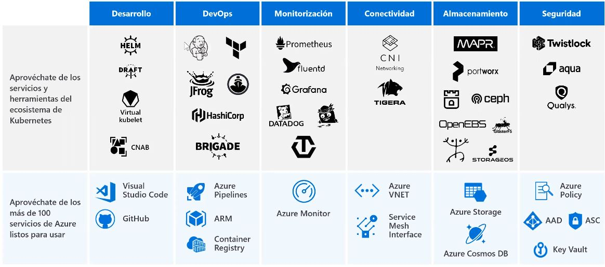
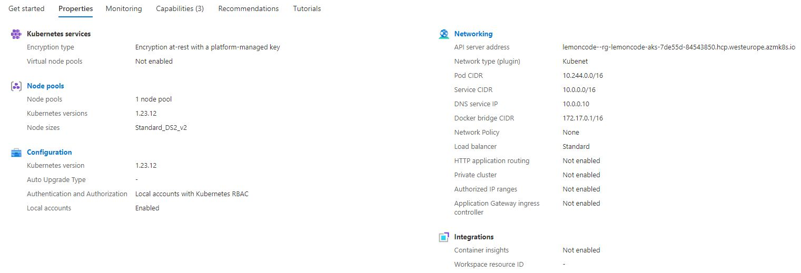
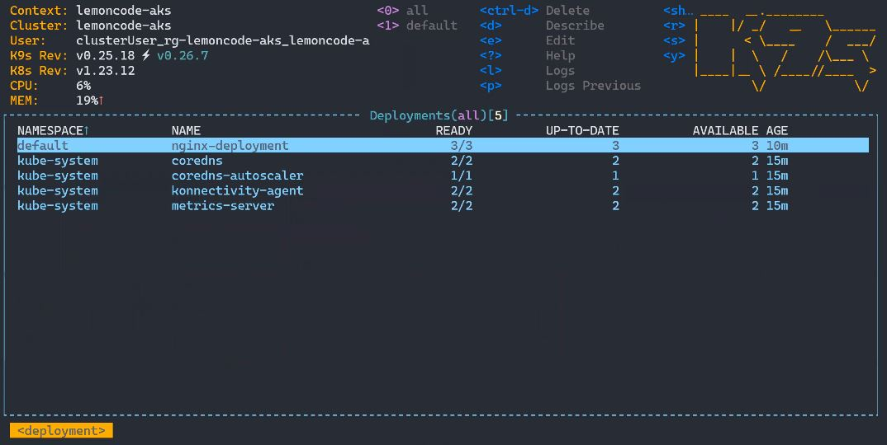
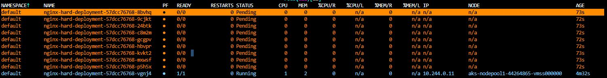
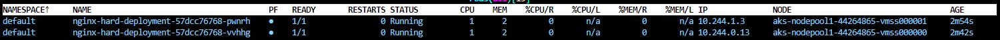
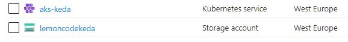
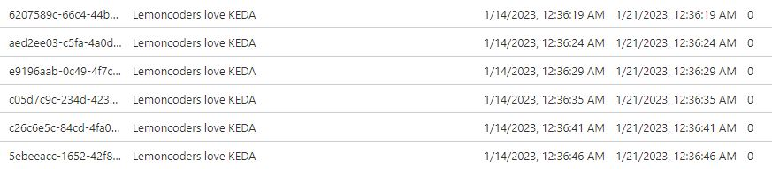

# AKS (Azure Kubernetes Service) <a name="aks"></a>

**Azure Kubernetes Service** es un servicio de *Azure* para administrar y operar contenedores orquestados sobre Kubernetes, que simplifica la implementación, la administración y el uso de Kubernetes como un servicio orquestador de contenedores totalmente administrado

**Kubernetes** por si solo no es suficiente, ya que el clúster que creemos debe ser monitorizado, poder depurar microservicios, integrarlo con CI/CD, poder utilizar Registros que guardan las imágenes de nuestros contenedores y que eso se conecto con nuestro clúster, poder conectarse a repositorio para acceder al código fuente, lo relativo a seguridad, etc. AKS nos simplifica todos estos aspectos

**Azure Advisor** proporciona recomendaciones proactivas basadas en el conocimiento de miles de interacciones con clientes, resolviendo problemas comunes desde el portal

Nos permite una gestión unificada: Nos permite controlar cualquier plataforma basada en **Kubernetes** independientemente de donde se encuentre (Azure Stack, On-premises, Multi-cloud, Edge...)

Provee de múltiples herramientas a usar



 - [Conceptos básicos](#conceptos-básicos)
   - [Instalación k9s](#instalación-k9s)
   - [Interfaz de Azure](#interfaz-de-azure)
 - [Creación de un grupo de recursos](#creación-de-un-grupo-de-recursos)
 - [Creación de un clúster de Kubernetes desde el interfaz](#creación-de-un-clúster-de-kubernetes-desde-el-interfaz)
 - [Creación de un clúster de Kubernetes desde el CLI](#creación-de-un-clúster-de-kubernetes-desde-el-cli)
 - [Creación de un clúster de Kubernetes con Terraform](#creación-de-un-clúster-de-kubernetes-con-terraform)
 - [Creación de un cluster Autoscaler desde CLI](#creación-de-un-clúster-autoscaler-desde-cli)
 - [Escalado con Virtual Kubelet](#escalado-con-virtual-kubelet)
 - [KEDA: Kubernetes Event-driven Autoscaling](#keda-kubernetes-event-driven-autoscaling)
 - [OSM: Open Service Mesh](#osm-open-service-mesh)

# Conceptos básicos
- [Índice](#aks)

Para poder usar **AKS** de forma gratuíta para este lab entramos **Visual Studio Dev Essentials** y con una cuenta de **Microsoft** nos logueamos y seleccionamos *Probar Azure de forma gratuita* y nos registramos. Desde ese momento disponemos de 30 días para usar 200$ en servicios de Azure, a partir del día 31 hay disponible solo ciertos recursos gratuitos que podemos usar durante 12 meses, y otros que son gratuitos para siempre

## Instalación k9s
- [Índice](#aks)

Una buena herramienta a medio camino entre terminal y el interfaz gráfico que nos permite ver de forma cómoda los recursos que tenemos en **Kubernetes** es **k9s**. Se instala de la forma siguiente en **WSL**

Instalamos **HomeBrew** para posteriormente instalar **k9s**
```shell
sudo apt update # Actualizamos repositorios
sudo apt-get install build-essential curl file git # Instalamos herramienta para instalar Brew
/bin/bash -c "$(curl -fsSL https://raw.githubusercontent.com/Homebrew/install/master/install.sh)" # Instalamos HomeBrew en WSL
# Añadimos Homebrew al system PATH
test -d ~/.linuxbrew && eval $(~/.linuxbrew/bin/brew shellenv)
test -d /home/linuxbrew/.linuxbrew && eval $(/home/linuxbrew/.linuxbrew/bin/brew shellenv)
test -r ~/.bash_profile && echo "eval \$($(brew --prefix)/bin/brew shellenv)" >>~/.bash_profile
echo "eval \$($(brew --prefix)/bin/brew shellenv)" >>~/.profile
```

Instalamos **k9s**
```shell
brew install derailed/k9s/k9s
```

## Interfaz de Azure
- [Índice](#aks)

### Clúster

Una vez tenemos nuestro clúster desplegado, nos vamos al **Grupo de Recursos** y entramos en el **clúster** podemos ver amplia información: Cuantos nodos tenemos, máquinas a usar por los mismos, networking, políticas, si hemos configurado autoescalado, recomendaciones, etc



Por otro lado en la barra lateral del interfaz dentro del mismo **clúster** podemos ver múltiples categorías, entres las que están los Namespaces, Workloads, Services desplegados en el clúster, si tenemos Storage, etc

### Resource Groups

Cuando desplegamos un clúster de **AKS** se nos genera automáticamente otro **Resource Group** con el nombre `MC_<nombre del Resource Group del clúster creado>`, y entrando en el mismo podemos ver información interesante:
- `vnet`: Donde está desplegado el clúster (entrando en la misma podemos ver la Subnet donde se han desplegado los nodos)
- `nodepool`: Podemos ver las Instancias (nodos) que hemos creado
  
  Podemos ver otras opciones como el `LoadBalancer`, la IP pública, tabla de rutas, etc. Todo gestionado desde el mismo portal de **Azure**

# Creación de un grupo de recursos
- [Índice](#aks)

Los **Grupos de Recursos** son especies de carpeta que nos permiten agrupar ciertos recursos. Para crear una nueva escribimos `resource groups` en el buscador de **Azure**, y una vez dentro seleccionamos `Create a resource group`, le damos nombre y en region seleccionamos `(Europe) West Europe`, y pulsamos `Review + create` y de nuevo `Create`

# Creación de un clúster de Kubernetes desde el interfaz
- [Índice](#aks)

Desde dentro del **Grupo de Recursos** pulsamos en `Create`, ponemos `aks` en el buscador del marketplace, y seleccionamos `Azure Kubernetes Service (AKS)`:
- `Cluster preset configuration`: Seleccionamos Standard
- `Kubernetes cluster name`: El que queramos
- `Region`: (Europe) West Europe
- `Availability zones`: Ninguna
- `Kubernetes version`: Por defecto
- `API server availability`: 99.9%
- `Scale method`: Manual (ya que el autoescalado lo veremos en otro ejemplo)
- `Node count`: 1 (para este ejemplo)

Seleccionamos `Next: Node pools` y aquí vemos los tipos de nodos que podemos crear (Linux o Windows). En este caso nos quedamos con el nodo de Linux por defecto. El resto de pestañas son sobre acceso, networking, container registry, etc. Por ahora pasamos directamente a `Review + create`, que ejecutará la validación, tras la cual pulsamos `Create` y el clúster se creará en unos minutos

# Creación de un clúster de Kubernetes desde el CLI
- [Índice](#aks)

Lo primero es instalarlo, en este caso lo ejecutaremos desde un contenedor de **Docker**
```shell
docker run -it mcr.microsoft.com/azure-cli
```
Aunque otra alternativa es instalarlo en Ubuntu mediante un comando
```shell
curl -sL https://aka.ms/InstallAzureCLIDeb | sudo bash
```

Para ver el subconjunto de serviios que puedes gestionar a través de la linea de comandos:
```shell
az
```

Iniciamos sesión en nuestra cuenta de Azure
```shell
az login --use-device-code
```

Nos aseguramos que estamos usando la subscripción correcta
```shell
az account set -s "<nombre subscripción>"
```

Creamos las variables para usar en los comandos siguientes
```shell
resourceGroupName="rg-lemoncode-aks" \
location="westeurope" \
aksName="lemoncode-aks"
```

Creamos un grupo de recursos en una ubicación concreta
```shell
az group create --name $resourceGroupName --location $location
```

Desplegamos el clúster
```shell
az aks create --resource-group $resourceGroupName --name $aksName --node-count 1 --generate-ssh-keys
```

Obtenemos las credenciales que nos permite conectarnos al clúster. Esto puede hacerse desde el interfaz de **Azure**, pulsando en `Contectar` desde dentro del clúster
```shell
az aks get-credentials --resource-group $resourceGroupName --name $aksName
```

Vamos a ver cuantos nodos tengo
```shell
kubectl get nodes
```

Desplegamos un servidor Nginx en el nodo. El `YAML` es el siguiente:
```yaml
# nginx-deployment.yaml

apiVersion: apps/v1
kind: Deployment
metadata:
  name: nginx-deployment
  labels:
    app: nginx
spec:
  replicas: 3
  selector:
    matchLabels:
      app: nginx
  template:
    metadata:
      labels:
        app: nginx
    spec:
      containers:
        - name: nginx
          image: nginx:1.14.2
          ports:
            - containerPort: 80
---
apiVersion: v1
kind: Service
metadata:
  labels:
    app: nginx
  name: nginx
spec:
  ports:
    - port: 80
      targetPort: 80
  selector:
    app: nginx
  type: LoadBalancer
```

Aplicamos los cambios
```shell
kubectl apply -f ./nginx-deployment.yaml
```

Vemos los servicios desplegados
```shell
kubectl get svc
```

Si vamos a la IP pública del `LoadBalancer` podremos ver que el Nginx está desplegado 

Vamos a escalar nuestros nodos
```shell
az aks scale --resource-group $resourceGroupName --name $aksName --node-count 3
```

Una buena herramienta a medio camino entre terminal y el interfaz gráfico que nos permite ver de forma cómoda los recursos que tenemos es **k9s**. Su entorno gráfico es el siguiente



A parte de poder ver los recursos, podemos ver los `YAML`, los logs, etc. A nivel de gestión desde el terminal es bastante útil

# Creación de un clúster de Kubernetes con Terraform
- [Índice](#aks)

Generamos el fichero de terraform:
```javascript
// aks.tf

provider "azurerm" {
  features {}
}

resource "azurerm_resource_group" "rg" {
  name     = "rg-lemoncode-aks-tf"
  location = "westeurope"
}

resource "azurerm_kubernetes_cluster" "aks" {
  name                = "aks-lemoncode-tf"
  resource_group_name = azurerm_resource_group.rg.name
  location            = azurerm_resource_group.rg.location
  dns_prefix          = "aks-lemoncode-tf"

  default_node_pool {
    name       = "default"
    node_count = 1
    vm_size    = "Standard_DS2_v2"
  }

  identity {
    type = "SystemAssigned"
  }
}

```

Desde el terminal nos vamos al directorio raíz donde se encuentra `aks.tf`

Lo primero es descargarnos las dependencias necesarias
```shell
terraform init
```

Aplicamos los cambios necesarios y esperamos a que el nuevo clúster se despliegue
```shell
terraform apply
```

# Creación de un clúster Autoscaler desde CLI
- [Índice](#aks)

Vamos a desplegar un Nginx que pedirá muchos recursos y que en principio no tendrá cabida cuando escale. Creamos el `YAML`:
```yaml
# nginx-hard-deployment.yaml

apiVersion: apps/v1
kind: Deployment
metadata:
  name: nginx-hard-deployment
  labels:
    app: nginx
spec:
  replicas: 1
  selector:
    matchLabels:
      app: nginx
  template:
    metadata:
      labels:
        app: nginx
    spec:
      containers:
        - name: nginx
          image: nginx:1.14.2
          ports:
            - containerPort: 80
          resources:
            requests:
              memory: 1.5G
              cpu: 1
---
apiVersion: v1
kind: Service
metadata:
  labels:
    app: nginx
  name: nginx
spec:
  ports:
    - port: 80
      targetPort: 80
  selector:
    app: nginx
  type: LoadBalancer
```

Creamos las variables para usar en los comandos siguientes
```shell
resourceGroupName="rg-lemoncode-aks-autoscaler" \
location="westeurope" \
aksName="lemoncode-aks-reloaded"
```

Creamos un grupo de recursos en una ubicación concreta
```shell
az group create --name $resourceGroupName --location $location
```

Desplegamos el clúster
```shell
az aks create --resource-group $resourceGroupName --name $aksName --node-count 1 --generate-ssh-keys
```

Obtenemos las credenciales que nos permite conectarnos al clúster
```shell
az aks get-credentials --resource-group $resourceGroupName --name $aksName
```

Desplegamos el Nginx en el clúster
```shell
kubectl apply -f ./nginx-hard-deployment.yaml
```

Ahora vamos a crear 2 réplicas
```shell
kubectl scale deployment nginx-hard-deployment --replicas=2
```

Tras esto veremos que el 2º pod que se ha intentado crear está en *Pending*. Si hacemos un `describe` veremos que no hay suficiente CPU



Para arreglar esto sin ser de forma manual o con el uso de **Virtual Kubelet**

Lo primero es actualizar este clúster para que soporte autoescalado
```shell
az aks update --resource-group $resourceGroupName --name $aksName --enable-cluster-autoscaler --min-count 1 --max-count 10
```

Tras esto podemos ver que se ha creado un nodo nuevo y ha permitido que se genere el 2º pod en dicho nodo



# Escalado con Virtual Kubelet
- [Índice](#aks)

Nos permite escalar de forma serverless sin tener que crear más nodos físicos dentro del clúster. El una forma muy rápida de escalar un clúster de **Kubernetes** en el Cloud sin tener que crear más nodos (como en el caso anteriorcon el clúster Autoscaler)

Vamos a desplegar un Nginx que pedirá muchos recursos y que en principio no tendrá cabida cuando escale. El `YAML` es el siguiente:
```yaml
# nginx-virtual-node-deployment.yaml

apiVersion: apps/v1
kind: Deployment
metadata:
  name: nginx-virtual-node-deployment
  labels:
    app: nginx
spec:
  replicas: 1
  selector:
    matchLabels:
      app: nginx
  template:
    metadata:
      labels:
        app: nginx
    spec:
      containers:
        - name: nginx
          image: nginx:1.14.2
          ports:
            - containerPort: 80
          resources:
            requests:
              memory: 1.5G
              cpu: 1
      tolerations: # Para que tolere nodos virtuales. Sin esto no se crearían pods en el nodo virtual
        - key: virtual-kubelet.io/provider
          operator: Exists
        - key: azure.com/aci
          effect: NoSchedule
---
apiVersion: v1
kind: Service
metadata:
  labels:
    app: nginx
  name: nginx
spec:
  ports:
    - port: 80
      targetPort: 80
  selector:
    app: nginx
  type: LoadBalancer
```

Creamos las variables a usar en los siguientes comandos
```shell
resourceGroupName="rg-lemoncode-aks-virtual-node" \
location="westeurope" \
aksName="aks-virtual-node" \
vnetName="vnet-virtual-node" \
subnetName="subnet-virtual-node"
```

Creamos un grupo de recursos en una ubicación concreta
```shell
az group create --name $resourceGroupName --location $location
```

Creamos la vnet que contendrá la subnet que contendrá los nodos
```shell
az network vnet create \
    --resource-group $resourceGroupName \
    --name $vnetName \
    --address-prefixes 10.0.0.0/8 \
    --subnet-name $subnetName \
    --subnet-prefix 10.240.0.0/16
```

Los nodos de nuestro clúster se van a ejecutar en una subred en particular, pero hay un servicio llamado **Azure Container Instances** que ejecuta **Instancias de contenedores** y eso lo hará en una subred aparte. Por lo que creamos la subnet donde se desplegarán los **Virtual Nodes**. 
```shell
az network vnet subnet create \
    --resource-group $resourceGroupName \
    --vnet-name $vnetName \
    --name myVirtualNodeSubnet \
    --address-prefixes 10.241.0.0/16
```

Obtenemos el ID de esa subnet
```shell
subnetId=$(az network vnet subnet show --resource-group $resourceGroupName --vnet-name $vnetName --name $subnetName --query id -o tsv)
```

Desplegamos el clúster de `AKS` dentro de la red del `AKS`
```shell
az aks create \
    --resource-group $resourceGroupName \
    --name $aksName \
    --node-count 1 \
    --network-plugin azure \
    --vnet-subnet-id $subnetId
```

Habilitamos el addons de **Virtual Nodes**, que será una feature dentro de ese clúster de `AKS`
```shell
az aks enable-addons \
    --resource-group $resourceGroupName \
    --name $aksName \
    --addons virtual-node \
    --subnet-name myVirtualNodeSubnet
```

Obtenemos las credenciales que nos permite conectarnos al clúster
```shell
az aks get-credentials --resource-group $resourceGroupName --name $aksName
```

Desplegamos el Nginx en el clúster
```shell
kubectl apply -f ./nginx-virtual-node-deployment.yaml
```

Ahora vamos a crear 4 réplicas
```shell
kubectl scale deployment nginx-virtual-node-deployment --replicas=4
```

Podemos ver que se crean las réplicas de los pods en el nodo virtual sin necesidad de crear nodos extras para poder albergar esos pods que consumen muchos recursos

# KEDA: Kubernetes Event-driven Autoscaling
- [Índice](#aks)

Si entramos en [keda.sh](https://keda.sh) podemos ver los distintos eventos para hacer escalar a nuestros pods

Para usar KEDA, hay que habilitar la marca de característica AKS-KedaPreview en la suscripción
```shell
az feature register --name AKS-KedaPreview --namespace Microsoft.ContainerService
```

Comprobar el estado del registro con el comando az feature list
```shell
az feature list -o table --query "[?contains(name, 'Microsoft.ContainerService/AKS-KedaPreview')].{Name:name,State:properties.state}"
```

Actualizar el registro del proveedor de recursos Microsoft.ContainerService
```shell
az provider register --namespace Microsoft.ContainerService
```

Instalamos la extensión *aks-preview*
```shell
az extension add --upgrade --name aks-preview
```

Creamos las variables a usar en los comandos
```shell
resourceGroupName="rg-lemoncode-aks-keda" \
location="westeurope" \
aksName="aks-keda" \
storageAccountName="lemoncodekeda" \
queueName="lemonqueue"
```

Creamos el **Grupo de Recursos**
```shell
az group create --name $resourceGroupName --location $location
```

Creamos el clúster de **AKS**
```shell
az aks create --resource-group $resourceGroupName --name $aksName --node-count 2 --generate-ssh-keys
```

Habilitamos **KEDA** usando un comando de actualización
```shell
az aks update \
    --resource-group $resourceGroupName \
    --name $aksName \
    --enable-keda
```

Obtenemos las credenciales que nos permite conectarnos al clúster
```shell
az aks get-credentials --resource-group $resourceGroupName --name $aksName
```

Creamos el `YAML` del **Deployment**
```yaml
# keda-deployment.yaml

apiVersion: apps/v1
kind: Deployment
metadata:
  name: keda-deployment
  labels:
    app: nginx
spec:
  replicas: 1
  selector:
    matchLabels:
      app: nginx
  template:
    metadata:
      labels:
        app: nginx
    spec:
      containers:
        - name: nginx
          image: nginx:1.14.2
          ports:
            - containerPort: 80
---
apiVersion: v1
kind: Service
metadata:
  labels:
    app: nginx
  name: nginx
spec:
  ports:
    - port: 80
      targetPort: 80
  selector:
    app: nginx
  type: LoadBalancer
```

Desplegamos el *Deployment*
```shell
kubectl apply -f ./keda-deployment.yaml
```

Ahora tenemos desplegados nuestro *Deployment* con 1 pod. Imaginamos que nuestra app que es nuestro *Nginx* tuviera que leer información de una cola, y dependiendo el número de mensajes tuviera que escalarse para así poder leer más mensajes de forma más rápida

**Azure** tiene el **Storage Accounts** que tiene la posibilidad de crear colas

Creamos el **Storage Account**
```shell
az storage account create \
    --name $storageAccountName \
    --resource-group $resourceGroupName
```

Añadimos el *Key* del **Storage Account** para crear una cola
```shell
accountKey=$(az storage account keys list \
    --account-name $storageAccountName \
    --resource-group $resourceGroupName \
    --query "[0].value" \
    -o tsv)
```

Creamos la cola
```shell
az storage queue create --account-name $storageAccountName --name $queueName
```

Añadimos la **Connection String**
```shell
connectionString=$(az storage account show-connection-string \
    --name $storageAccountName \
    --resource-group $resourceGroupName \
    -o tsv)
```

Ahora vamos a crear varias cosas dentro del clúster. Lo primero es crear un secreto con la cadena de conexión de la **Storage Account**
```shell
kubectl create secret generic keda-queue-secret \
    --from-literal=connection-string=$connectionString
```

En este punto si vamos a **Azure** y vamos a nuestro **Resource Group** podemos ver que se ha creado el **clúster** y la **Storage Account**



Si entramos en el **Storage Account** y vamos a **Queues** y entramos en ella podemos ver que está vacía

Ahora creamos el `YAML` de un**Scaled Object**
```yaml
# scaled-object.yaml

apiVersion: keda.sh/v1alpha1
kind: TriggerAuthentication
metadata:
  name: azure-queue-auth
spec:
  secretTargetRef: # Trigger de autentificación que usa el secreto con la cadena de conexión creada
    - parameter: connection
      name: keda-queue-secret
      key: connection-string

---

apiVersion: keda.sh/v1alpha1
kind: ScaledObject
metadata:
  name: azure-queue-scaledobject
  namespace: default
spec:
  scaleTargetRef: # Decimos que tiene que escalar
    name: keda-deployment
  minReplicaCount: 0 # Si no hay nada en la cola no quiero ningún pod
  maxReplicaCount: 5 # Cuando haya algo puede escalar hasta 5
  cooldownPeriod: 1 # Cuando haya dejado de tener mensajes nuevos, espera 1 minuto para desescalar
  triggers:
   - type: azure-queue # Hacemos el trigger en base a la azure-queue creada
     metadata:
      queueName: lemonqueue # Aportamos el nombre de la queue
      queueLength: "7" # Por cada 7 mensajes escalará 1 pod hasta llegar a un máximo de 5
     authenticationRef:
       name: azure-queue-auth # Nos autentificamos con el Trigger de autentificación que está más arriba definido
```

Creamos el **Scaled Object**
```shell
kubectl apply -f ./scaled-object.yaml
```

Ahora vamos a generar mensajes en esa cola
```shell
while true; do az storage message put --content "Lemoncoders love KEDA" --queue-name $queueName --account-name $storageAccountName --account-key $accountKey; done
```

Ahora podemos ver que se están creando mensajes



Si nos vamos al *Deployment* veremos que mientras se generan los mensajes se van replicando los pods hasta llegar a un máximo de 5. Cuando paremos el bucle y limpiemos la lista de mensajes tras unos segundos los pods serán eliminados y el *Deployment* quedará a 0

# OSM: Open Service Mesh
- [Índice](#aks)

Es una herramienta que podemos añadir dentro de nuestro **clúster** que nos va a permitir securizar el tráfico entre pods, controlar su tráfico, entre otras utilidades a nivel de *Networking*

Definimos las variables a usar
```shell
resourceGroupName="rg-lemoncode-aks-osm" \
location="westeurope" \
aksName="aks-osm"
```

Creamos el **Grupo de Recursos**
```shell
az group create --name $resourceGroupName --location $location
```

Creamos el clúster de **AKS**
```shell
az aks create --resource-group $resourceGroupName --name $aksName --node-count 2 --generate-ssh-keys
```

Habilitamos el addon de **OSM** en el 
```shell
az aks enable-addons \
  --resource-group $resourceGroupName \
  --name $aksName \
  --addons open-service-mesh
```

Obtenemos las credenciales que nos permite conectarnos al clúster
```shell
az aks get-credentials --resource-group $resourceGroupName --name $aksName
```
Creamos un *Namespace* específico
```shell
kubectl create ns osm
```

Le decimos a **OSM** que monitorice ese *Namespace*
```shell
kubectl label ns osm openservicemesh.io/monitored-by=osm
```

Creamos el `YAML` de un *Deployment* de *Nginx*
```yaml
# nginx-osm-deployment.yaml

--- # Creamos Service Account
apiVersion: v1
kind: ServiceAccount
metadata:
  creationTimestamp: null
  name: nginx
  namespace: osm
--- # Creamos 1 pod de Nginx con ese Service Account
apiVersion: v1
kind: Pod
metadata:
  name: nginx
  namespace: osm
  labels:
    run: nginx
  annotations:
    openservicemesh.io/sidecar-injection: enabled # Le decimos a OSM que puede inyectar su sidecar
spec:
  containers:
  - image: nginx
    name: nginx
    ports:
    - containerPort: 80
  serviceAccountName: nginx  # Definimos el Service Account para posteriormente usarse para habilitar el tráfico entre ciertos pods a través del Traffic Target
--- # Creamos un servicio
apiVersion: v1
kind: Service
metadata:
  creationTimestamp: null
  name: nginx
  namespace: osm
spec:
  ports:
  - port: 80
    protocol: TCP
    targetPort: 80
  selector:
    run: nginx
```

Creamos el `YAML` de un *busybox*
```yaml
# busybox-deployment.yaml

--- # Creamos Service Account
apiVersion: v1
kind: ServiceAccount
metadata:
  creationTimestamp: null
  name: busybox
  namespace: osm
--- # Creamos 1 pod
apiVersion: v1
kind: Pod
metadata:
  name: busybox
  namespace: osm
  labels:
    run: busybox
  annotations:
    openservicemesh.io/sidecar-injection: enabled # Le decimos a OSM que puede inyectar su sidecar
spec:
  containers:
  - image: busybox
    name: busybox
    ports:
    - containerPort: 80
    command:
    - sh
    - -c
    - sleep 3600
  serviceAccountName: busybox # Definimos el Service Account para posteriormente usarse para habilitar el tráfico entre ciertos pods a través del Traffic Target
```

Desplegamos un *Deployment* de *Nginx* y el *busybox*
```shell
kubectl apply -f ./nginx-osm-deployment.yaml -n osm # Desplegamos el deployment en ese Namespace
kubectl apply -f ./busybox-deployment.yaml -n osm # Desplegamos busybox en ese Namespace
```

Si desde **k9s** observamos el *Namespace* veremos que se ha creado el pod de *Nginx* y el *busybox* y que hay 2 contenedores en cada uno, pero en realidad es el contenedor correspondiente y otro contenedor de **envoy** que **OSM** ha inyectado en mi pod, por lo que todo tráfico entre los 2 servicios pasan por ese **envoy**

Abrimos el terminal de *busybox* y nos conectamos al *Nginx*
```shell
kubectl exec -it busybox -c busybox -n osm -- sh # Abrimos terminal de busybox
wget -O- http://nginx # Nos conectamos al Nginx
```

Podemos comprobar que se ha conectado correctamente al estar ese contenedor de **envoy** ahí ha permitido la conexión entre esos 2 servicios a través de **mTLS**, por lo que ha securizado las 2 peticiones a pesar de estar haciendo una petición al puerto 80. Básicamente el tráfico va dede el *busybox*, entro en el **envoy**, luego este **envoy** hizo una petición de forma segura al **envoy** del *Nginx*, y luego llegó al *Nginx*

Por defecto **OSM** tiene una política enfocada a permitir el tráfico entre pods. Vamos a probar no haciéndola permisiva a no ser que le especifiquemos un pod concreto:
```shell
kubectl patch meshconfig osm-mesh-config -n kube-system -p '{"spec":{"traffic":{"enablePermissiveTrafficPolicyMode":false}}}' --type=merge # Deshabilitamos conexión entre pods por defecto
```

Abrimos el terminal de *busybox* y nos conectamos al *Nginx*. Pudiendo comprobar que ahora no podemos conectarnos al mismo
```shell
kubectl exec -it busybox -c busybox -n osm -- sh # Abrimos terminal de busybox
wget -O- http://nginx # Nos conectamos al Nginx
```

Creamos el `YAML` del **Traffic Target**
```yaml
# traffic-target.yaml

apiVersion: specs.smi-spec.io/v1alpha4
kind: HTTPRouteGroup
metadata:
  name: all-routes
  namespace: osm
spec:
  matches:
  - name: everything
    pathRegex: "/*" # Todas las rutas cuyos paths empiecen por / (/get, /post...), en ese grupo voy a permitir ciertos tráficos
    methods: ["*"]
--- # Voy a permitir que el tráfico cuya Service Account sea "busybox" esté habilitado para la Service Account "nginx"
apiVersion: access.smi-spec.io/v1alpha3
kind: TrafficTarget
metadata:
  name: nginx
  namespace: osm
spec:
  destination:
    kind: ServiceAccount
    name: nginx
    namespace: osm
  rules:
  - kind: HTTPRouteGroup
    name: all-routes
    matches:
    - everything
  sources:
  - kind: ServiceAccount
    name: busybox
    namespace: osm
```

Aplicamos un **Traffic Target** para dejar conexión entre pods específicos
```shell
kubectl apply -f ./traffic-target.yaml -n osm
```

Abrimos el terminal de *busybox* y nos conectamos al *Nginx*. Pudiendo comprobar que ahora si que podemos conectarnos al mismo
```shell
kubectl exec -it busybox -c busybox -n osm -- sh # Abrimos terminal de busybox
wget -O- http://nginx # Nos conectamos al Nginx
```

Por lo que **OSM** nos permite bloquear el tráfico entre pods y crear unas reglas para definir que pods pueden hablar entre ellos, gracias a que ha inyectado **envoy** para que la comunicación sea en este caso **envoy-envoy** y no **busybox-nginx**

