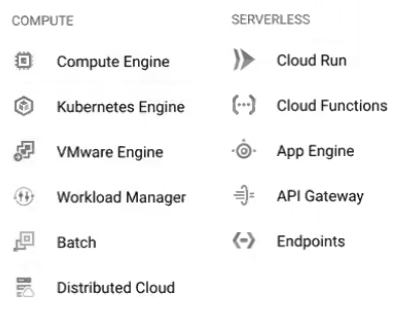

# GKE (Google Kubernetes Engine) <a name="gke"></a>
- [Despliegue de contenedor de Kubernetes en Cloud Run](#despliegue-de-contenedor-de-kubernetes-en-cloud-run)
- [Creación de la imagen del contenedor mediante CLI](#creación-de-la-imagen-del-contenedor-mediante-cli)
- [Creación de un clúster en la Consola de GCP](#creación-de-un-clúster-en-la-consola-de-gcp)
  - [Autopilot GKE](#autopilot-gke)
  - [Desplegar un contenedor sobre nuestro clúster de GKE](#desplegar-un-contenedor-sobre-nuestro-clúster-de-gke)
  - [Standard GKE](#standard-gke)
  - [Creación de un clúster mediante CLI](#creación-de-un-clúster-mediante-cli)
  - [Creación de un clúster mediante CLI en modo Autopilot](#creación-de-un-clúster-mediante-cli-en-modo-autopilot)

Es un servicio gestionado de Kubernetes de la nube de **Google** que se encarga de proporcionarle a sus clientes un entorno completamente administrado, donde pueden llevar a cabo las tareas de implementación, gestión y escalado de datos y aplicaciones pertenecientes a los contenedores, a través del uso de la infraestructura de **Google Cloud Platform (GCP)**

Tenemos que hacernos una cuenta de **Google Cloud** y una vez dentro de la consola vemos un interfaz que muestra diversos elementos: Quick access (con los servicios más usados), Dashboard (con toda la información de lo que está pasando en mi entorno)

En cuanto a la organización de recursos, en **GCP** trabajan con el concepto de *proyecto* (en AWS es *cuenta* y en Azure es *suscripción*), pudiendo desplegar sus recursos, gestionar la facturación y permisos. Podemos tener proyectos multi-region, por lo que tendríamos un *clúster* en cada una y todo estaría en mi *proyecto*

En la parte superior-izquierda tenemos el menú que al ser desplegado podemos ver todos los servicios. Al trabajar con *contenedores* vamos a trabajar con 2 bloques de servicios: **Compute** y **Serverless**



En **GCP** hay 3 maneras de desplegar: Consola de **GCP**, CLI o IaC (con **Terraform** o llamando a la *API* directamente)

# Despliegue de contenedor de Kubernetes en Cloud Run
- [Índice](#gke)

En **Cloud Run** tenemos: **Cloud Run Services** (para exponer web o app invocada a través de endpoint HTTPS) y **Cloud Run Jobs** (Ejecutar algo que funcione hasta que se termine el *Job*)

Vamos a crearnos un *servicio* a través de la *Consola*. Pulsamos en `Create Service` y se nos abre una ventana con las siguientes opciones:
- Elegir entre coger la imagen de nuestro contenedor desde el **Container Registry** o vincularlo a un **Repositorio** de forma que cada vez que se actualice el mismo, se haga un *build* del contenedor y se despliegue en **Cloud Run**
- `Service name`: Nombre del *servicio*
- `Region`: Región donde quiero desplegar mi contenedor, que puede ser de 2 formas: desplegarlo en un *clúster* que he creado previamente y aparecería en el listado de `Region`, o dejamos que **GCP** se encargue de todo y elegimos una de las regiones que nos muestra
- `CPU allocation and pricing`: Si queremos que la CPU sea provista cuando hagamos una petición o esté siempre disponible
- `Autoscaling`: El mínimo y máximas *instancias* que queremos que se autoescalen
- Si queremos que el acceso al *servicio* sea público o interno
- `Authentication`: Si quiero que las peticiones al servicio tengan que ser autentificadas o no
Entre otras opciones como el puerto del contenedor, otras opciones de networking y seguridad. Tras darle a `Create`, coge la imagen de nuestro contenedor y crea un *Endpoint* securizado para que pueda acceder a mis servicios

# Creación de la imagen del contenedor mediante CLI
- [Índice](#gke)

Desde dentro del *proyecto*, abrimos el **Cloud Shell** pulsando en el siguiente botón  en la esquina superior derecha. Una vez abierta tenemos también un editor pulsando `Open Editor` para poder editar los ficheros del *proyecto*. Si tenemos varias carpetas, cada una con una aplicación y queremos desplegar una en un contenedor a un *clúster* de manera fácil. Desde el **Cloud Shell** hacemos:
1. `cd <carpeta aplicación>` para entrar en el directorio de la app a desplegar
2. `gcloud run deploy` para iniciar el *build* de la imagen y el despliegue
3. Al estar ya dentro del directorio de la app damos a *enter*, o si no escribiríamos la ruta del directorio de la app
4. Damos nombre al servicio
5. Autorizamos a **Cloud Shell** para que pueda hacer peticiones a **GCP**
6. Elegimos la `Region`

De esta forma nuestra app se ha contenerizado y desplegada en un *clúster* de **GCP**

# Creación de un clúster en la Consola de GCP
- [Índice](#gke)

Desplegamos el menú de opciones y vamos a `Kubernetes Engine > Create`. Posteriormente nos muestra 2 opciones:
- `Autopilot`: Pagamos por pod, no por nodo y tenemos que tocar menos configuración. Aquí los nodos se crearán en función al número de peticiones a nuestra app
- `Standard`: Pagamos por nodo (virtual machine) y tenemos que gestionar ciertos aspectos de la configuración

## Autopilot GKE
- [Índice](#creación-de-un-clúster-en-la-consola-de-gcp)

En la ventana de creación del **Autopilot Cluster** nos aparecen diversas opciones:
- `Cluster basics`: Ponemos el nombre y la región
- `Networking`: Configuramos la red, la subnet, si queremos clúster público/privado, etc
- `Advanced settings`: Aquí configuramos como gestionar las actualizaciones de las versiones de **Kubernetes**, Automation (configurar horas donde se realizarían las actualizaciones), Anthos Service Mesh (Para desplegar Istio en nuestro clúster y así tener mejor control de los servicios), Security (ciertas opciones de seguridad), y Metadata (por si quiero ponerle etiquetas a mi clúster)
- `Review and create`: Nos muestra todo lo seleccionado y que opciones (con candado) no van a poder volver a modificarse

Finalmente damos a `Create` y comenzará a crearse el clúster

## Desplegar un contenedor sobre nuestro clúster de GKE
- [Índice](#creación-de-un-clúster-en-la-consola-de-gcp)

Si desplegamos el menú de opciones y vamos a `Kubernetes Engine > Deploy`, por si queremos desplegar un contenedor directamente, seleccionando el tipo de imagen, la ruta de la misma, variables de entorno, namespace, yaml de la configuración, clúster donde desplegarlo, etc

Esto también nos sirve cuando tenemos nuestra app en el clúster y queremos hacer un nuevo *deployment* de la misma

## Standard GKE
- [Índice](#creación-de-un-clúster-en-la-consola-de-gcp)

De esta forma podemos crear el clúster pero teniendo muchas más opciones de configuración. Una vez dentro podríamos usar la opción `Use a Setup Guide` que nos da la opción de crear 2 tipos de clusters (barato o para máxima eficacia) mediante la ayuda de un asistente de configuración

Si decidimos hacerlo de la forma normal, solo tenemos que ir navegando por las distintas opciones:
- `Cluster basics`
  - `Name`: Nombre del clúster
  - `Location type`: Zonal (en 1 sola zona) o Regional (se despliega en varias zonas)
  - `Control plane version`: Configurar las actualizaciones del clúster
- `Node Pools`
  - `default-pool`: Las opciones del nodo por defecto
    - `Name`: Nombre del node pool
    - `Size`: Número de nodos que queremos
    - `Enable cluster autoscaler`: Si habilitamos el autoescalado y opciones al respecto
    - `Specify node locations`: Especificar las zonas de los nodos
    - `Node Pool Upgrade Strategy`: La forma en la que se realizará la actualización del node pool
  - `Nodes`: Opciones a nivel de las máquinas virtuales
    - `Image type`: Tipos de imágenes que podemos utilizar
    - `Machine configuration`: Opciones relacionadas con el tipo de máquinas virtuales
      - `Series`: Da a elegir entre máquinas con distintos procesadores
      - `Machine type`: Tamaño de los nodos (nº de CPUs y memoria RAM)
      - `Boot disk encryption`: Configuración del cifrado de los discos
  - `Networking`: Networking del node pool
    - `Maximum Pods per node`: Número máximo de pods por nodo a nivel de node pool
    - `Network tags`: Etiquetas para los nodos
    - `Node Pool Address Range`: Podríamos definir diferentes rangos de IPs para las distintas node pools
  - `Security`
    - `Service account`: Service Account a usar para conectarse a los distintos servicios de **GCP**
    - `Access scopes`: Nivel de acceso del clúster a las distintas *APIs* de **GCP**
  - `Metadata`: Crear etiquetas a nivel de **Kubernetes**, Crear *Node taints* para que no sean usados por ciertos pods
- `Cluster`
  - `Automation`: Habilitar ventana de mantenimiento, habilitar notificaciones, autoescalado pods y nodos
  - `Networking`: Networking del clúster
    - `Network`: Configuramos la red
    - `Node subnet`: la subred para los nodos
    - `IP stack type`: Uso de IPv4, o IPv4 y IPv6
    - `IPv4 network access`: Si quiero el clúster público o privado
    - `Maximum Pods per node`: Número máximo de pods por nodo a nivel de clúster
    - `DNS provider`: Proveedor de DNS a utilizar
  - `Security`: Opciones de seguridad a nivel de clúster
  - `Metadata`: Para meter información a nuestro clúster
  - `Features`:
    - `Enable Cloud Run for Anthos`: Si queremos desplegar el contenedor pero que el clúster sea nuestro, al habilitar esto, la próxima vez que entre en **Cloud Run** me preguntará donde desplegar
    - Otro tipos de opciones adicionales

Finalmente en la parte inferior tenemos 3 opciones:
- `Create`: Creamos el clúster con las opciones anteriormente elegidas
- `Rest`: Para desplegar el clúster a partir de la API
- `CLI`: Para desplegar el clúster a través de la línea de comandos

Una vez hemos creado el clúster y entramos en el mismo podemos ver todos los detalles. Si queremos conectarnos al mismo pulsamos `Connect` y podemos conectarnos por el CLI o por el Dashboard

# Creación de un clúster mediante CLI
- [Índice](#gke)

Desde dentro del *proyecto*, abrimos el **Cloud Shell** y escribimos los siguientes comandos para crear el clúster

Definimos el *Project ID* con el que vamos a trabajar
```shell
PROJECT_ID="<id del proyecto>"
```

Zona donde vamos a desplegar el clúster
```shell
ZONE="europe-west1-c"
```

Vamos a clonar el repositorio que contiene una aplicación de una boutique y que permite probar casi todas las funcionalidades de **GKE**
```shell
git clone https://github.com/GoogleCloudPlatform/microservices-demo.git
```

Creamos el clúster
```shell
gcloud container clusters create onlineboutique \
    --project=${PROJECT_ID} \
    --zone=${ZONE} \
    --machine-type=e2-standard-4 \
    --num-nodes=4 \
    --workload-pool=${PROJECT_ID}.svc.id.goog
```

Damos a `Connect` para conectarnos a nuestro clúster por **Cloud Shell** e introduciendo el comando que nos muestra en pantalla


Una vez dentro del clúster. Desplegamos la app de la boutique (con todos los microservicios) que clonamos anteriormente
```shell
kubectl apply -f ./release/kubernetes-manifests.yaml
```

Si voy al menú principal a `Compute Engine > VM instances` puedo ver las Instancias EC2 que se van a ir creando

Una vez creado podemos ver que especifica los 4 nodos que hemos creado

Si dentro de mi clúster voy a `Service & Ingress` veré todos los servicios desplegados y el servicio `frontend-external` que es de tipo *LoadBalancer* nos mostrará la IP pública a la que conectarnos a nuestra app

En el apartado de `Workloads` podemos ver gráficas de rendimiento de los distintos *Namespaces* y los *cost optimizations*

# Creación de un clúster mediante CLI en modo Autopilot
- [Índice](#gke)

Desde dentro del *proyecto*, abrimos el **Cloud Shell** y escribimos los siguientes comandos para crear el clúster

Definimos el *Project ID* con el que vamos a trabajar
```shell
PROJECT_ID="<id del proyecto>"
```

Región donde vamos a desplegar el clúster. Ya que **Autopilot** va a distribuir por su cuenta los nodos en las distintas zonas de una region
```shell
ZONE="europe-westl-c"
```
 
Creamos el clúster
```shell
gcloud container clusters create-auto onlineboutiqueauto \
    --project=${PROJECT_ID} \
    --region=${REGION} \
    --machine-type=e2-standard-4 \
    --num-nodes=4 \
    --workload-pool=${PROJECT_ID}.svc.id.goog
```

Para despegar en este clúster, damos a `Connect` para conectarnos a nuestro clúster por **Cloud Shell** e introduciendo el comando que nos muestra en pantalla

Vamos a clonar el repositorio que contiene una aplicación de una boutique y que permite probar casi todas las funcionalidades de **GKE**
```shell
git clone https://github.com/GoogleCloudPlatform/microservices-demo.git
```

Una vez dentro del clúster. Desplegamos la app de la boutique (con todos los microservicios) que clonamos anteriormente
```shell
kubectl apply -f ./release/kubernetes-manifests.yaml
```

Una vez creado vemos que no especifica nodos en esta opción ya que son gestionados por **GKE**, aparte que cuando ha detectado la necesidad a nivel de rendimiento de nuestra app desplegada ha creado las CPUs y memoria RAM que considera necesarias de forma automática

Otra opción que hay dentro de cada clúster creado es el botón `Register` para gestionarlo desde el menú principal `Anthos` (panel único para todos los clústers), desde el que podríamos ver todos los clústers que tenemos desplegados, incluso en otras *Clouds* y *on-prem*, pudiendo entre otras cosas establecer de forma unificada las políticas de seguridad. También dentro de `Anthos > Service Mesh` nos hace una representación gráfica de todos los microservicios de nuestra app y los tiempos de comunicación, latencias, etc, para así podamos detectar cuellos de botella, problemas en el desarrollo, etc. Siendo más fácil de gestionar en **Anthos** que en **Istio**