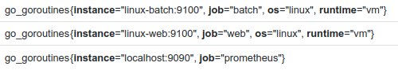
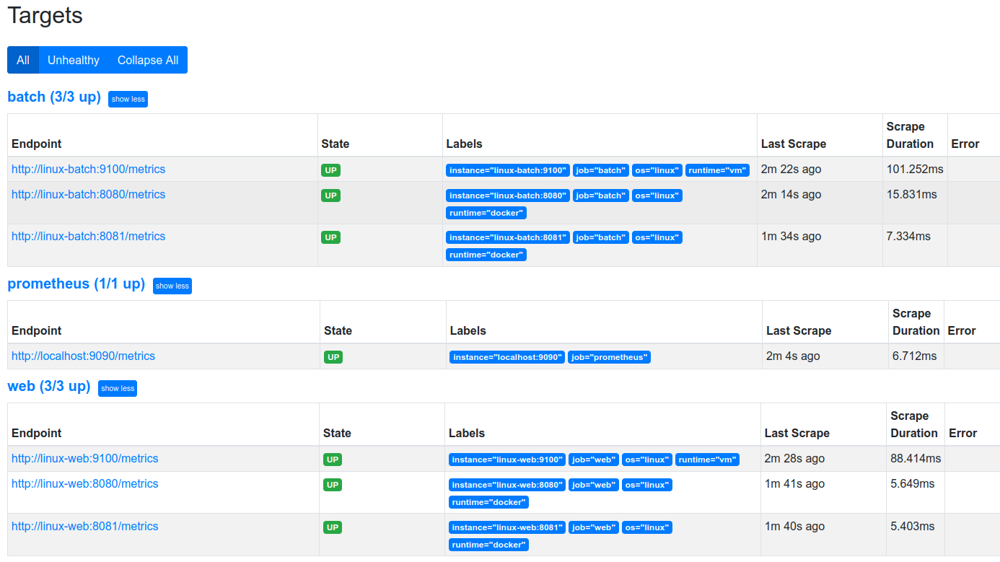

# Prometheus


- [Prometheus](#prometheus)
  - [Introducción](#introducción)
  - [Tipos de métricas](#tipos-de-métricas)
    - [Counter](#counter)
    - [Gauge](#gauge)
    - [Summary](#summary)
    - [Histogram](#histogram)
  - [Node.js Client Library](#nodejs-client-library)
    - [Instalación](#instalación)
    - [Creamos nuestras custom metrics](#creamos-nuestras-custom-metrics)
    - [Actualizamos la lógica de procesos](#actualizamos-la-lógica-de-procesos)
    - [Recuperamos las métricas](#recuperamos-las-métricas)
  - [Counters \& Gauges](#counters--gauges)
    - [Configuración](#configuración)
    - [Proceso Batch](#proceso-batch)
    - [Node Exporter](#node-exporter)
  - [Summaries \& Histograms](#summaries--histograms)
    - [Creamos las métricas](#creamos-las-métricas)
    - [Actualizamos index.js](#actualizamos-indexjs)
    - [Comprobamos la app](#comprobamos-la-app)
  - [Ejecutar Prometheus](#ejecutar-prometheus)
    - [Configuración](#configuración-1)
    - [Descargar el servidor Prometheus](#descargar-el-servidor-prometheus)
    - [Ejecutamos Prometheus con la configuración por defecto](#ejecutamos-prometheus-con-la-configuración-por-defecto)
    - [Explorando la UI de Prometheus](#explorando-la-ui-de-prometheus)
  - [Configurar Prometheus](#configurar-prometheus)
    - [Configuración estática de los scrape targets](#configuración-estática-de-los-scrape-targets)
    - [Exploramos los nuevos targets](#exploramos-los-nuevos-targets)
    - [Hacer una actualización en vivo del config](#hacer-una-actualización-en-vivo-del-config)
  - [Filtrado y enriquecimiento de Labels](#filtrado-y-enriquecimiento-de-labels)
    - [Uso de relabel para dar consistencia](#uso-de-relabel-para-dar-consistencia)
    - [Manipulando métricas y labels en configuración](#manipulando-métricas-y-labels-en-configuración)
  - [PromQL Environment](#promql-environment)
    - [Gauges](#gauges)
    - [Counters](#counters)
    - [Summaries](#summaries)
    - [Histograms](#histograms)

## Introducción

 - [Índice](#prometheus)

El **DevOps** es una figura fundamental en el mundo de los *microservicios*. Cuando trabajamos con ellos necesitamos un **logging centralizado** (importa más a Desarrollo) y **monitorización** (importa más a Infraestructura). Necesitamos generar *trazas* para saber donde empieza un servicio, a quien ha llamado y donde ha muerto. Una herramienta de **monitorización** importante es **Prometheus**, que se va conectando a los distintos servicios y va recopilando las métricas a lo largo del tiempo, creando las **Time Series**, que constan de un valor y cuando se generó el mismo

Prometheus se genera en un solo nodo y tiene la capacidad de **monitorizar** bastantes elementos. Al usar **Kubernetes** lo tendremos en un *clúster*, y podemos tener a **Prometheus** dentro o fuera del *clúster* de **Kubernetes** (aunque perderíamos ciertas ventajas). **Prometheus** trae un *Service Discovery* y este mecanismo depende de donde hayamos desplegado **Prometheus**. El *Service Discovery* más sencillo es el **file-based service discovery** que hace *scraping* de nuestros *targets (nodos)* y los almacena en un *JSON*. **Kubernetes** viene con su propio mecanismo de *Service Discovery* que está escuchando a su *API* y cuando aparecen nuevos recursos (los definidos por el sistema), los registra para su monitorización. Por lo que si generamos métricas personalizadas en nuestra app y queremos que sean descubiertas por **Kubernetes**, habría que exponerlas o por configuración pasarle a **Prometheus** dentro de nuestro *clúster* de **Kubernetes** donde se están exponiendos esas métricas

**Prometheus** va a estar monitorizando continuamente esos *endpoints* y tiene un gestor de alertas para que avise al alcanzar cierto umbral por email, notificación por **Slack**,  etc

**Prometheus** tiene su propio lenguaje llamado **PromQL** que es sencillo y potente. **Prometheus server** nos va a exponer un interfaz web donde se pueden lanzar unas *queries* con **PromQL**, aunque lo más típico es usar **Grafana**, que nos deja consumir los datos obtenidos a través de **Prometheus** y podremos generar *dashboards* más interesantes

Hay [client libraries](https://prometheus.io/docs/instrumenting/clientlibs/) para **Prometheus** que debemos configurar acorde al lenguaje de nuestra app para así crear métricas personalizadas. Cuando queremos métricas de un nodo en Linux o de Nginx usamos los **exporters**, que son procesos que instalamos que recogen métricas del lenguaje que sean y las traducen al lenguaje de **Prometheus**

## Tipos de métricas

 - [Índice](#prometheus)

Con una sola métrica no tenemos suficiente, necesitamos varias métricas. Si medimos el nº total de peticiones a distintas horas y vemos la tasa de variación entre las mismas, y a la vez medimos la CPU y memoria RAM y están estables, es buena señal. Pero si por ejemplo en un pico de peticiones sube la CPU y la memoria RAM, y tras bajar las peticiones la CPU y la memoria RAM se mantienen, en ese caso hay algo que no va bien. Por eso varias métricas son necesarias cuando queremos ver si algo está ocurriendo. Con **Counter** y **Gauge** ya se puede sacar bastante información

### Counter

 - [Índice](#prometheus)

Un `Counter` es un tipo de métrica que siempre aumenta, es un contador que va en incremental. Nos sirve por ejemplo para ver el nº total de peticiones a distintas horas y ver la tasa de variación entre las mismas

### Gauge

 - [Índice](#prometheus)

El `Gauge` es un tipo de métrica que toma un `snapshot` the un valor cambiante. Su valor evoluciona de 0 a determinada cantidad. Nos sirve por ejemplo para ver el nº de peticiones activas en mi sistema en un cierto instante

### Summary

 - [Índice](#prometheus)

El `Summary` es un tipo de métrica que sirve para tomar el tamaño medio de algo. Es una métrica que presenta dos tipos de información: `count` (el número de veces que ha ocurrido el evento) y `sum` (la suma de todos los eventos)

### Histogram

 - [Índice](#prometheus)

El `Histogram` guarda los datos en `buckets` (intervalos), el valor devuelto es la cuenta de eventos por cada `bucket`. Se incluye el total de eventos en el bucket con label `+Inf`.
Ej: calculo en segundos de un histogram, va tllenando los buckets que le corresponde en cada momento

## Node.js Client Library

 - [Índice](#prometheus)

Vamos a ver las métricas de una app. Emularemos que se van a estar ejecutando varios *jobs*, y algunos lo harán de forma satisfactoria y otros van a ir fracasando

### Instalación

 - [Índice](#prometheus)

Vamos a instalar el cliente de **Prometheus**, Aunque el proceso sería similar en otros lenguajes. En el caso de Node.js el cliente de Prometheus es [prom-client](https://github.com/siimon/prom-client)

Para hacer hacer la demo vamos a copiar el contenido de [de la carpeta batch a nuestro directorio de trabajo](extra/.demos/01-counters-gauges/.start/batch/). Desde dicha carpeta y teniendo *Node.js* instalado, instalamos el **prom-client**
```shell
npm i prom-client
```

### Creamos nuestras custom metrics

 - [Índice](#prometheus)

Creamos el fichero *custom-metrics.js*
```js
// custom-metrics.js

const promClient = require('prom-client');

// Reference: https://github.com/siimon/prom-client/blob/master/example/counter.js
// Generamos un Counter
const counter = new promClient.Counter({ 
// Cuando generamos una métrica con Prometheus hay que dar 2 cosas: nombre de métrica y el campo 'help'
name: 'worker_jobs_total',  //nombre de la metrica
help: 'Total jobs handled', // es un comentario para entender las metricas
labelNames: ['code'] // Etiquetas
});

// Reference: https://github.com/siimon/prom-client/blob/master/example/gauge.js
// Generamos un Gauge
const gauge = new promClient.Gauge({
    name: 'worker_jobs_active',
    help: 'Worker jobs in process'
  });

// Ambas métricas se exportan al fichero batch.js
module.exports.counter = counter;
module.exports.gauge = gauge;
```

### Actualizamos la lógica de procesos

 - [Índice](#prometheus)

Actualizamos *batch.js*
```js
// batch.js

/*diff*/
const { counter, gauge } = require('./custom-metrics'); // Importamos las métricas del fichero custom-metrics.js
/*diff*/

const getRandom = (start, end) => Math.floor((Math.random() * end) + start);

const randomBatchProcess = () => {
  const jobs = getRandom(50, 500); // Jobs generados
  const failed = getRandom(1, 50); // Jobs fallidos
  const processed = jobs - failed; // Restamos a los generados los fallidos
  const active = getRandom(1,100);
  return { active, failed, processed };
};

module.exports.batch = () => {
  const intervalId = setInterval(() => {
    const { active, failed, processed } = randomBatchProcess();

/*diff*/
    counter.labels('200').inc(processed); // le decimos que coja el labels de custom y le ponemo 200 segundos y que mida el incremento del proceso
    counter.labels('500').inc(failed); // lo mismo que arriba pero con los fallos

    gauge.set(active);// Gauge ve cada 5 segundos los que hay activos
/*diff*/

  }, 5_000); // Se va a ejecutar cada 5 segundos

  return intervalId;
};
```

### Recuperamos las métricas

 - [Índice](#prometheus)

Recuperaremos las métricas que expone por defecto `prom-client` actualizando *index.js*. Creamos el *endpoint* para ver las métricas
```diff
# index.js

const express = require('express');
+const promClient = require('prom-client');
const { port } = require('./config');
const { batch } = require('./batch');

# Nos traemos dos librerías de prom-client
+const { register, collectDefaultMetrics } = promClient; 

# Decimos como coger las métricas por defecto, podemos poner defaul o otra palabra.
+collectDefaultMetrics({ prefix: 'default_' });

const intervalId = batch();
const app = express();

# Creamos el endpoint para las métricas
app.get('/metrics', async (_, res) => {
  try {
    
    res.send('Not implemented yet');
  } catch (ex) {
    res.status(500).end(ex);
  }
});

app.post('/stop', (_, res) => {
  clearInterval(intervalId);
  res.send('batch process stopped');
});

app.listen(port, () => {
  console.log(`Listening at ${port}`);
});
```

Por último tenemos que indicar a `prom-client`, cuando debemos volcar las métricas:

```diff
# index.js

app.get('/metrics', async (_, res) => {
  try {
# Recogemos las métricas
-   res.send('Not implemented yet');
+   res.set('Content-Type', register.contentType);
+   res.end(await register.metrics()); 
  } catch (ex) {
    res.status(500).end(ex);
  }
});

Si ejecutamos nuestra aplicación ahora podremos ver como las métricas son expuestas en el formato `Prometheus`

```bash
# Hacemos que escuche por el  puerto 3000
npm start
```

Y desde otra terminal, podemos verificar la salida con `curl localhost:3000/metrics`. Donde se mostrará primero las custom metrics y luego el resto


## Counters & Gauges

 - [Índice](#prometheus)

### Configuración

 - [Índice](#prometheus)

Para esta demo usaremos **Vagrant**, que es un gestor de VM, al que le damos un proveedor de virtualización (VirtualBox, VMWare, etc) y gestiona la configuración de nuestras VM 

Teniendo **Vagrant** instalado en nuestro sistema. Partimos del `Vagrantfile` ubicado en `/01-counters-gauges/02-usando-counters-gauges/` y lo copiamos en una carpeta que creemos en nuestro directorio de trabajo
```vagrantfile
# Una máquina Linux con Docker instalado

Vagrant.configure("2") do |config|
  config.vm.box = "bento/ubuntu-20.04" # le decimos el linux que queremos montar 
  config.vm.network "private_network", ip: "10.0.0.10" # Esta máquina será accesible desde el `host` en la dirección `10.0.0.10`. Si queremos levantar varias maquinas
  config.vm.provision "docker" # Aprovisionamos Docker en esta VM
end
```
SI queremos levantar varias máquinas que se puedn ver entre si, al registrar las ip se cmunicanentre ellas.

Desde la carpeta donde tenemos el `Vagrantfile` arrancamos la VM

```bash
vagrant up
# vagrant destroy se usa para destruirla
```

Para acceder a la VM

```bash
vagrant ssh
```

### Proceso Batch

 - [Índice](#prometheus)

Desde dentro de **Vagrant** vamos a ejecutar el contenedor de *Docker Hub* `jaimesalas/prom-batch` con la app de la anterior demo
```bash
docker run -d --name batch \
 -e PORT="8080" \
 -p 8080:8080 \
 jaimesalas/prom-batch
```

La VM levantada con IP `"10.0.0.10"` debería poder alcanzarse desde el *Host* que hospeda a la VM

Hacemos `docker ps` para ver por que puerto se expone el contendor y vemos que es el `8080`

Nos conectamos desde el *Host* al contenedor con la app levantado en la VM
```s
curl http://10.0.0.10:8080/metrics
```

Podemos ver las *Custom Metrics* al principio

- `worker_jobs_active` es un _Gauge_, cuando refrescamos podemos ver como el valor sube y baja
- `worker_jobs_total` es un _Counter_, los números siempre aumentan, el `counter` también tiene etiquetas para registrar las variaciones. 

Seguídamente podemos ver las *Node Metrics*

### Node Exporter

 - [Índice](#prometheus)

Antes hemos visto las métricas de una app y ahora vamos a ver las métricas de un servidor. Vamos a instalar el **Node Exporter** de **Prometheus** para poder ver esas métricas en formato **Prometheus**
```s
# Descargamos el Exporter desde dentro de la VM
wget https://github.com/prometheus/node_exporter/releases/download/v1.3.1/node_exporter-1.3.1.linux-amd64.tar.gz

# Descomprimimos el fichero
tar xvfz node_exporter-1.3.1.linux-amd64.tar.gz

# Entramos al directorio
cd node_exporter-1.3.1.linux-amd64/

# Ejecutamos el binario
./node_exporter
```

Tras la ejecución, en la penúltima línea vemos que se está ejecutando en el puerto `9100`. Mientras se está ejecutando, desde el *Host* accedemos a la VM por ese puerto bien haciendo `curl http://10.0.0.10:9100/metrics` o entrando en el enlace desde el navegador. Pudiendo ver todas las métricas de ese nodo de Linux:

- Métricas de hardware/OS:
  - `node_disk_io_time_seconds_total` - es un contador con la etiqueta `name`
  - `node_cpu_seconds_total` - tiene etiquetas para el CPU core y el modo de trabajo
  - `node_filesystem_avail_bytes` - es un gauge con el espacio en disco libre
- Métricas de mera información
  - `node_uname_info` - devuelve texto que da información de la version

Podemos parar la ejecución con `CTRL+C` y escribimos `exit` para salir de la VM y la paramos para que no consuma recursos
```shell
vagrant halt # Paramos la VM

vagrant status # Vemos el estado

vagrant destroy # Elimina la VM ya que ocupa espacio en el HDD
```

## Summaries & Histograms

 - [Índice](#prometheus)

Para hacer hacer la demo vamos a copiar el contenido de [de la carpeta web a nuestro directorio de trabajo](extra/.demos/02-summaries-histograms/.start/web/), conteniendo una web-app que expone un endpoint que al ser llamado nos devolverá una quote (cita). En este caso, en el `package.json` ya viene listado el **prom-client**, por lo que desde `/web` instalamos las dependencias
```s
npm ci
```

### Creamos las métricas

 - [Índice](#prometheus)

Vamos a crear nuestras *custom-metrics* con *Summaries* e *Histograms*. Creamos el fichero *custom-metrics.js*
```js
const promClient = require('prom-client');

const counter = new promClient.Counter({ // Counter
  name: 'http_requests_received_total',
  help: 'Total number of requests received and response code',
  labelNames: ['method', 'response_code'] // Definimos 2 etiquetas. Se guardarán tantas Time Series como valores distintos tenga cada etiqueta que tengamos aquí (IMPORTANTE)
});


const histogram = new promClient.Histogram({ // El Histogram generará varios buckets divididos en 10 secciones cada uno. Se generará un Time Series por cada bucket que tengamos
  name: 'http_request_duration_seconds',
  help: 'Shows processing requests durations',
  labelNames: ['code'] //genera 2 etiquetas, con codigo y sin
});

const delaySummary = new promClient.Summary({ // Summary que nos da prom-client
  name: 'web_delay_seconds',
  help: 'Custom delay added',
});

module.exports.counter = counter;
module.exports.histogram = histogram;
module.exports.delaySummary = delaySummary;
```

### Actualizamos index.js

 - [Índice](#prometheus)

Abrimos el fichero `index.js`

Primero vamos añadir las métricas que se exponen por defecto:

```diff
const express = require('express');
+const promClient = require('prom-client');
const { port } = require('./config');
const { getQuote } = require('./helpers');

+const { register, collectDefaultMetrics } = promClient;
+
+collectDefaultMetrics();

const app = express();

// curl -X GET "http://localhost:3000/quote"
app.get('/quote', async (_, res) => {
  try {
    const quote = getQuote();
    res.send(quote);
  } catch (ex) {
    res.status(500).end(ex);
  }
});

app.listen(port, () => {
  console.log(`Listenning at ${port}`);
});
```

Vamos a hacer que el endpoint se comporte de una manera distinta en función de recibir un `query param`. Además queremos resgistrar cada vez que se realiza una petición al endpoint `quote`

```diff
const express = require('express');
const promClient = require('prom-client');
const { port } = require('./config');
-const { getQuote } = require('./helpers');
+const { getQuote, delay, getRandom } = require('./helpers');
+const { counter, histogram, delaySummary } = require('./custom-metrics');
# ....
```

Y actualizamos el endpoint para que cuando nos conectemos a él y si `slow=true` vamos a generar una petición un tiempo random (a conciencia) para así ver un ejemplo de métricas registran cuanto tiempo tardan ciertas peticiones

```js
// curl -X GET "http://localhost:3000/quote"
// curl -X GET "http://localhost:3000/quote?slow=true"
app.get('/quote', async (req, res) => {
  try {
    counter.labels('GET', 200).inc(); // Se incrementa cada vez que nos hacen una petición
    const end = histogram.startTimer(); // Vemos el tiempo que dura la petición
    const quote = getQuote();
    const { slow } = req.query;

    if (slow === 'true') { 
      const delaySeconds = getRandom(2, 10); // Generamos un valor random entre 2 y 10
      delaySummary.observe(delaySeconds); // Recoge el valor de delaySeconds
      await delay(delaySeconds); // Hacemos que la petición tarde el valor random generado en segundos
    }

    histogram.labels(200).observe(end()); // Le pasamos al histogram el valor a observar (el valor de end)
    res.send(quote);
  } catch (ex) {
    counter.labels('GET', 500).inc();
    res.status(500).end(ex);
  }
});
```

Para que esto funcione debemos exponer las métricas agregando el endpoint

```js
// curl http://localhost:3000/metrics
app.get('/metrics', async (_, res) => {
  try {
    res.set('Content-Type', register.contentType);
    res.end(await register.metrics());
  } catch (ex) {
    res.status(500).end(ex);
  }
});

app.listen(port, () => {
  console.log(`Listening at ${port}`);
});
```

### Comprobamos la app

 - [Índice](#prometheus)

Vamos a comprobar que la aplicación funciona como nosotros esperamos

```bash
npm start
```

En un terminal nuevo hagamos un par de peticiones:

```bash
curl -X GET "http://localhost:3000/quote?slow=true"
curl -X GET "http://localhost:3000/quote"
```

Veremos que la primera opción tarda en responder entre 2 a 10 segundos, cuando la segunda opción es instantánea

Podemos obtener las métricas llamando a su endpoint:

```bash
curl http://localhost:3000/metrics
```
Las metricas son registradas a nivel de etiqueta relacionadas.

## Ejecutar Prometheus

 - [Índice](#prometheus)

Ya hemos visto como funciona **Prometheus** y como se sacan métricas. Ahora vamos a ver como levantar un servidor de **Prometheus**

### Configuración<a name="config-prom"></a>

 - [Índice](#prometheus)

Partimos del `Vagrantfile` ubicado en `03-running-prometheus/` y lo copiamos en una carpeta que creemos en nuestro directorio de trabajo
```vagrantfile
Vagrant.configure("2") do |config|
  config.vm.box = "bento/ubuntu-20.04"
  config.vm.network "private_network", ip: "10.0.0.10"
end
```

Desde la carpeta donde tenemos el `Vagrantfile` arrancamos la VM

```bash
vagrant up
```

Para acceder a la VM

```bash
vagrant ssh
```

### Descargar el servidor Prometheus

 - [Índice](#prometheus)

Lo descagamos y descomprimimos
```s
wget https://github.com/prometheus/prometheus/releases/download/v2.32.1/prometheus-2.32.1.linux-amd64.tar.gz

tar xvfz prometheus-2.32.1.linux-amd64.tar.gz
```
Modificamos el fichero de configuración de **Prometheus** para usar solo lo que necesitemos
```s
nano prometheus-2.32.1.linux-amd64/prometheus.yml
```

Eliminamos las alertas y las reglas, quedándonos solo con *global config* y *scrape config*
```diff
# my global config
global:
  scrape_interval: 15s # Set the scrape interval to every 15 seconds. Default is every 1 minute.
- evaluation_interval: 15s # Evaluate rules every 15 seconds. The default is every 1 minute.
- # scrape_timeout is set to the global default (10s).
-
-# Alertmanager configuration
-alerting:
- alertmanagers:
-   - static_configs:
-       - targets:
-         # - alertmanager:9093
-
-# Load rules once and periodically evaluate them according to the global 'evaluation_interval'.
-rule_files:
- # - "first_rules.yml"
- # - "second_rules.yml"
-
-# A scrape configuration containing exactly one endpoint to scrape:
-# Here it's Prometheus itself.
scrape_configs:
  # The job name is added as a label `job=<job_name>` to any timeseries scraped from this config.
  - job_name: "prometheus"

    # metrics_path defaults to '/metrics'
    # scheme defaults to 'http'.

    static_configs:
      - targets: ["localhost:9090"]
```

### Ejecutamos Prometheus con la configuración por defecto

 - [Índice](#prometheus)

Cambiamos al directorio de descarga y ejecutamos el binario:

```bash
cd prometheus-2.32.1.linux-amd64
./prometheus
```

Mientras se ejecuta **Prometheus**. Vamos a abrir otro nuevo terminal contra la VM

```bash
vagrant ssh
```

Accedemos a `prometheus-2.32.1.linux-amd64/` y vemos que se ha creado la carpeta `data`, conteniendo las *Time Series*

### Explorando la UI de Prometheus

 - [Índice](#prometheus)

Podemos ver las propias métrcas del servidor de **Prometheus** desde la VM
```bash
curl http://localhost:9090/metrics
```

Desde el `host` podemos navegar a la UI DE Prometheus http://10.0.0.10:9090


Para finalizar paramos la VM y la destruímos

## Configurar Prometheus

 - [Índice](#prometheus)

### Configuración estática de los scrape targets

 - [Índice](#prometheus)

Vamos a levantar un entorno *Vagrant* con 3 VM (servidor Prometheus, batch app, web app). El `Vagrantfile` situado en `04-configuring-prometheus/` es el siguiente:
```vagrantfile
# Instalo Prometheus

$prometheus_script = <<-SCRIPT
echo Downloading Prometheus
wget https://github.com/prometheus/prometheus/releases/download/v2.32.1/prometheus-2.32.1.linux-amd64.tar.gz
echo Getting files
tar xvfz prometheus-2.32.1.linux-amd64.tar.gz
SCRIPT

# Instalo el Exporter

$exporter_script = <<-SCRIPT
echo Installing prometheus node exporter linux
apt-get -y install prometheus-node-exporter
SCRIPT

# Creamos 3 VM distintas: Servidor Prometheus, App Batch, App Web ( de las anteriores demos)

Vagrant.configure("2") do |config|
  config.vm.provision "shell", inline: <<-SHELL
    apt-get update -y
    echo "10.0.0.10 prometheus" >> /etc/hosts
    echo "10.0.0.11 linux-batch" >> /etc/hosts
    echo "10.0.0.12 linux-web" >> /etc/hosts
  SHELL

  config.vm.define "prometheus" do |prometheus|
    prometheus.vm.box = "bento/ubuntu-20.04"
    prometheus.vm.hostname = "prometheus"
    prometheus.vm.network "private_network", ip: "10.0.0.10"  
    prometheus.vm.provision "shell", inline: $prometheus_script
    prometheus.vm.provider "virtualbox" do |vb|
      vb.memory = 4048
      vb.cpus = 2
    end
  end

  config.vm.define "linux-batch" do |linuxbatch|
    linuxbatch.vm.box = "bento/ubuntu-20.04"
    linuxbatch.vm.hostname = "linux-batch"
    linuxbatch.vm.network "private_network", ip: "10.0.0.11"  
    linuxbatch.vm.provision "docker" do |d| # Corre la app batch en un contenedor de Docker y la expone al puerto 8080
      d.run "jaimesalas/prom-batch",
        args: "-e PORT=8080 -p 8080:8080"
    end
    linuxbatch.vm.provision "shell", inline: $exporter_script
    linuxbatch.vm.provider "virtualbox" do |vb|
      vb.memory = 1012
      vb.cpus = 1
    end
  end

  config.vm.define "linux-web" do |linuxweb|
    linuxweb.vm.box = "bento/ubuntu-20.04"
    linuxweb.vm.hostname = "linux-web"
    linuxweb.vm.network "private_network", ip: "10.0.0.12"  
    linuxweb.vm.provision "docker" do |d| # Corre la app web en un contenedor de Docker y la expone al puerto 8080
      d.run "jaimesalas/prom-web",
        args: "-e PORT=8080 -p 8080:8080"
    end
    linuxweb.vm.provision "shell", inline: $exporter_script
    linuxweb.vm.provider "virtualbox" do |vb|
      vb.memory = 1012
      vb.cpus = 1
    end
  end
end
```

Levantamos el entorno
```s
vagrant up
```

amos a crear un fichero de configuración para Prometheus en lugar de usar el que viene por defecto:

```yaml
#prometheus-config.yml

global:
  scrape_interval: # 20s  Podemos definir la fracuencia de scrapeo (por defecto 1m) 

scrape_configs:
  
  # Servidor Prometheus
  - job_name: 'prometheus'
    static_configs:
    - targets: ['localhost:9090']  
  
  # Servidor Linux donde corren nuestros app batch
  - job_name: 'linuxbatch'
    static_configs:
      - targets: ['linux-batch:9100'] # Coge el DNS declarado en el Vagrantfile para la IP 10.0.0.11
  
  # Accedemos al contenedor de la app batch expuesta en el puerto 8080
  - job_name: 'batch'
    static_configs:
      - targets: ['linux-batch:8080']

  # Servidor Linux donde corren nuestra app web
  - job_name: 'linuxweb'
    scrape_timeout: 15s  # Podemos definir cuanto dure la scrape request (por defecto 10 s)
    static_configs:
      - targets: ['linux-web:9100']

  # Accedemos al contenedor de la app web expuesta en el puerto 8080
  - job_name: 'web'
    metrics_path: /metrics # Podemos definir el path de acceso
    scheme: http  # Podemos definir si es http o https
    static_configs:
      - targets: ['linux-web:8080']
```

Abrimos sesión SSH contra la vm de Prometheus 

```bash
vagrant ssh prometheus
```

ComprobamPodemos comprobar que tenemos conectividad con las otras máquinas:
```bash
ping linux-batch
ping linux-web
```

Una de las funcionalidades de *Vagrant* es la sincronización, que consiste que lo que haya en el mismo directorio del `Vagrantfile` en el *Host*, se encontrará dentro de la VM en el directorio `/vagrant`, por lo que copiamos el `prometheus-config.yml` del *Host* a nuestra carpeta personal dentro de la VM
```bash
cp /vagrant/prometheus-config.yml .
```

**Prometheus** viene con una utilidad `promtool` para verificar que el `yaml` es correcto 

```bash
prometheus-2.32.1.linux-amd64/promtool \
 check config prometheus-config.yml 
```

Y ahora podemos arrancar **Prometheus** tirando del fichero de configuración que hemos creado, y `web.enable-lifecycle` habilitará un endpoint en el servidor web de **Prometheus** para cuando se haga petición `POST` al mismo, recargar su configuración sin reiniciar el servidor

```bash
prometheus-2.32.1.linux-amd64/prometheus \
 --config.file="prometheus-config.yml" \
 --web.enable-lifecycle
```

### Exploramos los nuevos targets

 - [Índice](#prometheus)

Comprobamos la configuración que le hemos suministrado en `http://10.0.0.10:9090/config` y desde la *UI* de **Prometheus** desde `Status > Targets` podemos ver los endpoints que hemos creado y la duración de los *scrapes*

Dentro del *UI* de **Prometheus**, en `Graph` Vamos a comprobar que las métricas son recogidas:

Introducimos una palabra en la barra de búsqueda y damos a `Execute` y nos mostrará distintos resultados:

- `up`: Nos muestra los endpoints que se han levantado corréctamente
- `scrape_duration_seconds`: La duración en segundos que ha tardado en recoger las métricas
- `worker_jobs_active`: La métrica *Gauge* que creamos nosotros

En la pestaña `Table` veríamos los últimos valores recorridos


En la pestaña `Graph` veríamos una tabla con la evolución de dichos valores


### Hacer una actualización en vivo del config

 - [Índice](#prometheus)

Mientras en un terminal se está ejecutando **Prometheus**, abrimos otro terminal y nos conectamos a la VM de **Prometheus**
```bash
vagrant ssh prometheus
```

Editamos el fichero `prometheus-config.yml` para cambiar el puerto de conexión al contenedor de la app web
```bash
nano prometheus-config.yml
```
```diff
global:
  scrape_interval: 20s # default 1m

scrape_configs:
  - job_name: "prometheus"
    static_configs:
      - targets: ["localhost:9090"]

  - job_name: "linuxbatch"
    static_configs:
      - targets: ["linux-batch:9100"]

  - job_name: "batch"
    static_configs:
      - targets: ["linux-batch:8080"]

  - job_name: "linuxweb"
    scrape_timeout: 15s # default 10 s
    static_configs:
      - targets: ["linux-web:9100"]

  - job_name: "web"
    metrics_path: /metrics
    scheme: http # can include TLS and auth for HTTPS
    static_configs:
-     - targets: ["linux-web:8080"]
+     - targets: ["linux-web:8081"]
# La conexión al contenedor no debe funcionar ya que se expuso en el puerto 8080
```

Nos salimos de la VM y desde fuera hacemos una petición `POST` al servidor
```bash
curl -X POST http://10.0.0.10:9090/-/reload
```

Nos vamos a la *UI* de **Prometheus** y probamos la métrica `prometheus_config_last_reload_successful`, la cual nos devuelve el valor `1`, por lo que ha habido un problema. Entramos en `Status > Targets` y vemos que la app web está *down* debido a que intentó conectarse al puerto incorrecto


## Filtrado y enriquecimiento de Labels

 - [Índice](#prometheus)

Ahora vamos a ver algo de *relabelling*. Partimos del `Vagrantfile` situado en `05-filtering-and-enriching-lables/` y . Lo copiamos a nuestro directorio de trabajo y hacemos un `vagrant up`, tras lo que nos conectaremos a la VM de **Prometheus** con `vagrant ssh prometheus`
```vagrantfile
$prometheus_script = <<-SCRIPT
echo Downloading Prometheus
wget https://github.com/prometheus/prometheus/releases/download/v2.32.1/prometheus-2.32.1.linux-amd64.tar.gz
echo Getting files
tar xvfz prometheus-2.32.1.linux-amd64.tar.gz
SCRIPT

$exporter_script = <<-SCRIPT
echo Installing prometheus node exporter linux
apt-get -y install prometheus-node-exporter

SCRIPT

Vagrant.configure("2") do |config|
  config.vm.provision "shell", inline: <<-SHELL
    apt-get update -y
    echo "10.0.0.10 prometheus" >> /etc/hosts
    echo "10.0.0.11 linux-batch" >> /etc/hosts
    echo "10.0.0.12 linux-web" >> /etc/hosts
  SHELL

  config.vm.define "prometheus" do |prometheus|
    prometheus.vm.box = "bento/ubuntu-20.04"
    prometheus.vm.hostname = "prometheus"
    prometheus.vm.network "private_network", ip: "10.0.0.10"  
    prometheus.vm.provision "shell", inline: $prometheus_script
    prometheus.vm.provider "virtualbox" do |vb|
      vb.memory = 4048
      vb.cpus = 2
    end
  end

  config.vm.define "linux-batch" do |linuxbatch|
    linuxbatch.vm.box = "bento/ubuntu-20.04"
    linuxbatch.vm.hostname = "linux-batch"
    linuxbatch.vm.network "private_network", ip: "10.0.0.11"  
    linuxbatch.vm.provision "docker" do |d|
      d.run "jaimesalas/prom-batch",
        args: "-e PORT=8080 -p 8080:8080"
    end
    linuxbatch.vm.provision "shell", inline: $exporter_script
    linuxbatch.vm.provider "virtualbox" do |vb|
      vb.memory = 1012
      vb.cpus = 1
    end
  end

  config.vm.define "linux-web" do |linuxweb|
    linuxweb.vm.box = "bento/ubuntu-20.04"
    linuxweb.vm.hostname = "linux-web"
    linuxweb.vm.network "private_network", ip: "10.0.0.12"  
    linuxweb.vm.provision "docker" do |d|
      d.run "jaimesalas/prom-web",
        args: "-e PORT=8080 -p 8080:8080"
    end
    linuxweb.vm.provision "shell", inline: $exporter_script
    linuxweb.vm.provider "virtualbox" do |vb|
      vb.memory = 1012
      vb.cpus = 1
    end
  end
end
```

Vamos a usar el 1º fichero de configuración de **Prometheus**
```yml
# prometheus-config-1.yml

# Este fichero de configuración es como el anterior con la peculiaridad de que hemos creado etiquetas personalizadas para las Static Configs

global:
  scrape_interval: 15s

scrape_configs:
  - job_name: "prometheus"
    static_configs:
      - targets: ["localhost:9090"]

  - job_name: "linuxbatch" # Cuando extraigamos métricas de 'linuxbatch' las etiquetas que generará son 'os' y 'runtime'
    static_configs:
      - targets: ["linux-batch:9100"]
        labels: # Creamos etiquetas personalizadas
          os: linux
          runtime: vm

  - job_name: "batch"
    static_configs:
      - targets: ["linux-batch:8080"]
        labels:
          os: linux
          runtime: container

  - job_name: "linuxweb"
    scrape_timeout: 15s # default 10 s
    static_configs:
      - targets: ["linux-web:9100"]
        labels:
          os: linux
          runtime: vm

  - job_name: "web"
    metrics_path: /metrics
    scheme: http # can include TLS and auth for HTTPS
    static_configs:
      - targets: ["linux-web:8080"]
        labels:
          os: linux
          runtime: docker

```

Lo copiamos a nuestro directorio de trabajo dentro de la VM
```bash
cp /vagrant/prometheus-config-1.yml .
```

Ejecutamos **Prometheus** con nuestro 1º de configuración
```bash
prometheus-2.32.1.linux-amd64/prometheus \
 --config.file="prometheus-config-1.yml" \
 --web.enable-lifecycle
```

Nos dirigimos a la *UI* de **Prometheus** `Status > Service Discovery`, donde podremos ver las `Target Labels` *os* y *runitme* que hemos creado

Si nos dirigimos a `Graph`, introducimos `worker_jobs_active`  y damos a `Execute` aparecerán las `Target Labels` creadas


### Uso de relabel para dar consistencia

 - [Índice](#prometheus)

Lo anterior es para configuraciones estáticas. Ahora vamos a ver un `Service Discovery`. Para ello vamos a usar el 2º fichero de configuración de **Prometheus**
```yml
# prometheus-config-2.yml

global:
  scrape_interval: 15s

scrape_configs:
  - job_name: "prometheus"
    static_configs:
      - targets: ["localhost:9090"]

  - job_name: "web" # El job_name 'web' va a usar para descubrir sus targets, el file_sd_configs y el fichero a usar será web.json (debe estar en la misma carpeta)
    file_sd_configs:
      - files:
          - "web.json"

  - job_name: "batch"
    file_sd_configs:
      - files:
          - "batch.json"
    relabel_configs: # Le decimos que a la hora de tomar la métrica, de las etiquetas que tenemos definidas tenga en cuenta 'runtime' y a las que tengan el valor 'container' se lo reemplacemos por el valor 'docker'
      - source_labels: [runtime] # Le decimos que tenga en cuenta la etiqueta 'runtime' aunque se puede hacer con varias
        regex: container # A la etiqueta definida abajo en target_label con valor container se le reemplaza el valor por el definido en 'replacement'
        target_label: runtime # Etiqueta a la que focalizarse
        replacement: docker # Valor por el que se reemplaza las etiquetas definidas arriba
```

Para el `job_name` *web* tenemos el fichero `web.json` que contiene los *targets* y las *labels* asociadas a cada uno de ellos
```yml
# web.json

[
  {
    "targets": [
      "linux-web:9100"
    ],
    "labels": {
      "os": "linux",
      "runtime": "vm"
    }
  },
  {
    "targets": [
      "linux-web:8080"
    ],
    "labels": {
      "os": "linux",
      "runtime": "docker"
    }
  }
]
```

Para el `job_name` *batch* tenemos el fichero `batch.json` que contiene los *targets* y las *labels* asociadas a cada uno de ellos
```yml
# batch.json

[
  {
    "targets": [
      "linux-batch:9100"
    ],
    "labels": {
      "os": "linux",
      "runtime": "vm"
    }
  },
  {
    "targets": [
      "linux-batch:8080"
    ],
    "labels": {
      "os": "linux",
      "runtime": "container"
    }
  }
]
```

Paramos la ejecución de **Prometheus** y copiamos los ficheros `prometheus-config-2.yml`, `web.json` y `batch.json` desde el *Host* a la carpeta de trabajo dentro de la VM
```bash
cp /vagrant/prometheus-config-2.yml .
cp /vagrant/batch.json .
cp /vagrant/web.json .
```
Volvemos a arrancar **Prometheus** con el 2º fichero de configuración
```bash
prometheus-2.32.1.linux-amd64/prometheus \
 --config.file="prometheus-config-2.yml"
```

Vamos a la *UI* de **Prometheus** a `Status > Service Discovery` y podemos comprobar que la etiqueta *runtime* en *batch* ha cambiado de *container* a *docker* (valor que inicialmente tenía el *runtime* de *web*) por lo que hemos hecho que la etiqueta *runtime* tenga un valor consistente

### Manipulando métricas y labels en configuración

 - [Índice](#prometheus)

Desde el *UI* de **Prometheus** vamos a `Graph` y podemos buscar 3 métricas con los que vamos a trabajar en esta demo:

-`go_goroutines`: Nº de *goroutines* que existen



-`node_filesystem_avail_bytes`: Mountpoint labels


-`node_filesystem_free_bytes`: fstype labels


Ahora vamos a usar el *relabel* para hacer 2 cosas:
- Eliminar todo que venga de la métricas que comiencen por *go* 
- Reemplazar el valor de la label *device* por el que tenga la label *fstype* de cada elemento

Para ello vamos a usar el 3º fichero de configuración de **Prometheus**
```yml
# prometheus-config-3.yml

global:
  scrape_interval: 15s

scrape_configs:
  - job_name: "prometheus"
    static_configs:
      - targets: ["localhost:9090"]

  - job_name: "web"
    file_sd_configs:
      - files:
          - "web.json"
    metric_relabel_configs: # Retiquetamos las métricas del job_name 'web' (por lo que no afectará a los job_names 'prometheus' y 'batch')
      - source_labels: [__name__] # Hace referencia al campo de búsqueda que aparece en 'Graph' en la UI de Prometheus, o sea, el nombre de la métrica
        regex: "go_.*" # Decimos que se focalice en las métricas que aparezcan en el campo de búsqueda que empiecen por 'go_'
        action: drop # Las elimina
      - source_labels: [__name__, fstype] # Cogemos 2 etiquetas: nombre de la métrica y la label 'fstype'
        regex: "node_filesystem_free_bytes;(.*)" # De la métrica 'node_filesystem_free_bytes' cogemos todos los 'fstype'
        replacement: "${1}" # Cogemos el valor del 1º grupo de captura de 'fstype' y lo aplicamos a la target_label de abajo (device)
        target_label: device # Aplicamos en la label 'device' el 1º valor listado de la label 'fstype'

  - job_name: "batch"
    file_sd_configs:
      - files:
          - "batch.json"
    relabel_configs: # Como en la demo anterior, las labels 'runtime' con valor 'container' cambiarán a valor 'docker'
      - source_labels: [runtime]
        regex: container
        target_label: runtime
        replacement: docker
    metric_relabel_configs: # Retiquetamos las métricas del job_name 'batch' solamente
      - source_labels: [__name__] # Al igual que en el job_name 'web' eliminamos todas las métricas que empiencen por 'go_'
        regex: "go_.*"
        action: drop
      - source_labels: [__name__, mountpoint] # Cogemos 2 etiquetas: nombre de la métrica y la label 'mountpoint'
        regex: "node_filesystem_avail_bytes;.*" # De la métrica 'node_filesystem_avail_bytes' cogemos todos los 'mountpoints'
        action: replace # Reemplaza lo que haya
        replacement: "" # El reemplazo que se hace será por vacío
        target_label: mountpoint # Aplicamos en la label 'mountpoint' el valor vacío

```

Paramos la ejecución de **Prometheus** y copiamos el fichero `prometheus-config-3.yml` desde el *Host* a la carpeta de trabajo dentro de la VM
```bash
cp /vagrant/prometheus-config-3.yml .
```
Volvemos a arrancar **Prometheus** con el 3º fichero de configuración
```bash
prometheus-2.32.1.linux-amd64/prometheus \
 --config.file="prometheus-config-3.yml"
```

Para ver los cambios vamos a `Graph` en la *UI* de **Prometheus**, y tras haber dejado el tiempo prudencial para que se hayan refrescado bien los valores. Introducimos en el campo de búsqueda:

-`go_goroutines`: Comprobando que en esta métrica o cualquiera que comience por *go_* solo mantiene las de **Prometheus** y ha borrado las de *batch* y *web*


-`node_filesystem_avail_bytes`: Comprobando que en esta métrica solamente se ha borrado el campo *mountpoint* en *batch*, sin haber afectado a *web* ni a *prometheus*


-`node_filesystem_free_bytes`: Comprobando que en esta métrica solamente en *web* el valor del campo *device* se ha reemplazado por el de *fstype*, sin haber afectado a *batch* ni a *prometheus*


## PromQL Environment

 - [Índice](#prometheus)

Podemos lanzar *queries* contra **Prometheus** utilizando el lenguage **PromQL**, para extraer información relevante acerca de los sistemas que estamos monitorizando

Vamos a usar **PromQL** para sacar métricas de los 4 registros básicos que tenemos: *Gauges, Counters, Summaries e Histograms*

Por un lado tenemos el *Vagrantfile* que lo copiamos al directorio de trabajo desde `06-querying-gauges-counters/`
```vagrantfile
# Aquí vamos a levantar 3 VM: Servidor de Prometheus, linux-batch y linux-web. De estas 2 últimas esta vez vamos a tener 2 procesos por cada una que uno se ejecutará en el puerto 8080 y el otro en el 8081

$prometheus_script = <<-SCRIPT
echo Downloading Prometheus
wget https://github.com/prometheus/prometheus/releases/download/v2.32.1/prometheus-2.32.1.linux-amd64.tar.gz
echo Getting files
tar xvfz prometheus-2.32.1.linux-amd64.tar.gz
SCRIPT

$exporter_script = <<-SCRIPT
echo Installing prometheus node exporter linux
apt-get -y install prometheus-node-exporter

SCRIPT

Vagrant.configure("2") do |config|
  config.vm.provision "shell", inline: <<-SHELL
    apt-get update -y
    echo "10.0.0.10 prometheus" >> /etc/hosts
    echo "10.0.0.11 linux-batch" >> /etc/hosts
    echo "10.0.0.12 linux-web" >> /etc/hosts
  SHELL

  config.vm.define "prometheus" do |prometheus|
    prometheus.vm.box = "bento/ubuntu-20.04"
    prometheus.vm.hostname = "prometheus"
    prometheus.vm.network "private_network", ip: "10.0.0.10"  
    prometheus.vm.provision "shell", inline: $prometheus_script
    prometheus.vm.synced_folder "prometheus-config/", "/opt/prometheus"
    prometheus.vm.provider "virtualbox" do |vb|
      vb.memory = 2024
      vb.cpus = 1
    end
  end

  config.vm.define "linux-batch" do |linuxbatch|
    linuxbatch.vm.box = "bento/ubuntu-20.04"
    linuxbatch.vm.hostname = "linux-batch"
    linuxbatch.vm.network "private_network", ip: "10.0.0.11"  
    linuxbatch.vm.provision "docker" do |d|
      d.run "batch", image: "jaimesalas/prom-batch", args: "-e PORT=80 -p 8080:80"
      d.run "batch2", image: "jaimesalas/prom-batch", args: "-e PORT=80 -p 8081:80"
    end
    linuxbatch.vm.provision "shell", inline: $exporter_script
    linuxbatch.vm.provider "virtualbox" do |vb|
      vb.memory = 1012
      vb.cpus = 1
    end
  end

  config.vm.define "linux-web" do |linuxweb|
    linuxweb.vm.box = "bento/ubuntu-20.04"
    linuxweb.vm.hostname = "linux-web"
    linuxweb.vm.network "private_network", ip: "10.0.0.12"  
    linuxweb.vm.provision "docker" do |d|
      d.run "web", image: "jaimesalas/prom-web", args: "-e PORT=80 -p 8080:80"
      d.run "web2", image: "jaimesalas/prom-web", args: "-e PORT=80 -p 8081:80"
    end
    linuxweb.vm.provision "shell", inline: $exporter_script
    linuxweb.vm.provider "virtualbox" do |vb|
      vb.memory = 1012
      vb.cpus = 1
    end
  end
end
```

Por otro lado tenemos el fichero `loadgen.sh` que es un *script* que lanza peticiones contra el servicio de *quotes* y el de *quote slow* para que se vayan generando métricas (podemos pararlo cuando creamos que se han generado suficientes)
```s
#!/bin/bash
while :
do
	for (( c=1; c<=$((1 + $RANDOM % 50)); c++ ))
  do  
    curl -s -X GET "http://10.0.0.12:8080/quote" > /dev/null
  done

  curl -s -X GET "http://10.0.0.12:8080/quote?slow=true" > /dev/null

  for (( c=1; c<=$((1 + $RANDOM % 30)); c++ ))
  do  
    curl -s -X GET "http://10.0.0.12:8081/quote" > /dev/null
  done

  curl -s -X GET "http://10.0.0.12:8081/quote?slow=true" > /dev/null

done
```

En cuanto a las configuraciones de **Prometheus** tenemos dentro de la carpeta `prometheus-config` 3 ficheros: Uno para para el *batch* y otro para el *web* que ahora expondrán 2 targets cada uno de las 2 aplicaciones de cada uno(la del 8080 y la del 8081). También el fichero de configuración de **Prometheus** con los relabelling como lo estabamos haciendo anteriormente
```yml
#batch.json

[
  {
    "targets": [
      "linux-batch:9100"
    ],
    "labels": {
      "os": "linux",
      "runtime": "vm"
    }
  },
  {
    "targets": [
      "linux-batch:8080",
      "linux-batch:8081"
    ],
    "labels": {
      "os": "linux",
      "runtime": "container"
    }
  }
]
```
```yml
#web.json

[
  {
    "targets": [
      "linux-web:9100"
    ],
    "labels": {
      "os": "linux",
      "runtime": "vm"
    }
  },
  {
    "targets": [
      "linux-web:8080",
      "linux-web:8081"
    ],
    "labels": {
      "os": "linux",
      "runtime": "docker"
    }
  }
]
```
```yml
#prometheus.yaml

global:
  scrape_interval: 60s

scrape_configs:
  - job_name: "prometheus"
    static_configs:
      - targets: ["localhost:9090"]

  - job_name: "web"
    file_sd_configs:
      - files:
          - "web.json"
    metric_relabel_configs:
      - source_labels: [__name__]
        regex: "go_.*"
        action: drop

  - job_name: "batch"
    file_sd_configs:
      - files:
          - "batch.json"
    relabel_configs:
      - source_labels: [runtime]
        regex: container
        target_label: runtime
        replacement: docker
    metric_relabel_configs:
      - source_labels: [__name__]
        regex: "go_.*"
        action: drop

```

Copiamos a nuestro directorio de trabajo el *Vagrantfile*, la carpeta *prometheus-config* y *loadgen.sh*. Posteriormente desplegamos las VM con un `vagrant up` y nos conectamos a la VM de **Prometheus** con `vagrant ssh prometheus`

Esta vez vamos a arrancar **Prometheus** dando la ruta de la carpeta sincronizada entre la VM y el *Host*
```bash
prometheus-2.32.1.linux-amd64/prometheus \
 --config.file="/vagrant/prometheus-config/prometheus.yaml"
```

Abrimos la *UI* de *Prometheus* desde `http:10.0.0.10:9090` y entramos en `Status > Targets`, comprobando que tanto *batch* como *web* tienen 3 endpoints cada uno: la VM que escucha el **Node Exporter** (9100) y las métricas de las 2 aplicaciones que hay tanto en *batch* como en *web*



### Gauges

 - [Índice](#prometheus)

Vamos a trabajar con la métrica `worker_jobs_active` ya que es de tipo *Gauge*, que va teniendo un valor cada cierto tiempo depende de los worker jobs activos. Ahora nos vamos a `Graph` y vamos mostrando:

- `worker_jobs_active`: worker jobs actuales en el proceso batch. Nos muestra los de ambas instancias de VM (8080 y 8081)


- `worker_jobs_active{instance="linux-batch:8080"}`: Usamos un selector para ver el de una sola instancia


- `sum (worker_jobs_active)`: Nos muestra la suma los worker jobs activos de ambas VM. Aunque no se muestra ninguna label
  


- `sum without(instance) (worker_jobs_active)`: Nos muestra lo mismo que antes pero esta vez excluye la label *instance* y muestra el resto


- `sum by(instance) (worker_jobs_active)`: En este caso al ser distinto el valor de la label *instance* muestra 2 elementos separados por valor. Si usáramos una label que el valor fuera común mostraría la suma como en casos anteriores


- `avg (worker_jobs_active)`: Calcula la media de los worker jobs activos


- `max (worker_jobs_active)`: Calcula el máximo de los worker jobs activos


Todos los valores que son mostrados en `Table` son los valores actuales, si seleccionamos `Graph` podemos ver una gráfica sobre la evolución de los valores. Aunque **Grafana** es mucho más completo

### Counters

 - [Índice](#prometheus)

Vamos a trabajar con la métrica `worker_jobs_total` ya que es de tipo *Counter*, que va teniendo un valor incremental ya que va sumando los worker jobs totales. Ahora nos vamos a `Graph` y vamos mostrando:

- `worker_jobs_total`: Muestra la suma de jobs de las 2 VM (8080 y 8081) agrupadas por éxito o fracaso (200 y 500)


- `worker_jobs_total[5m]`: Nos da las muestras de los últimos 5 minutos por cada *time series*. Al mostrar un vector no se puede representar gráficamente


- `rate(worker_jobs_total[5m])`: Nos muestra la tasa de variación de los valores de los últimos 5 minutos por cada *time series*


- `sum without(instance, job, os, runtime) (rate(worker_jobs_total[5m]))`: Muestra suma de la tasa de variación de los últimos 5 minutos agrupándolo por éxito o fracaso


- `sum without(job, os, runtime) (rate(worker_jobs_total[5m]))`: Muestra la suma de la tasa de variación de los últimos 5 minutos en cada una de las VM. Aquí si nos vamos a `Graph` podemos ver la evolución a nivel de éxitos y fracasos de cada instancia de VM de forma más clara


### Summaries

 - [Índice](#prometheus)

Para esta demo, mientras **Prometheus** se está ejecutando, vamos ejecutar desde el *Host* el fichero `loadgen.sh` desde otra ventana de terminal y se quedará en 2º plano enviando peticiones a las instancias de las VM
```s
./loadgen.sh
```

- `web_delay_seconds_count`: Muestra el número de veces que se han hecho peticiones slow mode en cada instancia de VM de *web*


- `web_delay_seconds_sum`: Muestra la cantidad total de retraso que se ha creado por todas las respuestas para cada instancia de VM de *web*


- `sum without(job, os, runtime) (rate(web_delay_seconds_count[5m]))`: Muestra la tasa de variación entre ambas instancias de VM de *web*, o sea, el número de peticiones slow mode por segundo recibidas en cada una en los último 5 minutos


- `sum without(job, os, runtime) (rate(web_delay_seconds_sum[5m]))`: Nos muestra en ambas VM de *web* el delay por segundo en los últimos 5 minutos


- `sum without(job, os, runtime) (rate(web_delay_seconds_sum[5m])) / sum without(job, os, runtime) (rate(web_delay_seconds_count[5m]))`: Nos muestra la media de retardo, cuanto han tardado de media las peticiones en cada VM de *web* en los últimos 5 minutos


### Histograms

 - [Índice](#prometheus)

- `http_request_duration_seconds_bucket`:

Por cada una de las instancias de VM nos muestra el histograma con los bucket que se han ido generando. Los valores son *Counters* que han ido aumentando


- `rate(http_request_duration_seconds_bucket[5m])`: Al ser los valores anteriores *Counters*, podemos usar *rate* para ver la variación en el tiempo. Nos muestra la tasa de incremento por cada bucket en cada instancia de VM en los último 5 minutos


- `rate(http_request_duration_seconds_bucket{code="200"}[5m])`: Igual que antes pero solo con las peticiones que han tenido éxito


- `sum without(code, job, os, runtime) (rate(http_request_duration_seconds_bucket{code="200"}[5m]))`: Quitando algunas labels se ve más claro el resultado anterior


- `histogram_quantile(0.90, sum without(code, job, method, os, runtime) (rate(http_request_duration_seconds_bucket{code="200"}[5m])))`: En relación al SLA (Service Level Agreement), si por ejemplo en el caso de nuestra app se estipula que el 90% del tiempo, el tiempo de respuesta media a las peticiones hechas a nuestras VM deben estar por debajo de 0,5. Aquí nos muestra los segundos de respuesta media de las 2 instancias de VM el 90% del tiempo

